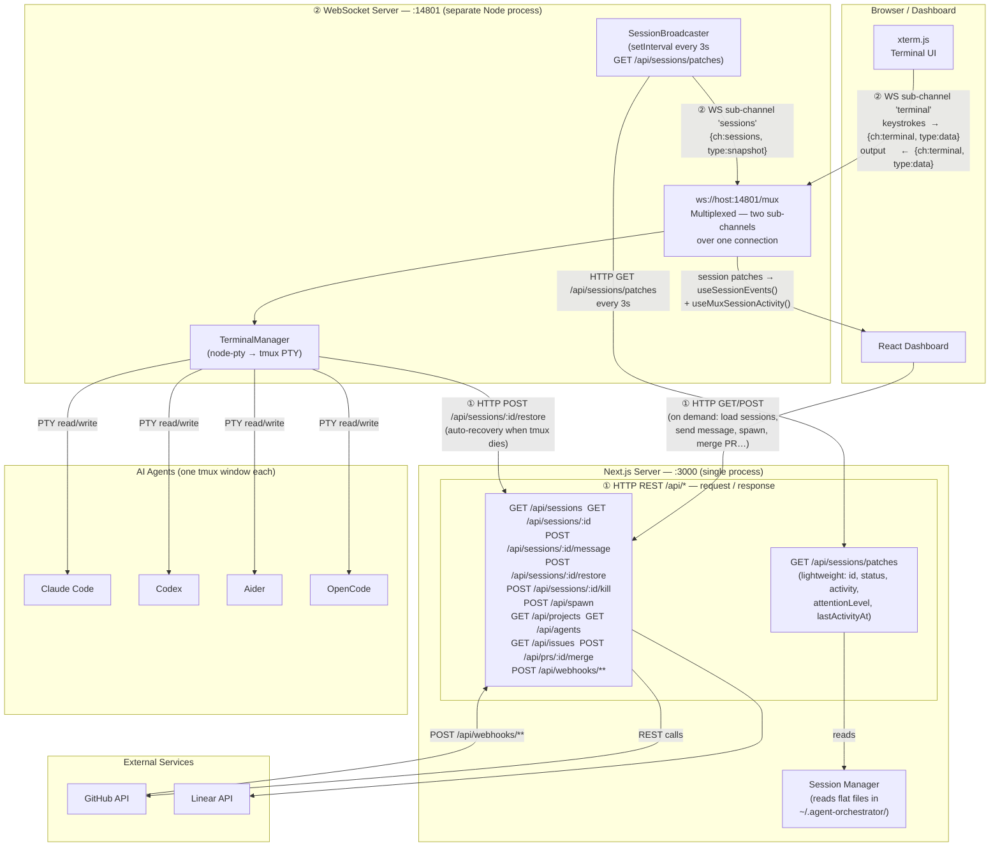

# Remove Browser SSE — Full EventSource Elimination

## Problem summary

- Browser opens two real-time connections: `EventSource` to `GET /api/events` (SSE) AND WebSocket to `ws://:14801/mux`
- WebSocket already carries session patches via `sessions` sub-channel — SSE is redundant
- `useSessionEvents` already skips SSE when WS is connected; SSE is dead-code in normal operation
- `useSSESessionActivity` (session detail page title) opens a second redundant `EventSource`
- Server-side: `SessionBroadcaster` only consumes `/api/events` to re-broadcast over WS — replaceable with a plain HTTP poll of `/api/sessions/patches`
- Goal: delete every `EventSource` from browser code, delete `/api/events` route entirely, remove all SSE-specific types

## Research findings

- `useSessionEvents` — `packages/web/src/hooks/useSessionEvents.ts`
  - SSE `useEffect` spans lines 244-346 (the whole effect including the `muxActive` early-return branch at 244-262 and the `EventSource` setup at 264-346)
  - `muxSessions` prop drives the mux effect at lines 208-242; this effect stays, the SSE effect is deleted
  - Callers: `Dashboard.tsx:82-87`, `PullRequestsPage.tsx:48-53` — both pass `mux.sessions`
- `useSSESessionActivity` — `packages/web/src/hooks/useSSESessionActivity.ts:24`
  - Opens its own `EventSource`; sole caller is `sessions/[id]/page.tsx:97`
  - Call site reads `sseActivity?.activity` — replacement must return `{ activity: ActivityState | null } | null`
  - All needed fields (`activity`, `attentionLevel`) already present in `mux.sessions` (`SessionPatch`)
- `SSESnapshotEvent["sessions"]` — used as a type in `useSessionEvents.ts` at lines 33, 88, 223
  - After deleting `SSESnapshotEvent` from `lib/types.ts`, replace with `SessionPatch[]` imported from `@/lib/mux-protocol`
- `SessionBroadcaster` — `packages/web/server/mux-websocket.ts:51-195`
  - Fetches `GET /api/events` as SSE stream (line 130) and re-broadcasts to WS clients
  - Already polls `/api/sessions/patches` for initial snapshot (line 105) — same pattern for replacement
  - Refactor: replace `abortController` + SSE stream + reconnect loop with a simple `setInterval` storing an interval ID
  - Keep the class name `SessionBroadcaster`; only the internals change
- `/api/events` route — `packages/web/src/app/api/events/route.ts`
  - Once `SessionBroadcaster` is migrated, zero consumers remain → delete
- SSE-specific types — `packages/web/src/lib/types.ts:142,156`
  - `SSESnapshotEvent`, `SSEActivityEvent` — used only by the SSE hooks being deleted
- `SSEAttentionMap` — exported from `useSessionEvents.ts:21`, used by `DynamicFavicon`
  - Rename to `AttentionMap`; update `DynamicFavicon` and its tests
- `sseAttentionLevels` — field on `useSessionEvents` return value; rename to `attentionLevels`
  - Callers: `Dashboard.tsx`, `PullRequestsPage.tsx`, `DynamicFavicon.tsx`

## Proposed approach

- **Phase 1** — refactor `SessionBroadcaster` off SSE
  - Replace SSE `fetch` + stream parsing + reconnect loop with `setInterval` polling `GET /api/sessions/patches`
  - Replace `abortController` field with an interval ID (`_intervalId: ReturnType<typeof setInterval> | null`)
  - On subscribe: start interval if first subscriber, send immediate snapshot
  - On unsubscribe: clear interval when last subscriber leaves
  - Failed fetches: log and skip — next interval retries automatically (no reconnect logic needed)
  - Keep same 3s interval and same broadcast shape to subscribers
- **Phase 2** — delete `/api/events` route
- **Phase 3** — remove `EventSource` from `useSessionEvents`
  - Delete the entire second `useEffect` (lines 244-346) — both the `muxActive` branch and the SSE setup
  - Replace `SSESnapshotEvent["sessions"]` type references with `SessionPatch[]` from `@/lib/mux-protocol`
  - Rename `sseAttentionLevels` → `attentionLevels` and `SSEAttentionMap` → `AttentionMap`
- **Phase 4** — replace `useSSESessionActivity` with `useMuxSessionActivity`
- **Phase 5** — delete SSE-specific types from `lib/types.ts`
- **Phase 6** — rename `SSEAttentionMap` / `sseAttentionLevels` in all callers
- **Phase 7** — update `docs/ARCHITECTURE.md`

## `useMuxSessionActivity` — implementation sketch

```typescript
// packages/web/src/hooks/useMuxSessionActivity.ts
"use client";
import type { ActivityState } from "@/lib/types";
import { useMux } from "@/providers/MuxProvider";

export function useMuxSessionActivity(
  sessionId: string,
): { activity: ActivityState | null } | null {
  const mux = useMux();
  const patch = mux.sessions.find((s) => s.id === sessionId);
  if (!patch) return null;
  return { activity: (patch.activity as ActivityState) ?? null };
}
```

Caller in `sessions/[id]/page.tsx` reads `sseActivity?.activity` — shape is compatible.

## Files to modify / delete

| File | Change |
|------|--------|
| `packages/web/server/mux-websocket.ts` | Refactor `SessionBroadcaster`: replace SSE fetch + reconnect with `setInterval` polling `/api/sessions/patches` |
| `packages/web/server/__tests__/mux-websocket.test.ts` | Rewrite `SessionBroadcaster` tests for HTTP poll behaviour |
| `packages/web/src/app/api/events/route.ts` | **Delete** |
| `packages/web/src/__tests__/api-routes.test.ts` | Delete `describe("GET /api/events")` block and its import |
| `packages/web/src/hooks/useSessionEvents.ts` | Delete SSE `useEffect` (lines 244-346); replace `SSESnapshotEvent["sessions"]` with `SessionPatch[]`; rename `sseAttentionLevels` → `attentionLevels`; rename `SSEAttentionMap` → `AttentionMap` |
| `packages/web/src/hooks/useSSESessionActivity.ts` | **Delete** |
| `packages/web/src/hooks/__tests__/useSSESessionActivity.test.ts` | **Delete** |
| `packages/web/src/hooks/useMuxSessionActivity.ts` | **New** — see sketch above |
| `packages/web/src/app/sessions/[id]/page.tsx` | Swap `useSSESessionActivity` → `useMuxSessionActivity` |
| `packages/web/src/lib/types.ts` | Remove `SSESnapshotEvent`, `SSEActivityEvent` |
| `packages/web/src/components/DynamicFavicon.tsx` | `SSEAttentionMap` → `AttentionMap` |
| `packages/web/src/components/__tests__/DynamicFavicon.test.tsx` | `SSEAttentionMap` → `AttentionMap` |
| `packages/web/src/components/Dashboard.tsx` | `sseAttentionLevels` → `attentionLevels` |
| `packages/web/src/app/(with-sidebar)/dashboard/page.tsx` | `sseAttentionLevels` → `attentionLevels` (if passed as prop) |
| `packages/web/src/components/PullRequestsPage.tsx` | `sseAttentionLevels` → `attentionLevels` |
| `packages/web/src/app/(with-sidebar)/prs/page.tsx` | `sseAttentionLevels` → `attentionLevels` (if passed as prop) |
| `docs/ARCHITECTURE.md` | Revamp system overview diagram + data flow table |

## Target architecture (post-change)



**Key differences from current architecture:**
- `/api/events` (SSE route) deleted — no browser or server code touches it
- `SessionBroadcaster` internals replaced: SSE stream → `setInterval` + plain HTTP GET
- Browser has exactly one real-time connection: the WebSocket on `:14801`
- `useSessionEvents` and `useMuxSessionActivity` both read from `mux.sessions` — no `EventSource` anywhere

## Risks and open questions

- **No SSE fallback** — if WS drops, session cards go stale until reconnect; `MuxProvider` auto-reconnects so this is acceptable
- **`useMuxSessionActivity` before WS connects** — returns `null` briefly on first render; call site already handles `sseActivity?.activity` gracefully
- **`muxSessions` still optional in `useSessionEvents` signature** — keep the param optional but when `undefined` the mux effect is a no-op; data stays stale until WS connects (acceptable, same as today)

## Validation strategy

- `grep -r "new EventSource" packages/web/src` → zero results
- `grep -r "api/events" packages/web/src packages/web/server` → zero results
- `grep -r "SSESnapshotEvent\|SSEActivityEvent\|SSEAttentionMap\|sseAttentionLevels" packages/web/src` → zero results
- `pnpm --filter @composio/ao-web typecheck`
- `pnpm --filter @composio/ao-web test`
- `pnpm lint`

## Implementation checklist

- [ ] **Phase 1 — Refactor `SessionBroadcaster`** (`mux-websocket.ts`)
  - [ ] Replace `abortController` field with `_intervalId: ReturnType<typeof setInterval> | null`
  - [ ] Replace SSE `fetch` + `getReader` + `TextDecoder` + chunk-parse loop with `setInterval(() => fetch(/api/sessions/patches).then(broadcast), 3000)`
  - [ ] On failed fetch: log and return — next tick retries automatically
  - [ ] Remove entire reconnect logic (lines 178-184) — not needed with polling
  - [ ] Keep lazy start/stop: start interval on first subscriber, clear on last
  - [ ] Keep immediate snapshot on first subscribe
- [ ] **Phase 2 — Delete `/api/events`**
  - [ ] Delete `packages/web/src/app/api/events/route.ts`
  - [ ] Delete `describe("GET /api/events")` block from `packages/web/src/__tests__/api-routes.test.ts`
  - [ ] Remove any `"sse.events"` surface references in observability calls
- [ ] **Phase 3 — Clean `useSessionEvents`**
  - [ ] Delete entire second `useEffect` (lines 244-346 on main)
  - [ ] Import `SessionPatch` from `@/lib/mux-protocol`; replace `SSESnapshotEvent["sessions"]` at lines 33, 88, 223
  - [ ] Remove `SSESnapshotEvent` import
  - [ ] Rename `sseAttentionLevels` → `attentionLevels` in state interface, return value, and all internal references
  - [ ] Rename exported type `SSEAttentionMap` → `AttentionMap`
  - [ ] Remove `DISCONNECTED_GRACE_PERIOD_MS` and other SSE-only constants
- [ ] **Phase 4 — Replace `useSSESessionActivity`**
  - [ ] Delete `packages/web/src/hooks/useSSESessionActivity.ts`
  - [ ] Delete `packages/web/src/hooks/__tests__/useSSESessionActivity.test.ts`
  - [ ] Create `useMuxSessionActivity.ts` per sketch above
  - [ ] Update `sessions/[id]/page.tsx`: swap import + hook call (call site shape is compatible)
- [ ] **Phase 5 — Delete SSE types**
  - [ ] Remove `SSESnapshotEvent`, `SSEActivityEvent` from `lib/types.ts`
- [ ] **Phase 6 — Rename in all callers**
  - [ ] `DynamicFavicon.tsx` + `DynamicFavicon.test.tsx`: `SSEAttentionMap` → `AttentionMap`
  - [ ] `Dashboard.tsx`: `sseAttentionLevels` → `attentionLevels`
  - [ ] `dashboard/page.tsx`: `sseAttentionLevels` → `attentionLevels`
  - [ ] `PullRequestsPage.tsx`: `sseAttentionLevels` → `attentionLevels`
  - [ ] `prs/page.tsx`: `sseAttentionLevels` → `attentionLevels`
- [ ] **Phase 7 — Architecture doc**
  - [ ] Replace system overview diagram in `docs/ARCHITECTURE.md` with target architecture above
  - [ ] Update data flow summary table: remove SSE row, update Mux row
- [ ] **Phase 8 — Final validation**
  - [ ] `grep -r "new EventSource" packages/web/src` → zero results
  - [ ] `grep -r "api/events" packages/web/src packages/web/server` → zero results
  - [ ] `grep -r "SSESnapshotEvent\|SSEActivityEvent\|SSEAttentionMap\|sseAttentionLevels" packages/web/src` → zero results
  - [ ] `pnpm --filter @composio/ao-web typecheck`
  - [ ] `pnpm --filter @composio/ao-web test`
  - [ ] `pnpm lint`
