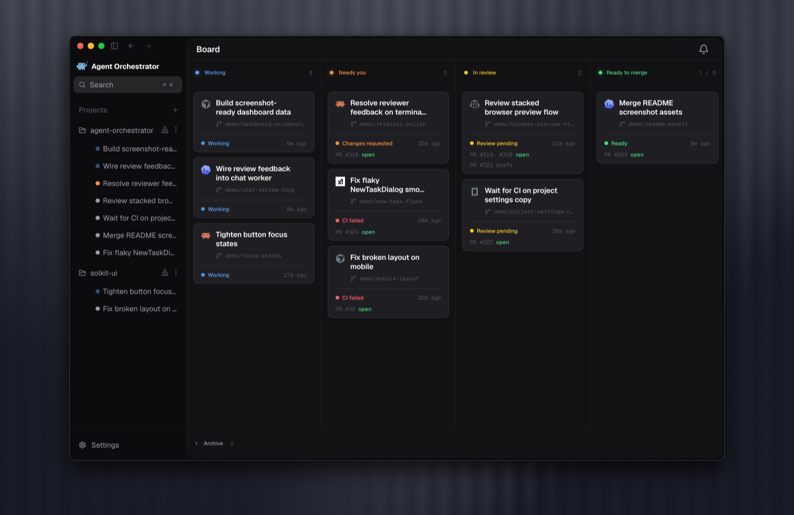
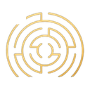
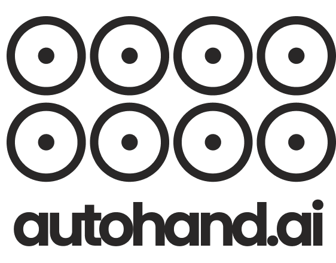

<div align="center">
  

### Agent Orchestrator

#### Delegate to an orchestrator. Supervise the work, not the terminals.

[](https://github.com/Untrivial-ai/agent-orchestrator/stargazers)

[](https://github.com/Untrivial-ai/agent-orchestrator/releases/latest)
[](https://github.com/Untrivial-ai/agent-orchestrator/releases)
[](LICENSE)
[](https://x.com/aoagents)
[](https://discord.com/invite/UZv7JjxbwG)

Give a dedicated orchestrator the outcome you want. It plans the work, delegates implementation,<br />
and coordinates Claude Code, Codex, Cursor, opencode, and other coding agents.<br />
AO isolates every worker and turns live agent, pull request, CI, and review state into one Kanban control plane.

[**Download AO**](#install) &nbsp;&bull;&nbsp; [Documentation](https://aoagents.dev/docs) &nbsp;&bull;&nbsp; [Releases](https://github.com/Untrivial-ai/agent-orchestrator/releases) &nbsp;&bull;&nbsp; [Contributing](CONTRIBUTING.md) &nbsp;&bull;&nbsp; [Discord](https://discord.com/invite/UZv7JjxbwG)

**English** · [简体中文](translations/README.zh-CN.md) · [日本語](translations/README.ja.md) · [한국어](translations/README.ko.md) · [Español](translations/README.es.md) · [Français](translations/README.fr.md) · [Deutsch](translations/README.de.md) · [Português (Brasil)](translations/README.pt-BR.md)

<br />


</div>

## The coordination layer between you and your coding agents

Coding agents make implementation faster, but running more of them moves the bottleneck: now someone has to split the work, give each agent context, prevent branch collisions, notice failures, follow up on reviews, and remember what is ready to merge.

AO is built around that coordination problem. Each project can have a dedicated, human-facing **orchestrator agent**. You describe an outcome to the orchestrator; it inspects the current project state, plans the work, delegates implementation to worker sessions, follows their progress, and reports blockers back to you. The orchestrator coordinates—it does not edit your code. Workers own implementation, tests, commits, and pull requests in their isolated workspaces.

This creates a clear division of responsibility:

- **You set direction and make judgment calls** — define the outcome, answer product questions, review the result, and decide what ships.
- **The orchestrator runs the plan** — it avoids duplicate work, spawns or redirects workers, sends follow-ups, and keeps the whole effort coherent.
- **Workers execute independently** — each task can use the best agent for the job while AO keeps branches, workspaces, interfaces, and pull requests separate.
- **AO maintains the control loop** — it observes agent activity and GitHub state, derives what needs attention, and routes CI failures, review feedback, and merge conflicts to the session that owns the work.

For a focused one-off task, you can skip the orchestrator and start a worker directly. At any point you can open a worker's structured Chat or native terminal UI and take a more hands-on role. AO supports both orchestrated outcomes and direct agent control without hiding the underlying tools.

## A Kanban for live agent work

AO's Kanban is the operational view of your agent team, not a manually maintained backlog. Cards move automatically from durable session and pull request facts, so the board answers the question that matters when several agents are running: **where do I need to look?**

- **Working** — workers that are actively implementing or ready for another instruction
- **Needs you** — blocked sessions, missing input, failed CI, requested changes, or lost signals
- **In review** — open and draft pull requests waiting on checks or review
- **Ready to merge** — approved or mergeable work, with merged sessions kept visible until they are archived

Each card keeps the task, agent, branch, activity, pull request, and status together. Open it to inspect the conversation or terminal, changed files, PR summary, reviews, and preview without reconstructing context across tabs.

## From goal to merge

1. **Describe the outcome.** Talk to the project's orchestrator for multi-step work, or use **New task** to launch a bounded worker directly.
2. **Delegate in parallel.** The orchestrator checks existing sessions, breaks the outcome into owned tasks, and starts workers with clear briefs.
3. **Work in isolation.** Every Git-backed worker gets its own branch and worktree; Scratch workers get AO-managed branchless directories.
4. **Follow live state.** The local daemon watches agent activity, pull requests, CI, review feedback, and merge conflicts. The Kanban updates from those facts.
5. **Close the loop.** AO can send actionable failures and review feedback back to the responsible worker. You step in for decisions and work that is ready to merge.

AO is local and supervisory. It does not replace your coding agents, source control, or code review, and it does not pretend that every decision should be automated. It gives agents the environment to work independently and gives you the leverage to supervise the system as a whole.

## Product highlights

<table>
  <tr>
    <td width="36%" valign="middle">
      <h3>Attention-first Kanban</h3>
      <p>See work grouped by live execution and pull request state: working, needs you, in review, and ready to merge.</p>
    </td>
    <td width="64%">
      
    </td>
  </tr>
  <tr>
    <td width="36%" valign="middle">
      <h3>Any agent, one workflow</h3>
      <p>Choose the right coding agent for each worker. Use structured Chat or its native terminal UI without losing the surrounding task and PR context.</p>
    </td>
    <td width="64%">
      
    </td>
  </tr>
  <tr>
    <td width="36%" valign="middle">
      <h3>Pull requests and agent reviews</h3>
      <p>Keep CI, mergeability, reviewer state, and interactive agent reviews beside the worker, then return requested changes to the same owner.</p>
    </td>
    <td width="64%">
      
    </td>
  </tr>
  <tr>
    <td width="36%" valign="middle">
      <h3>Agent-controllable browser</h3>
      <p>Preview and inspect a worker's local app beside its interface. Browser profiles are isolated per worker so parallel UI tasks do not share state.</p>
    </td>
    <td width="64%">
      
    </td>
  </tr>
</table>

## Supported agents

**26 coding agents supported** through one supervised workflow.

<table>
  <tr valign="middle">
    <td width="33%" valign="middle" nowrap> &nbsp; <b>Claude Code</b></td>
    <td width="33%" valign="middle" nowrap> &nbsp; <b>Codex</b></td>
    <td width="33%" valign="middle" nowrap> &nbsp; <b>Cursor</b></td>
  </tr>
  <tr valign="middle">
    <td valign="middle" nowrap> &nbsp; <b>opencode</b></td>
    <td valign="middle" nowrap> &nbsp; <b>Aider</b></td>
    <td valign="middle" nowrap> &nbsp; <b>GitHub Copilot</b></td>
  </tr>
  <tr valign="middle">
    <td valign="middle" nowrap> &nbsp; <b>Grok</b></td>
    <td valign="middle" nowrap> &nbsp; <b>Kimi</b></td>
    <td valign="middle" nowrap> &nbsp; <b>Pi</b></td>
  </tr>
  <tr valign="middle">
    <td valign="middle" nowrap> &nbsp; <b>Amp</b></td>
    <td valign="middle" nowrap> &nbsp; <b>Auggie</b></td>
    <td valign="middle" nowrap> &nbsp; <b>Droid</b></td>
  </tr>
  <tr valign="middle">
    <td valign="middle" nowrap> &nbsp; <b>Crush</b></td>
    <td valign="middle" nowrap> &nbsp; <b>Cline</b></td>
    <td valign="middle" nowrap> &nbsp; <b>Goose</b></td>
  </tr>
  <tr valign="middle">
    <td valign="middle" nowrap> &nbsp; <b>Qwen</b></td>
    <td valign="middle" nowrap> &nbsp; <b>Continue</b></td>
    <td valign="middle" nowrap> &nbsp; <b>Devin</b></td>
  </tr>
  <tr valign="middle">
    <td valign="middle" nowrap> &nbsp; <b>Kiro</b></td>
    <td valign="middle" nowrap> &nbsp; <b>Kilo Code</b></td>
    <td valign="middle" nowrap> &nbsp; <b>Vibe</b></td>
  </tr>
  <tr valign="middle">
    <td valign="middle" nowrap> &nbsp; <b>Muse</b></td>
    <td valign="middle" nowrap> &nbsp; <b>Agy</b></td>
    <td valign="middle" nowrap><picture><source media="(prefers-color-scheme: dark)" srcset="docs/assets/readme/agents/autohand-stacked-dark.png" /></picture> <b>Autohand</b></td>
  </tr>
  <tr valign="middle">
    <td valign="middle" nowrap> &nbsp; <b>Kimchi</b></td>
    <td valign="middle" nowrap> &nbsp; <b>Prime Agent</b></td>
    <td valign="middle" nowrap></td>
  </tr>
</table>

[Browse agent setup guides →](https://aoagents.dev/docs/plugins/agents)

**Use the interface that fits the moment: structured Chat or the agent's native terminal UI.**

## Install

Download the latest desktop build for your platform. The desktop app is the recommended, auto-updating install path.

| Platform              | Download                                                                                                                      |
| --------------------- | ----------------------------------------------------------------------------------------------------------------------------- |
| macOS (Apple silicon) | [Download](https://github.com/Untrivial-ai/agent-orchestrator/releases/latest/download/agent-orchestrator-darwin-arm64.dmg)   |
| macOS (Intel)         | [Download](https://github.com/Untrivial-ai/agent-orchestrator/releases/latest/download/agent-orchestrator-darwin-x64.dmg)     |
| Windows               | [Download](https://github.com/Untrivial-ai/agent-orchestrator/releases/latest/download/agent-orchestrator-win32-x64.exe)      |
| Linux (AppImage)      | [Download](https://github.com/Untrivial-ai/agent-orchestrator/releases/latest/download/agent-orchestrator-linux-x64.AppImage) |
| Linux (Debian/Ubuntu) | [Download](https://github.com/Untrivial-ai/agent-orchestrator/releases/latest/download/agent-orchestrator-linux-x64.deb)      |
| Linux (Fedora/RHEL)   | [Download](https://github.com/Untrivial-ai/agent-orchestrator/releases/latest/download/agent-orchestrator-linux-x64.rpm)      |

Open Agent Orchestrator and point it at the repository you want AO to manage. The desktop app runs the daemon for you, so no CLI is required. See the [installation guide](https://aoagents.dev/docs/installation) for agent CLI setup and troubleshooting.

## Develop and contribute

Contributions are welcome across code, docs, triage, examples, and tests.

```bash
git clone https://github.com/Untrivial-ai/agent-orchestrator.git
cd agent-orchestrator
```

Start with the [development guide](docs/development.md) for prerequisites, local setup, and test commands. Read [CONTRIBUTING.md](CONTRIBUTING.md) before opening a pull request, and use [GitHub Issues](https://github.com/Untrivial-ai/agent-orchestrator/issues) for bugs and feature requests.

## Documentation

| Document                                                         | Start here when you need                                                                     |
| ---------------------------------------------------------------- | -------------------------------------------------------------------------------------------- |
| [Product documentation](https://aoagents.dev/docs)               | Installation, agent setup, and day-to-day product usage.                                     |
| [docs/architecture.md](docs/architecture.md)                     | Backend mental model, lifecycle, persistence, CDC, status derivation, and daemon boundaries. |
| [docs/backend-code-structure.md](docs/backend-code-structure.md) | Package ownership and where each backend concern belongs.                                    |
| [docs/cli/README.md](docs/cli/README.md)                         | CLI behavior and daemon route mapping.                                                       |
| [docs/development.md](docs/development.md)                       | Prerequisites, build steps, running tests, and troubleshooting for local development.        |
| [docs/STATUS.md](docs/STATUS.md)                                 | What currently ships on `main` and what remains in flight.                                   |

## Follow the journey

<table>
  <tr>
    <td width="50%" align="center">
      <a href="https://x.com/agent_wrapper/status/2026329204405723180">
        
      </a>
    </td>
    <td width="50%" align="center">
      <a href="https://x.com/agent_wrapper/status/2025986105485733945">
        
      </a>
    </td>
  </tr>
</table>

## Community

Join [Discord](https://discord.com/invite/UZv7JjxbwG) for help and contributor discussion, follow [@aoagents](https://x.com/aoagents) for updates, or start a conversation in [GitHub Issues](https://github.com/Untrivial-ai/agent-orchestrator/issues).

## Anonymous telemetry

AO uses privacy-preserving product usage and reliability metrics—designed to exclude PII and project content—to understand adoption and improve the product. [Learn more about telemetry and privacy](docs/telemetry.md).

## License

Agent Orchestrator is available under the [Apache License 2.0](LICENSE).
