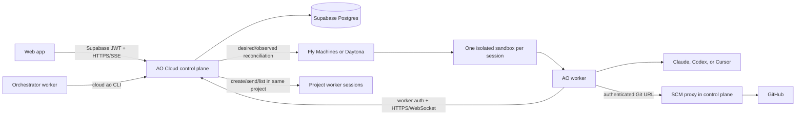

# AO Cloud: Current Architecture

This describes the deployed Cloud V1 system. Local AO and AO Cloud are two
independent execution paths: they share domain ideas and agent adapters, but
they do not synchronize databases, daemons, or sessions.

## The whole picture

## Components and ownership

- **Web app:** authenticates with Supabase, manages projects, sessions, provider
  connections, and structured conversations. It talks only to the control
  plane. It never talks directly to a sandbox.
- **Control plane (Render):** the public authority for accounts, projects,
  sessions, access checks, lifecycle intent, credentials, worker commands,
  event replay, SCM proxying, and sandbox reconciliation.
- **Postgres (Supabase):** durable source of truth. All application tables use
  the `ao_` prefix. It stores desired and observed lifecycle state, encrypted
  provider credentials, ordered session events, command idempotency, worker
  leases, SCM facts, and provider environment IDs.
- **Sandbox provider:** Fly Machines is the deployed provider. Daytona remains
  behind the same provider contract. Each active session gets one isolated
  VM/container and one persistent workspace disk.
- **Worker:** bootstraps with a one-time ticket, receives a short-lived
  worker credential, clones the repository, launches the selected harness, and
  reports heartbeats and canonical events. Heartbeats rotate the credential.
- **Agent harness:** Claude Code, Codex, and Cursor use machine-readable
  protocols. The worker translates provider-specific messages into AO's common
  `chat.*` event vocabulary.
- **Cloud `ao` CLI:** a separate binary inside orchestrator sandboxes. `ao
  spawn`, `ao send`, and `ao status` call worker-authenticated control-plane
  routes. They can operate only inside the orchestrator's account and project.

An orchestrator is still a normal session and sandbox; its extra
`worker:orchestrate` scope lets it create and coordinate child worker sessions
for the same repository project. New child sessions appear in the web UI
because the control plane, not the VM, creates their durable rows.

## LCM: lifecycle management

LCM is a reconciliation loop, not a chain of UI-side provisioning calls:

1. A browser or orchestrator records a session and desired sandbox state in
   Postgres.
2. The reconciler leases due `ao_sandboxes` rows.
3. The selected provider adapter creates, starts, pauses, resumes, or deletes
   the environment.
4. The reconciler records observed state, provider ID, errors, and next retry.
5. The worker exchanges its one-time bootstrap ticket and starts heartbeats.
6. A heartbeat changes bootstrapping/provisioning state to running.
7. Missing or deleted provider environments are cleared and safely
   reprovisioned with a new one-time ticket.

The database therefore keeps durable intent while Fly/Daytona is disposable.
Provider calls are retried, reconciliation uses leases for multi-instance
safety, and a failed probe is not treated as proof that user state is dead.

## SCM: source-control management

Current Cloud V1 uses the `localgh` SCM adapter:

1. The control plane exposes an account/session-scoped Git smart-HTTP URL.
2. The worker clones that URL into its persistent workspace.
3. The control plane verifies the worker credential and proxies the request to
   GitHub with the configured GitHub credential.
4. Git operations happen inside the sandbox; durable session and SCM summary
   state remains in the control plane.

The current GitHub credential comes from the deployment's local `gh`-derived
token. This is intentionally a V1 integration seam. Replacing it with a
GitHub App changes the SCM credential provider, installation lookup, and token
refresh path—not the worker, lifecycle, chat, or frontend contracts.

## Chat, durability, and reconnects

1. The control plane commits every user message with an idempotency key before
   attempting worker delivery.
2. The worker command WebSocket replays unacknowledged prompts in sequence.
3. A worker acknowledges a prompt only when the provider process accepts it.
4. Provider output is normalized and appended as ordered `chat.*` events.
5. The browser first replays all stored events, then uses authenticated SSE for
   live wakeups and drains Postgres in sequence order.
6. Refreshes, browser closes, Render reconnects, and worker reconnects do not
   lose the conversation.
7. Interrupt creates a control-plane event and sends a turn-scoped command.
   Claude receives its structured interrupt request; Codex/Cursor cancel only
   the active process; PTY fallback receives Ctrl-C. The long-lived worker and
   later prompts survive.

The web app shows structured chat whenever the worker advertises
`chat.stream-json.v1`. It shows the PTY only for a runtime advertising
`runtime.pty.v1`; terminal transport is a fallback, not the primary product UI.

## Relationship to local AO

Local and cloud use the same core vocabulary—projects, orchestrators, workers,
agent launch configuration, activity, SCM, and lifecycle boundaries. Cloud
workers reuse existing agent adapters and `ports` contracts where the runtime
behavior is genuinely shared.

Their authorities remain separate:

| Concern | Local AO | AO Cloud |
| --- | --- | --- |
| API authority | Loopback Go daemon | Hosted Go control plane |
| Durable store | SQLite under `~/.ao` | Supabase Postgres `ao_*` tables |
| Runtime | Local process/tmux/worktree | Isolated Fly/Daytona sandbox |
| Authentication | Local OS user | Supabase user JWT + worker tickets |
| Live transport | Local daemon streams | HTTPS, WebSocket, replay + SSE |
| SCM credential | Local user environment | Control-plane SCM adapter |

There is no local-to-cloud database sync. Login selects the cloud authority;
the desktop/local client selects the local daemon. Shared interfaces should
stay narrow, while storage, authentication, networking, and provider adapters
remain deployment-specific.

## Maintenance and migration seams

- Sandbox vendors implement the sandbox provider interface; changing vendors
  does not change sessions, events, UI, or worker protocol.
- Agent providers implement normalization into canonical `chat.*` events; the
  web timeline is provider-independent.
- SCM authentication sits behind the SCM adapter, enabling the planned GitHub
  App migration without changing sandbox execution.
- Desired/observed state and append-only events make control-plane restarts and
  horizontal replicas safe.
- The reusable worker image contains tools and AO binaries only. Per-session
  repository data, credentials, tickets, and prompts are injected at runtime.
- Secrets are never baked into the image. User agent credentials are encrypted
  at rest and released only to the authorized worker bootstrap.
- Stable image tags are used for new sessions, while immutable commit tags and
  image digests make a deployment auditable.

Operationally, deploy the control plane from the branch, publish the worker
image, then let LCM create or replace sandboxes. Do not manually make VM state
authoritative; repair durable intent and let reconciliation converge it.
