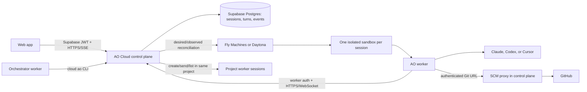

# AO Cloud: Current Architecture

Status: deployed test implementation on `feat/cloud-agent-v1`, updated
2026-07-30.

This describes the deployed Cloud V1 system. Local AO and AO Cloud are two
independent execution paths: they share domain ideas and agent adapters, but
they do not synchronize databases, daemons, or sessions.

This file describes what exists now. Longer-term work belongs in
[`docs/TODO-CLOUD.md`](../docs/TODO-CLOUD.md); the original reasoning and
competitive research remain in
[`docs/Cloud Agent Plan Nihal.md`](../docs/Cloud%20Agent%20Plan%20Nihal.md).

## The whole picture



## Components and ownership

- **Web app:** authenticates with Supabase, manages projects, sessions, provider
  connections, and structured conversations. It talks only to the control
  plane. It never talks directly to a sandbox.
- **Control plane (Render):** the public authority for accounts, projects,
  sessions, access checks, lifecycle intent, credentials, worker commands,
  event replay, SCM proxying, and sandbox reconciliation.
- **Postgres (Supabase):** durable source of truth. All application tables use
  the `ao_` prefix. It stores desired and observed lifecycle state, encrypted
  provider credentials, ordered session events, command idempotency, worker
  leases, first-class turns, SCM facts, and provider environment IDs.
- **Sandbox provider:** Fly Machines is the deployed provider. Daytona remains
  behind the same provider contract. Each active session gets one isolated
  VM/container and one persistent workspace disk.
- **Worker:** bootstraps with a one-time ticket, receives a short-lived
  worker credential, clones the repository, launches the selected harness, and
  reports heartbeats and canonical events. Heartbeats rotate the credential.
- **Agent harness:** Claude Code, Codex, and Cursor use machine-readable
  protocols. The worker translates provider-specific messages into AO's common
  `chat.*` event vocabulary.
- **Cloud `ao` CLI:** a separate binary inside orchestrator sandboxes. The
  commands `ao spawn`, `ao send`, `ao status`, `ao inspect`, `ao wait`, and
  `ao result` call worker-authenticated control-plane routes. They can operate
  only inside the orchestrator's account and project.

An orchestrator is still a normal session and sandbox; its extra
`worker:orchestrate` scope lets it create and coordinate child worker sessions
for the same repository project. New child sessions appear in the web UI
because the control plane, not the VM, creates their durable rows.

Worker completion uses the same durable turn and event records as the web app.
`ao inspect <worker>` reads one current session/turn snapshot. `ao wait
<worker>` polls that durable snapshot through transient control-plane restarts,
then prints the complete normalized assistant answer when the latest turn
reaches `completed`; a failed turn returns its partial answer and failure.
`ao result <worker>` reads the already-finished answer without waiting. Worker
names, full session IDs, and unambiguous ID prefixes are accepted. The
orchestrator prompt requires waiting for delegated results unless the user
explicitly requests fire-and-forget work, so it no longer has to repeatedly
guess from `ao status`.

## Which client talks to which authority

| Client/process                      | Authority used now                | It does not use  |
| ----------------------------------- | --------------------------------- | ---------------- |
| Electron desktop and local `ao` CLI | Loopback local daemon             | AO Cloud         |
| Cloud web app                       | Hosted AO Cloud API               | Local daemon     |
| Local agent process                 | Local daemon APIs/hooks           | Cloud worker API |
| Cloud worker and cloud orchestrator | Worker-authenticated AO Cloud API | Local daemon     |

The Electron app is not “cloud only.” It remains the local product today. The
browser app is cloud only. A future Electron login may compose the same cloud
transport, but that is not wired in this implementation and does not require
local/cloud database synchronization.

Closing either browser or Electron does not stop cloud work. The Render control
plane, Postgres records, Fly Machine, and worker continue independently.

## LCM: lifecycle management

LCM is a reconciliation loop, not a chain of UI-side provisioning calls:

1. A browser or orchestrator records a session and desired sandbox state in
   Postgres.
   Submitting a message marks the session active and restores desired state to
   running, so an offline sandbox is automatically reprovisioned.
   Creating a project also creates and requests its orchestrator sandbox before
   the first prompt, which prewarms the environment.
2. The reconciler leases due `ao_sandboxes` rows.
3. The selected provider adapter creates, starts, pauses, resumes, or deletes
   the environment.
4. The reconciler records observed state, provider ID, errors, and next retry.
5. The worker exchanges its one-time bootstrap ticket and starts heartbeats.
6. A heartbeat changes bootstrapping/provisioning state to running.
7. Missing or deleted provider environments are cleared and safely
   reprovisioned with a new one-time ticket.

In the web UI, **Starting** means that the durable orchestrator session already
exists but its agent runtime has not connected yet. During that window the
control plane may be allocating the VM and volume, the worker entrypoint may be
cloning and preparing the repository, or the agent process may be establishing
its command stream. The project Kanban remains available as soon as the
orchestrator record exists and shows this setup sequence over the empty board;
the indicator clears only after `runtimeConnected` becomes true.

Fly may continue returning a destroyed Machine by ID after removing it from the
active Machines list. The reconciler treats both provider `deleted` responses
and 404s as terminal infrastructure state, clears the stale provider ID, and
creates a replacement when durable intent is still `running`.

The database therefore keeps durable intent while Fly/Daytona is disposable.
Provider calls are retried, reconciliation uses leases for multi-instance
safety, and a failed probe is not treated as proof that user state is dead.

Deletion follows the same rule: first persist `desired_state=deleted`, then let
the provider adapter confirm resource deletion. Fly deletion also removes the
session's attached encrypted volume. Project rows should be removed only after
provider cleanup, because deleting the row first would remove the durable work
item that tells LCM to clean up the external resource.

## SCM: source-control management

Current Cloud V1 uses the `localgh` SCM adapter:

1. The control plane exposes an account/session-scoped Git smart-HTTP URL.
2. The worker clones that URL into its persistent workspace.
3. The control plane verifies the worker credential and proxies the request to
   GitHub with the configured GitHub credential.
4. Git operations happen inside the sandbox; durable session and SCM summary
   state remains in the control plane.

The current GitHub credential comes from the deployment's local `gh`-derived
token. This is intentionally a V1 integration seam. Replacing it with a
GitHub App changes the SCM credential provider, installation lookup, and token
refresh path—not the worker, lifecycle, chat, or frontend contracts.

## Chat, durability, and reconnects

1. The control plane atomically commits every user message and its `ao_turns`
   row before attempting worker delivery. The message payload carries the turn
   ID.
2. A partial unique index permits only one `queued`, `provisioning`, `running`,
   or `cancel_requested` turn per session. Concurrent browser, retry, and
   orchestrator requests therefore cannot start duplicate agent runs. The turn
   also records its claiming worker epoch and attempt count.
3. Turn state moves through `queued` → `provisioning` → `running` and ends as
   `completed` or `failed`. Interrupt first records `cancel_requested`.
4. Session-list/Kanban status, the in-chat startup loader, composer locking,
   interruption, and prompt replay read this durable turn instead of guessing
   from browser-local state.
5. The worker command WebSocket replays only unacknowledged prompts belonging
   to unfinished turns, in sequence. Terminal turns are never executed again
   after worker replacement. If an unfinished turn was claimed by an older
   worker epoch, the replacement atomically returns it to `provisioning` and
   replays that turn once. Application-level keepalives preserve the command
   stream through hosted reverse proxies.
6. A worker acknowledges a prompt only when the provider process accepts it.
7. Provider output is normalized and appended as ordered `chat.*` events. The
   control plane attaches the current turn ID before commit.
8. The browser first replays all stored events, then uses authenticated SSE for
   live wakeups and drains Postgres in sequence order.
9. Browser focus, tab visibility, and network-online events immediately probe
   the active turn and reconnect from the last committed sequence. Missing SSE
   activity beyond the keepalive window is treated as stale and triggers the
   same recovery path.
10. Refreshes, browser closes, Render reconnects, and worker reconnects do not
    lose the conversation or duplicate a completed turn.
11. Interrupt creates a control-plane event and sends a turn-scoped command.
    Claude receives its structured interrupt request; Codex/Cursor cancel only
    the active process; PTY fallback receives Ctrl-C. The long-lived worker and
    later prompts survive.

The web app shows structured chat whenever the worker advertises
`chat.stream-json.v1`. Structured workers also launch an independent Bash PTY
in the repository directory and advertise `runtime.pty.v1`; this shell does
not replace or interfere with the agent process. Raw agent PTY remains only
the fallback for harnesses without structured chat.

### Workspace inspector: changes, browser, terminal, and files

The session header opens a closed-by-default, resizable right inspector. Its
selected tab, width, and open state are browser preferences only.

- **Terminal:** xterm requests a 60-second, single-use browser ticket, then
  connects over WebSocket. Input and resize commands travel through the
  control-plane worker hub to the independent repository shell. Output remains
  sequence-numbered for reconnect replay.
- **Changes and files:** authenticated browser requests become ephemeral
  `workspace_request` commands. The worker confines paths to the checked-out
  repository (including resolved symlinks), reads directories/files, or runs
  read-only Git status/diff commands. Responses return through an authenticated
  worker endpoint and are never appended to the durable chat event log.
- **Browser:** the worker can run a localhost HTTP server (Python 3 is included
  in the worker image). The browser first obtains a short-lived,
  capability-scoped preview URL. The control plane proxies only the selected
  localhost port through the existing worker channel, rewrites common
  root-relative HTML/CSS/JavaScript asset paths, strips the capability from
  request logs, and renders the result in a sandboxed iframe. Fly machines
  remain private; no VM port is opened to the public internet.

Inspector RPCs are in-memory live operations with bounded payloads and
timeouts. Postgres remains authoritative for sessions, turns, and chat, while
the repository disk inside the VM remains authoritative for live files and
diffs.

### Browser cache and fast navigation

Postgres remains authoritative. The browser keeps a process-memory cache keyed
by session ID containing ordered `chat.*` events and the latest sequence:

- background refresh runs every two seconds;
- active sessions are eligible for chat prefetch every one second and idle
  sessions every five seconds;
- concurrent prefetch and open-chat replay share one in-flight request;
- cached history is used synchronously on mount, avoiding a false
  “Loading conversation” frame;
- a newly created empty orchestrator seeds an empty hydrated cache, so its
  first screen does not wait for a pointless history request;
- SSE events merge into the same sequence-aware cache;
- a hard page reload intentionally performs one fresh durable replay.

The cache is a latency optimization, not session truth. It is not local/cloud
sync and cannot start, complete, or cancel a turn.

### Immediate multi-session status

The page tracks a set of active session IDs rather than one global “active
chat.” Sending a message marks that worker as working immediately, with a
short optimistic bridge until the next authoritative session refresh. Each
selected chat is keyed by session ID so assistant, thinking, draft, and turn
state cannot leak into a rapidly selected neighbor. Kanban, sidebar, and chat
then converge on the durable `ao_turns` record.

## Relationship to local AO

Local and cloud use the same core vocabulary—projects, orchestrators, workers,
agent launch configuration, activity, SCM, and lifecycle boundaries. Cloud
workers reuse existing agent adapters and `ports` contracts where the runtime
behavior is genuinely shared.

Their authorities remain separate:

| Concern        | Local AO                    | AO Cloud                           |
| -------------- | --------------------------- | ---------------------------------- |
| API authority  | Loopback Go daemon          | Hosted Go control plane            |
| Durable store  | SQLite under `~/.ao`        | Supabase Postgres `ao_*` tables    |
| Runtime        | Local process/tmux/worktree | Isolated Fly/Daytona sandbox       |
| Authentication | Local OS user               | Supabase user JWT + worker tickets |
| Live transport | Local daemon streams        | HTTPS, WebSocket, replay + SSE     |
| SCM credential | Local user environment      | Control-plane SCM adapter          |

There is no local-to-cloud database sync. Login selects the cloud authority;
the desktop/local client selects the local daemon. Shared interfaces should
stay narrow, while storage, authentication, networking, and provider adapters
remain deployment-specific.

## Contracts and code ownership

The implementation uses composition, not a forked daemon or inheritance:

```text
Shared AO code
├── domain vocabulary and status concepts
├── agent launch configuration and existing agent adapters
└── narrow runtime/SCM/lifecycle ports where semantics really match

Local composition
├── loopback HTTP API
├── SQLite and trigger CDC
├── local worktrees
└── tmux/conpty and Electron lifecycle

Cloud composition
├── Supabase user auth and worker auth
├── PostgreSQL ao_* stores
├── durable turns/events and hosted transports
├── sandbox provider resolver
└── Fly/Daytona, Git proxy, and cloud worker hub
```

Cloud authentication and user/account IDs are not added as fake arguments to
every local contract. The cloud middleware resolves an account, cloud services
enforce ownership, and only cloud-specific commands carry account/provider
facts. Likewise, local-only commands keep filesystem paths and process handles
out of cloud DTOs.

There are three contract layers:

1. **Shared semantic contracts:** project/session identity, orchestrator versus
   worker, agent harnesses, normalized activity/SCM concepts, and error rules.
2. **Local wire contracts:** the generated local daemon OpenAPI and frontend
   client, including local filesystem and process operations.
3. **Cloud wire contracts:** authenticated browser and worker routes, durable
   events/turns, provider settings, and sandbox lifecycle.

This avoids a giant lowest-common-denominator API. A remaining maintenance task
is to generate the cloud TypeScript client from a cloud API schema instead of
hand-maintaining `frontend/src/landing/src/lib/cloud-api.ts`; it is tracked in
the cloud TODO.

### Current source layout

- `backend/internal/cloud/` owns cloud domain records, auth, Postgres stores,
  LCM, SCM, worker protocol, provider adapters, secrets, and HTTP routes.
- `backend/cmd/ao-cloud` is the hosted control-plane binary.
- `backend/cmd/ao-worker` is the sandbox worker.
- `backend/cmd/ao-cloud-agent` is the cloud-aware
  `ao spawn/send/status/inspect/wait/result` CLI installed in orchestrator
  environments.
- `ao-cloud/` owns deployment documentation and worker/control-plane images.
- `frontend/src/landing/src/app/app/` is the authenticated cloud web surface.
- The existing renderer and local backend remain local and are not imported
  into the hosted process.

The root `ao-cloud/` directory is deliberately packaging-focused because Go's
`internal` rules keep the implementation in the existing module, where shared
agent code can be reused without publishing a second module.

## Sandbox provider abstraction and UI

`backend/internal/cloud/sandbox.Provider` defines create, find, inspect, start,
stop, pause, resume, and delete behavior. The reconciler depends on that port;
Fly and Daytona are adapters selected by `AO_SANDBOX_PROVIDER`.

The web Settings screen asks the control plane which provider is active:

- Fly deployments show operator-managed Fly Machines and never expose the Fly
  token to the browser.
- Daytona deployments expose the user-owned Daytona connection form, validate
  the key server-side, and store it encrypted.

Provider-specific API URLs, image IDs, targets, and credentials stay in adapter
configuration. Session, turn, event, Kanban, and chat code do not branch on
Daytona or Fly. Supporting another provider means adding an adapter, resolver
wiring, configuration, and provider contract tests—not rewriting the UI.

## Maintenance and migration seams

- Sandbox vendors implement the sandbox provider interface; changing vendors
  does not change sessions, events, UI, or worker protocol.
- Agent providers implement normalization into canonical `chat.*` events; the
  web timeline is provider-independent.
- SCM authentication sits behind the SCM adapter, enabling the planned GitHub
  App migration without changing sandbox execution.
- Desired/observed state and append-only events make control-plane restarts and
  horizontal replicas safe.
- The reusable worker image contains tools and AO binaries only. Per-session
  repository data, credentials, tickets, and prompts are injected at runtime.
- Secrets are never baked into the image. User agent credentials are encrypted
  at rest and released only to the authorized worker bootstrap.
- Stable image tags are used for new sessions, while immutable commit tags and
  image digests make a deployment auditable.
- Structured application logs record safe HTTP metadata and duration, queued
  turns, worker command-stream connections, important worker lifecycle events,
  and sandbox provision/start/resume/delete operations. Successful health,
  heartbeat, and high-volume event ingestion requests are suppressed to avoid
  log floods; their errors are still logged.

### Repository and extraction decision

There is no separate AO Cloud fork today. Keeping local and cloud in one
repository prevents agent adapters and semantic contracts from drifting. Open
source versus enterprise packaging is a licensing/product decision, not a
reason to duplicate the implementation now.

The cloud system can be extracted later, but it is intentionally not a current
priority. Extraction would require:

1. moving genuinely shared packages out of Go `internal` into a versioned
   module;
2. freezing browser/worker API schemas and compatibility tests;
3. moving `backend/internal/cloud`, cloud binaries, migrations, and
   `ao-cloud/` images together;
4. keeping local and cloud adapter contract suites running against the shared
   module.

Until that cost is justified, one repository and explicit package boundaries
are the lower-maintenance design.

### Worktree shortcut note

`Cmd+Shift+N` is not a global implemented cloud shortcut. In local AO, creating
a task means creating a local session/worktree through the local daemon. In AO
Cloud, “New task” creates a durable cloud session, clone, branch, and sandbox;
it does not create a local Git worktree. A future shared shortcut should invoke
the selected runtime's high-level “new task” command rather than exposing a
worktree operation in the shared contract.

Operationally, deploy the control plane from the branch, publish the worker
image, then let LCM create or replace sandboxes. Do not manually make VM state
authoritative; repair durable intent and let reconciliation converge it.
