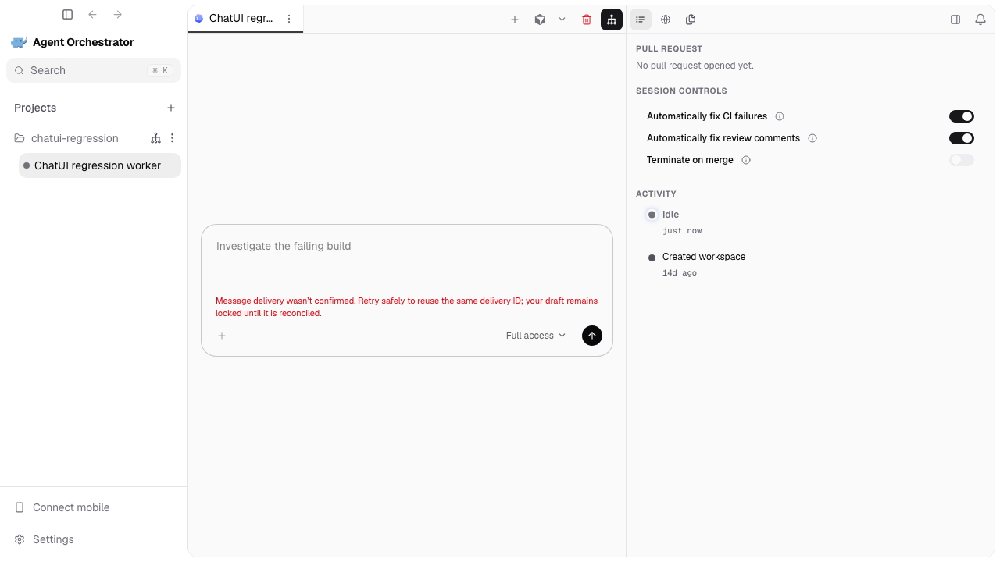
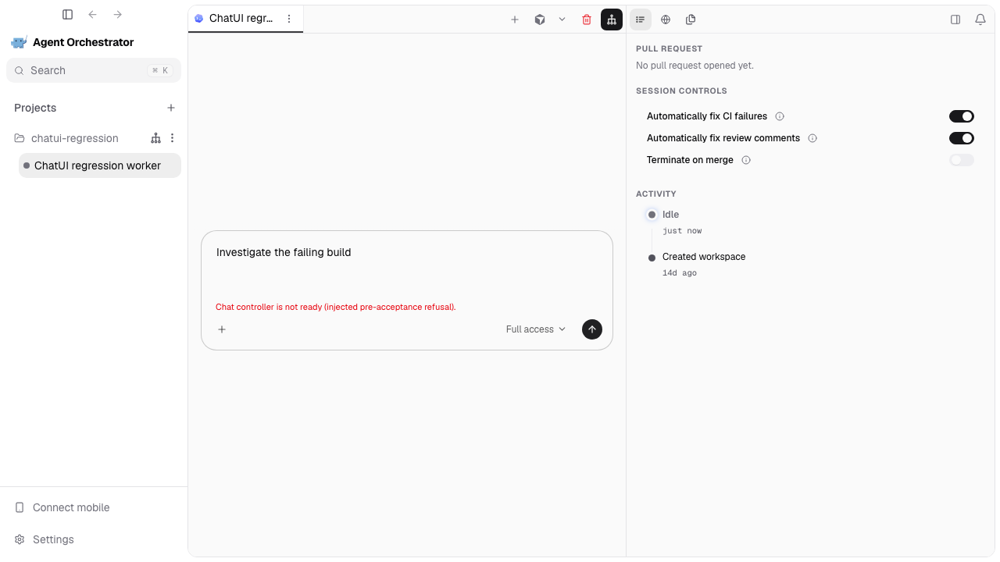
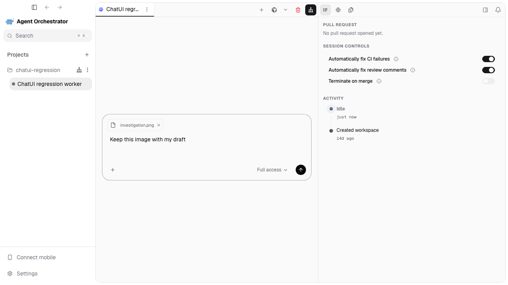
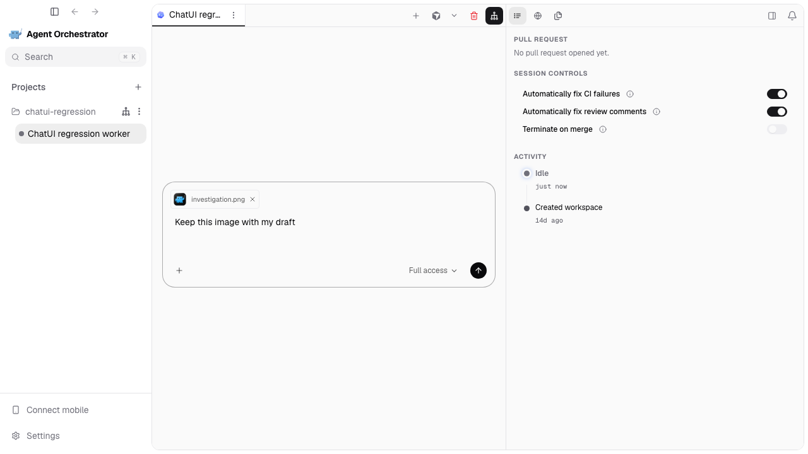

# Correctness fixes and full-stack re-review — 8 September 2026

Reviewed all six replacement PRs against their actual parent branches. The agreed scope is unchanged. The original #4463 remains draft.

Two independent final passes (behavior and implementation standards) found no remaining actionable correctness defects. The fixes are focused; minor optional duplication cleanup was not expanded into unrelated refactoring.

## What was fixed

- **#5106:** A first ordinary send rejected before acceptance (for example, `CHAT_CONTROLLER_NOT_READY`) used to leave the composer locked indefinitely. It now keeps the text editable, including after reload. An edited send receives a new request ID. A retry following an uncertain earlier attempt stays locked and keeps its original ID, even if that retry gets a definite refusal.
- **#5106:** An asynchronous native-image read now checks that it still owns the composer mutation before dispatch. This defensively prevents an obsolete continuation after authoritative session-incarnation replacement. Ordinary navigation/unmount remains supported; this was not established as a normally reachable cross-session production bug.
- **#5107:** Reloaded image descriptors now use their staged path for thumbnails. Previously the retained chip fell back to a generic file icon.
- **#5109:** Saved, cancelled, or replaced queued editors release their exact attachment metadata owner. Ordinary unmount and failed storage cleanup preserve recoverable descriptors. Actual staged bytes and other owners' drafts are untouched.
- **#5105, #5110, #5111:** No new actionable defect. Inline and steer dependents were restacked with the corrections; both mutation helpers were preserved in the inline conflict resolution.

## Direct before / after

These are actual screenshots and recordings of the production renderer. The daemon, preload and terminal transports are deterministic fixtures; they are not fresh native Electron/provider evidence. Existing native evidence in the individual PR descriptions remains separately labelled.

Before: original stack head `07f54cfb7c41990d4413988b538794a14452b3a2`.
After: corrected stack head `bfa0f6a58c6e370a7a1876c5545a7c8c035a357b`.

### Refused first send

| Before: text is locked behind recovery | After: text remains editable with the refusal displayed |
| --- | --- |
|  |  |

[Before recording](send-before.webm) · [After recording, including successful edited send](send-after.webm)

The browser test also reloads the composer, edits the text, sends successfully, and asserts that the new request ID differs from the refused one. A separate test loses the initial response, refuses its retry, and checks that both request bodies remain identical and editing stays locked.

### Reloaded thumbnail

| Before: generic file icon | After: the attached AO image is visible |
| --- | --- |
|  |  |

[Before recording](thumbnail-before.webm) · [After recording](thumbnail-after.webm)

The thumbnail check verifies a successful image load (`complete` and nonzero `naturalWidth`), not merely the presence of an image element. The displayed asset is the repository's AO icon.

## Evidence coverage

- Original stack: three expected-before checks passed, reproducing the locked first-send and missing-thumbnail behavior while confirming uncertain-retry protection.
- Corrected stack: all seven browser checks passed, covering first-send rejection and successful edited send, unchanged uncertain retries, attachment reload, queued-edit reload/cancel, inline-edit reload/cancel, and steer receipt reconciliation without provider redispatch.
- The thumbnail scenario was also rerun on both versions with the repository icon to make the before/after visible.
- New committed component regressions cover first-send rejection/remount/new identity, uncertain retry refusal, stale image-read continuation, and durable thumbnail remount.
- Queue lifecycle regression tests cover save, cancel, replacement, ordinary unmount, and failed persistence. The metadata cleanup is asserted through registry behavior; screenshots do not prove memory reclamation.

[Browser test source](correctness-review.spec.ts) · [Before results](before-results.json) · [After results](after-results.json)

Full suite results and remote checks are recorded in each PR description once complete. Local execution is macOS with Node 24.14.0 and Go 1.26.5. Docker did not respond, so Linux-container and native Windows validation are delegated to the corresponding CI jobs; no production publish was used as validation.
