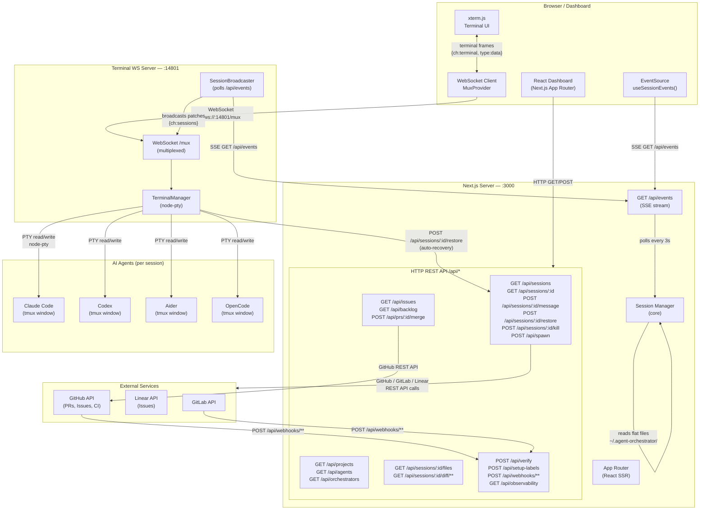
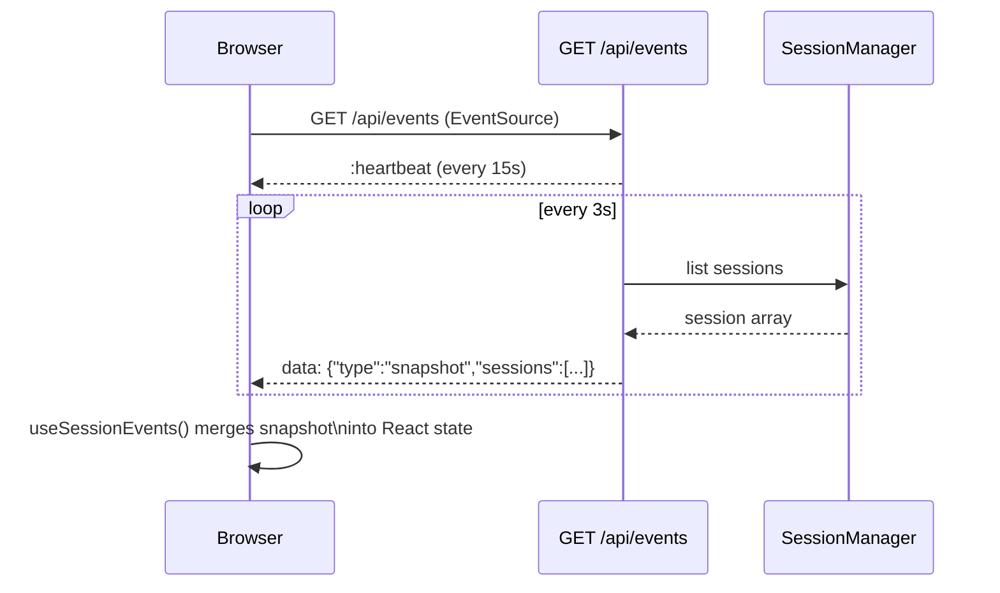
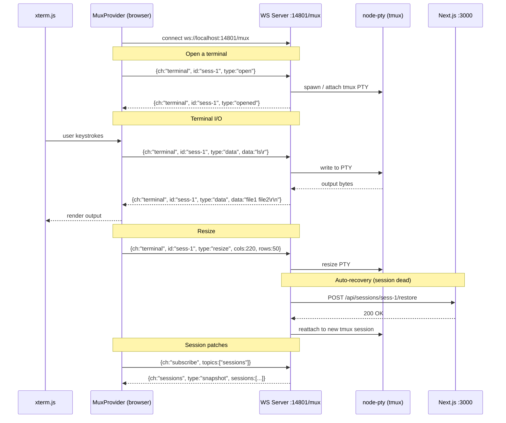
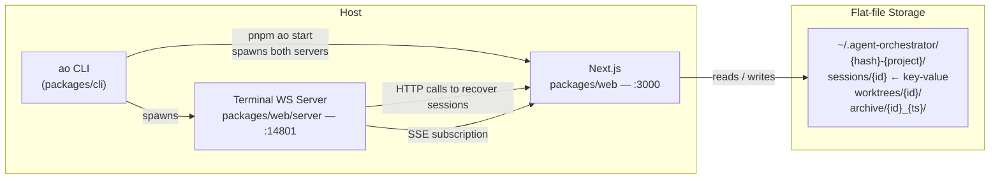

# Agent Orchestrator — Technical Architecture

This document explains how the various parts of the Agent Orchestrator communicate with each other, highlighting where HTTP, WebSocket, and SSE are used.

---

## System Overview



---

## Communication Channels

### 1. HTTP / REST — `/api/*` on port 3000

Used for all request-response interactions. The browser calls these directly; the CLI also uses them.

| Endpoint | Method | Purpose |
|----------|--------|---------|
| `/api/sessions` | GET | List all sessions (with PR / issue metadata) |
| `/api/sessions/light` | GET | Lightweight session list (minimal fields) |
| `/api/sessions/patches` | GET | Ultra-light patches (id, status, activity) — consumed by the Mux server |
| `/api/sessions/:id` | GET | Full session detail |
| `/api/sessions/:id/message` | POST | Send a message/command to a live agent |
| `/api/sessions/:id/restore` | POST | Respawn a terminated session |
| `/api/sessions/:id/kill` | POST | Terminate a running session |
| `/api/sessions/:id/files` | GET | Browse workspace files |
| `/api/sessions/:id/diff/**` | GET | File diff view |
| `/api/sessions/:id/sub-sessions` | GET / POST | List / create sub-sessions (forked agents) |
| `/api/spawn` | POST | Spawn a new agent session |
| `/api/projects` | GET | List configured projects |
| `/api/agents` | GET | List registered agent plugins |
| `/api/issues` | GET | Fetch backlog issues |
| `/api/backlog` | GET | Backlog summary |
| `/api/prs/:id/merge` | POST | Merge a PR |
| `/api/observability` | GET | Health and metrics summary |
| `/api/verify` | POST | Verify environment setup |
| `/api/setup-labels` | POST | Set up GitHub labels |
| `/api/webhooks/**` | POST | Inbound webhooks from GitHub / GitLab |

---

### 2. Server-Sent Events (SSE) — `GET /api/events`

A **unidirectional push stream** from server to browser. Used for real-time session status updates without polling from the client.



**Event payload shape:**
```json
{
  "type": "snapshot",
  "correlationId": "sse-abc123",
  "emittedAt": "2025-04-15T10:00:00Z",
  "sessions": [
    { "id": "sess-1", "status": "working", "activity": "active", "attentionLevel": "low" }
  ],
  "terminals": [
    { "id": "term-1", "tmuxName": "standalone-1", "alive": true }
  ]
}
```

**Client hook:** `useSessionEvents()` in `packages/web/src/hooks/useSessionEvents.ts`
- Opens an `EventSource` to `/api/events`
- On membership change (sessions added/removed) it fires a full `GET /api/sessions` fetch
- Falls back to Mux session patches when the Mux WebSocket is connected

The Mux server's `SessionBroadcaster` also consumes this same SSE endpoint to relay session patches to all connected WebSocket clients.

---

### 3. WebSocket (Multiplexed) — `ws://localhost:14801/mux`

A **bidirectional multiplexed channel** running on a separate Node.js process. It carries two independent sub-channels over a single connection:

- **`terminal` channel** — raw PTY I/O for xterm.js
- **`sessions` channel** — session patch broadcasts (forwarded from SSE)



**Message types:**

| Direction | Channel | Type | Payload |
|-----------|---------|------|---------|
| Client→Server | `terminal` | `open` | `{ id }` |
| Client→Server | `terminal` | `data` | `{ id, data: string }` |
| Client→Server | `terminal` | `resize` | `{ id, cols, rows }` |
| Client→Server | `terminal` | `close` | `{ id }` |
| Client→Server | `subscribe` | — | `{ topics: ["sessions"] }` |
| Client→Server | `system` | `ping` | — |
| Server→Client | `terminal` | `opened` | `{ id }` |
| Server→Client | `terminal` | `data` | `{ id, data: string }` |
| Server→Client | `terminal` | `exited` | `{ id, code }` |
| Server→Client | `terminal` | `error` | `{ id, message }` |
| Server→Client | `sessions` | `snapshot` | `{ sessions: SessionPatch[] }` |
| Server→Client | `system` | `pong` | — |

---

## Process Map



The CLI (`ao start`) is the entry point. It forks two long-running processes:
- **Next.js** on `:3000` — serves the dashboard and all REST/SSE routes
- **Terminal WS server** on `:14801` — handles multiplexed WebSocket + PTY management

Both processes share no in-memory state; coordination happens through flat files in `~/.agent-orchestrator/` and HTTP calls from the Mux server back to Next.js.

---

## Data Flow Summary

| Scenario | Protocol | Path |
|----------|----------|------|
| Load dashboard | HTTP GET | Browser → `:3000/` (SSR page) |
| List sessions | HTTP GET | Browser → `:3000/api/sessions` |
| Spawn new agent | HTTP POST | Browser → `:3000/api/spawn` |
| Send message to agent | HTTP POST | Browser → `:3000/api/sessions/:id/message` |
| Real-time status updates | SSE | Browser ← `:3000/api/events` (push, 3s interval) |
| Terminal output / input | WebSocket | Browser ↔ `:14801/mux` (bidirectional) |
| Mux watches session state | SSE | `:14801` ← `:3000/api/events` (server-to-server) |
| Mux restores dead session | HTTP POST | `:14801` → `:3000/api/sessions/:id/restore` |
| GitHub notifies of CI / PR | HTTP POST | GitHub → `:3000/api/webhooks/github` |
| CLI queries sessions | HTTP GET | `ao` CLI → `:3000/api/sessions` |
