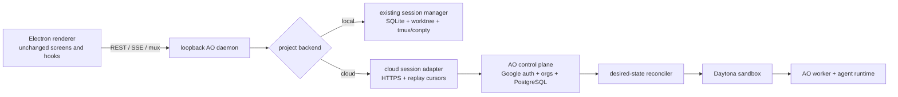
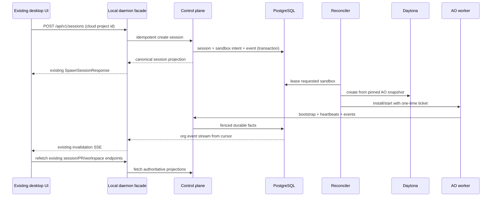

# Cloud integration: one AO, local and hosted execution

Status: accepted foundation; control-plane bootstrap implemented on PR #4116,
desktop project routing remains staged work

Research snapshot: `Untrivial-ai/ao-cloud@41f2f755ca815aca6df3ee310b1e7c79b041e4b0`, inspected 2026-08-18

Prior implementation reviewed: [`agent-orchestrator#3225`](https://github.com/Untrivial-ai/agent-orchestrator/pull/3225) at `19af4ffff1a01d1174a7eef401272d8359ba3929`, inspected 2026-08-19

Decision inputs: multi-tenant control plane, Daytona sandboxes, Google authentication, organizations from day one, PostgreSQL, and AO-held credential custody (locked 2026-07-28)

## Executive decision

Merge the useful control-plane and worker implementation from `ao-cloud` into this repository, but do not merge its product UI or treat its current WorkOS and NodeOps choices as accepted architecture.

The desktop renderer must continue to use one loopback API, one set of queries, and one set of components. The local daemon becomes a routing facade:



A project has one durable execution placement, `local` or `cloud`. Placement is chosen before a session is created. It does not change for a live session, and a local session is never silently moved into a hosted sandbox. The control plane is authoritative for cloud project/session/workspace/SCM facts; local SQLite is authoritative for local facts and stores only cloud identity links and replay cursors, not a second copy of cloud status.

This supersedes the public/private ownership split described in [`docs/cloud-development.md`](../cloud-development.md) and [`docs/cloud-refactor.md`](../cloud-refactor.md). Their extracted contract and presentation boundaries remain useful; their separate-repository and separate-Cloud-UI conclusions do not.

### Bootstrap implementation in this PR

The source snapshot described below is now imported under
[`backend/internal/cloud`](../../backend/internal/cloud), with its binaries under
[`backend/cmd`](../../backend/cmd) and PostgreSQL history under
[`backend/internal/cloud/postgres/migrations`](../../backend/internal/cloud/postgres/migrations).
The separate Next.js product UI was not imported.

This PR also implements the locked hosted choices:

- Google OIDC identity exchange and AO-issued short access/rotating refresh
  sessions in [`backend/internal/cloud/auth`](../../backend/internal/cloud/auth);
- native AO organizations and database-authoritative membership checks;
- the official Daytona Go SDK behind the existing sandbox provider and
  reconciler in
  [`backend/internal/cloud/sandbox/daytona`](../../backend/internal/cloud/sandbox/daytona);
- AWS bootstrap infrastructure and migration-first ECS rollout in
  [`deploy/cloud/terraform`](../../deploy/cloud/terraform) and
  [`docs/cloud/deployment.md`](../cloud/deployment.md).

The Electron-to-daemon cloud placement/resolver and renderer-neutral terminal
proxy remain deliberately outside this bootstrap. Until those seams land, the
new service plane is buildable and independently testable but local projects do
not call it.

## Research method and security note

The cloud repository was cloned into `/tmp` and left outside this worktree. The review traced binaries, handlers, SQL migrations, reconciliation, worker startup, browser/terminal transport, frontend callers, deployment assets, and tests. `go test ./...` passed at the snapshot above. PR #3225 was inspected from a separate detached `/tmp` worktree, including its 116-file diff, 17 commits, linked design, implementation tests, and final head. Its focused cloud/control-plane/bus packages passed locally; its CLI suite also passed after clearing the current AO worker's inherited `AO_SESSION_ID` and `AO_PROJECT_ID`, which otherwise intentionally change CLI project resolution.

A redacted full-repository `gitleaks detect` scan found no committed secret. A filename/pattern scan found `.env.example` and a synthetic credential-shaped test fixture, but no confirmed credential, private key, token, or populated environment file. Nothing from the scan was copied into this repository. The source is nevertheless security-sensitive: deployment configuration names AWS secret locations and environment-variable contracts, and the database schema contains encrypted provider, GitHub, and repository-capability material. Import history and artifacts only; never import a developer `.env`, generated deployment output, database dump, or local auth store.

### Prior in-repository implementation: PR #3225

PR #3225 is valuable implementation evidence, not the merge base. It put a Daytona-backed, Clerk-authenticated control plane directly into this repository as an earlier alternative to the `ao-cloud` code reviewed here. It proved live Daytona provisioning and four-location agent coordination, while its follow-up commits documented failures that an integration must prevent. It is still an open draft with no review discussion, uses per-session Local/Cloud selection rather than project placement, and predates the locked Google/AO-custody decisions.

| Evidence from PR #3225 | Lesson to carry forward | Integration decision |
| --- | --- | --- |
| [`internal/cloud/provider.go`](https://github.com/Untrivial-ai/agent-orchestrator/blob/19af4ffff1a01d1174a7eef401272d8359ba3929/backend/internal/cloud/provider.go), [`daytona.go`](https://github.com/Untrivial-ai/agent-orchestrator/blob/19af4ffff1a01d1174a7eef401272d8359ba3929/backend/internal/cloud/daytona.go), and [`recipes.go`](https://github.com/Untrivial-ai/agent-orchestrator/blob/19af4ffff1a01d1174a7eef401272d8359ba3929/backend/internal/cloud/recipes.go) successfully separated provider operations, pinned images, harness setup, and egress domains. | Provider conformance, immutable worker images, a fake recipe, and per-harness outbound policy are proven useful. | Port its Daytona state/egress/label tests into the merged provider suite. Keep the newer `ao-cloud` reconciler as lifecycle owner and use the supported Daytona SDK rather than copying the old hand-written REST contract. |
| [`supervisor.go`](https://github.com/Untrivial-ai/agent-orchestrator/blob/19af4ffff1a01d1174a7eef401272d8359ba3929/backend/internal/cloud/supervisor.go) returned `provisioning` early, deduplicated retrying spawns, and recorded a durable fallback card. | Provisioning is an asynchronous command, not an HTTP request lifetime. A temporary sandbox outage must not erase the session from the product. | Keep command idempotency and durable desired/observed state in PostgreSQL. Do not copy the detached goroutine plus process-memory authoritative map or whole-table `Save` in [`pgstore.go`](https://github.com/Untrivial-ai/agent-orchestrator/blob/19af4ffff1a01d1174a7eef401272d8359ba3929/backend/internal/controlplane/pgstore.go). |
| Live testing found that sandbox-local IDs collide. The fix routes by sandbox ID and rewrites only at the edge in [`locations.go`](https://github.com/Untrivial-ai/agent-orchestrator/blob/19af4ffff1a01d1174a7eef401272d8359ba3929/backend/internal/controlplane/locations.go) and [`bus.go`](https://github.com/Untrivial-ai/agent-orchestrator/blob/19af4ffff1a01d1174a7eef401272d8359ba3929/backend/internal/controlplane/bus.go). Tests also added registration ownership, tenant isolation, scoped-token relationships, and compare-and-delete for stale streams. | A display/session ID is not a globally routable identity. Live location ownership is security state, and reconnect teardown can race replacement. | Introduce a canonical opaque session address and epoch-fenced location lease. Carry forward the collision, hijack, cross-tenant, authorization-relationship, and stale-reconnect tests. |
| The federated bus in [`busproto`](https://github.com/Untrivial-ai/agent-orchestrator/blob/19af4ffff1a01d1174a7eef401272d8359ba3929/backend/internal/busproto/proto.go) and [`busclient`](https://github.com/Untrivial-ai/agent-orchestrator/blob/19af4ffff1a01d1174a7eef401272d8359ba3929/backend/internal/busclient/client.go) let a keyless cloud orchestrator delegate child creation and let local/cloud agents address one another. | Agent-to-agent `spawn`, `send`, and `terminate` need a location-independent command path. A cloud worker must never receive the Daytona manager key. | Add durable `SessionCommand` routing and session-scoped worker authority to the control plane. Children inherit their project's placement. Use an outbound client connection only where a cloud command must reach a laptop; never expose the loopback daemon on the network. |
| [`service/session/service.go`](https://github.com/Untrivial-ai/agent-orchestrator/blob/19af4ffff1a01d1174a7eef401272d8359ba3929/backend/internal/service/session/service.go) routed a send remotely only after a local miss, and [`cli/fleet.go`](https://github.com/Untrivial-ai/agent-orchestrator/blob/19af4ffff1a01d1174a7eef401272d8359ba3929/backend/internal/cli/fleet.go) merged local and remote inventory. | Local-first fallback and graceful cloud unavailability are useful, but separate `fleet` and `session ls` vocabularies leak topology. | Route by canonical address/project placement, not by ambiguous local miss. Extend the canonical session list/send CLI and API to union backends; do not add a parallel fleet product model. |
| The sandbox ran a full nested daemon and was reached through a signed inbound preview URL in [`supervisor.go`](https://github.com/Untrivial-ai/agent-orchestrator/blob/19af4ffff1a01d1174a7eef401272d8359ba3929/backend/internal/cloud/supervisor.go). | Reusing the daemon made the prototype quick, but created nested SQLite/project/session identity, two lifecycle authorities, inbound bearer URLs, and edge ID rewriting. | Run the dedicated outbound-only `ao-worker` from `ao-cloud`. Reuse agent/runtime libraries, not the full local daemon or its unauthenticated app API, inside a sandbox. |
| Renderer routing spread cloud knowledge across 36 changed renderer files, including [`cloud-sessions.ts`](https://github.com/Untrivial-ai/agent-orchestrator/blob/19af4ffff1a01d1174a7eef401272d8359ba3929/frontend/src/renderer/lib/cloud-sessions.ts), [`session-api.ts`](https://github.com/Untrivial-ai/agent-orchestrator/blob/19af4ffff1a01d1174a7eef401272d8359ba3929/frontend/src/renderer/lib/session-api.ts), and [`useTerminalSession.ts`](https://github.com/Untrivial-ai/agent-orchestrator/blob/19af4ffff1a01d1174a7eef401272d8359ba3929/frontend/src/renderer/hooks/useTerminalSession.ts). | Even with shared components, renderer-side backend selection becomes a second product architecture and forces cloud branches into every interaction. | Keep the renderer on one loopback facade. The daemon resolves the backend and translates cloud REST/events/terminal protocols. UI sees capabilities and generic connection states, never preview URLs or transport selection. |
| The prototype passed a model credential through renderer HTTP, wrote model/GitHub credentials into the sandbox home, persisted a daemon bus token file, and used signed preview URLs as share/terminal capabilities. | “Not stored by the control plane” is weaker than AO-held custody: secrets still crossed renderer, request, filesystem, snapshot, and URL boundaries. | Reject these paths. Renderer stays token-free, user model credentials are held/encrypted by AO, worker credentials are short-lived and ephemeral, repository grants are scoped, and no sandbox preview bearer is returned to a device or persisted. |
| A follow-up disabled Daytona's idle auto-stop after it killed a long-running agent; another added bounded retry/back escape states when a sandbox was unreachable. | Provider idle detection cannot substitute for AO lifecycle, and network failure must be a visible recoverable state. | Disable provider-initiated idle stop. AO alone requests pause after durable checkpoint policy. Preserve generic `connecting`, `unavailable`, retry, and back states without cloud-specific screens. |

PR #3225 therefore strengthens the facade/reconciler/worker design below. It also supplies useful tests and operational cases to salvage. Its nested daemon, direct-preview transport, renderer registry, whole-table PostgreSQL store, Clerk identity, per-session placement toggle, and credential propagation are intentionally not adopted.

## A. `ao-cloud` codebase map

### Executables and services

| Area | Evidence at the snapshot | What it does | Assessment |
| --- | --- | --- | --- |
| Control plane | [`cmd/ao-cloud/main.go`](https://github.com/Untrivial-ai/ao-cloud/blob/41f2f755ca815aca6df3ee310b1e7c79b041e4b0/cmd/ao-cloud/main.go), [`internal/httpapi/server.go`](https://github.com/Untrivial-ai/ao-cloud/blob/41f2f755ca815aca6df3ee310b1e7c79b041e4b0/internal/httpapi/server.go) | Wires auth, PostgreSQL, GitHub, worker tokens, sandbox reconciliation, idle pause, PR polling, and HTTP routes. | Keep the service responsibilities; split the large wiring/handler package when it moves under `backend/internal/cloud`. |
| Database migration/health tools | [`cmd/ao-cloud-migrate/main.go`](https://github.com/Untrivial-ai/ao-cloud/blob/41f2f755ca815aca6df3ee310b1e7c79b041e4b0/cmd/ao-cloud-migrate/main.go), [`cmd/ao-cloud-healthcheck/main.go`](https://github.com/Untrivial-ai/ao-cloud/blob/41f2f755ca815aca6df3ee310b1e7c79b041e4b0/cmd/ao-cloud-healthcheck/main.go) | Applies embedded Goose migrations and supplies container health checks. | Keep, under this repository's Go module and release pipeline. |
| Sandbox worker | [`cmd/ao-worker/main.go`](https://github.com/Untrivial-ai/ao-cloud/blob/41f2f755ca815aca6df3ee310b1e7c79b041e4b0/cmd/ao-worker/main.go) | Redeems a one-time bootstrap ticket, checks out the repository, fetches one agent credential, launches the interactive agent PTY, heartbeats, and polls durable turn/transport queues. It opens no inbound port. | Keep the outbound-only trust model and epoch fencing; rewrite its harness and credential preparation around main-repo adapters. |
| Worker-local `ao` | [`cmd/ao-cloud-agent/main.go`](https://github.com/Untrivial-ai/ao-cloud/blob/41f2f755ca815aca6df3ee310b1e7c79b041e4b0/cmd/ao-cloud-agent/main.go) | Thin worker-authenticated CLI for hooks, child spawn/list/send/delete, and PR claim. | Keep the thin-client model; converge commands and error envelopes with the main CLI rather than maintaining a second vocabulary. |
| PostgreSQL store | [`internal/postgres`](https://github.com/Untrivial-ai/ao-cloud/tree/41f2f755ca815aca6df3ee310b1e7c79b041e4b0/internal/postgres) | Tenant-scoped transactions, command idempotency, queues/leases, events, worker epochs, SCM, shares, and sandbox intent. | Keep and move largely intact. Add package-level seams before feature changes; do not translate it into SQLite. |
| Sandbox reconciliation | [`internal/reconcile/reconciler.go`](https://github.com/Untrivial-ai/ao-cloud/blob/41f2f755ca815aca6df3ee310b1e7c79b041e4b0/internal/reconcile/reconciler.go), [`internal/sandbox/provider.go`](https://github.com/Untrivial-ai/ao-cloud/blob/41f2f755ca815aca6df3ee310b1e7c79b041e4b0/internal/sandbox/provider.go) | Leases desired-state rows across replicas, bounds provider/org concurrency, maps provider state into AO state, repairs missing/silent workers, and treats probe errors as inconclusive. | Keep. This is the best cloud-specific lifecycle boundary in the repository. Implement Daytona behind it. |
| Current providers | [`internal/sandbox/createos/client.go`](https://github.com/Untrivial-ai/ao-cloud/blob/41f2f755ca815aca6df3ee310b1e7c79b041e4b0/internal/sandbox/createos/client.go), [`internal/sandbox/docker/client.go`](https://github.com/Untrivial-ai/ao-cloud/blob/41f2f755ca815aca6df3ee310b1e7c79b041e4b0/internal/sandbox/docker/client.go), [`internal/sandboxresolve/resolver.go`](https://github.com/Untrivial-ai/ao-cloud/blob/41f2f755ca815aca6df3ee310b1e7c79b041e4b0/internal/sandboxresolve/resolver.go) | Production uses NodeOps through a CreateOS client; local tests use Docker and a persistent named volume. `daytona` and `ecs` are accepted names but resolve as unsupported. | Keep Docker as the local conformance provider. Drop NodeOps/CreateOS after Daytona reaches conformance. Do not expose placeholder providers as configurable choices. |
| GitHub integration | [`internal/githubapp`](https://github.com/Untrivial-ai/ao-cloud/tree/41f2f755ca815aca6df3ee310b1e7c79b041e4b0/internal/githubapp), [`internal/prstatus/prstatus.go`](https://github.com/Untrivial-ai/ao-cloud/blob/41f2f755ca815aca6df3ee310b1e7c79b041e4b0/internal/prstatus/prstatus.go) | GitHub App installation/grant lifecycle, encrypted user OAuth, repository-scoped worker grants, PR creation/claim/review, webhook inbox, and a 30-second PR refresh loop. | Keep the GitHub App custody and grants; adapt outputs to the main SCM facts and reaction rules. |
| Web Cloud UI | [`src/app/app`](https://github.com/Untrivial-ai/ao-cloud/tree/41f2f755ca815aca6df3ee310b1e7c79b041e4b0/src/app/app), [`src/lib/cloud-client.ts`](https://github.com/Untrivial-ai/ao-cloud/blob/41f2f755ca815aca6df3ee310b1e7c79b041e4b0/src/lib/cloud-client.ts) | A separate Next.js host with `Cloud*` screens. It uses some `@aoagents/product-ui` leaves but still owns duplicate board/session/workspace behavior and direct cloud polling. | Drop as a product surface for this integration. Reuse only tests or pure helpers that can move into the existing shared packages without Cloud-specific components. |
| Deployment | [`Dockerfile`](https://github.com/Untrivial-ai/ao-cloud/blob/41f2f755ca815aca6df3ee310b1e7c79b041e4b0/Dockerfile), [`nodeops/Sandbox.Dockerfile`](https://github.com/Untrivial-ai/ao-cloud/blob/41f2f755ca815aca6df3ee310b1e7c79b041e4b0/nodeops/Sandbox.Dockerfile), [`scripts`](https://github.com/Untrivial-ai/ao-cloud/tree/41f2f755ca815aca6df3ee310b1e7c79b041e4b0/scripts) | Builds separate control-plane/worker artifacts and deploys digest-pinned ECS services with migration-first promotion and monitoring helpers. | Keep the release discipline and reusable scripts. Replace NodeOps image publication and remove assumptions that the app lives in a nested private checkout. |

### Durable data model

The founding migration is a 28-table, UUID-based multi-tenant schema with composite `(org_id, id)` relationships and forced row-level security: [`internal/postgres/migrations/00001_founding_schema.sql`](https://github.com/Untrivial-ai/ao-cloud/blob/41f2f755ca815aca6df3ee310b1e7c79b041e4b0/internal/postgres/migrations/00001_founding_schema.sql). Later forward migrations bring the snapshot to 29 migrations.

The model falls into these groups:

| Group | Principal tables | Notes |
| --- | --- | --- |
| Identity and tenancy | `ao_users`, `ao_auth_sessions`, `ao_organizations`, `ao_org_memberships`, `ao_org_invitations` | Organization ownership exists from the founding schema. RLS context is set per transaction. Current provider values are `workos` and `local`; this must migrate to Google plus development-only local auth. |
| Projects and sessions | `ao_projects`, `ao_sessions`, `ao_sandboxes`, `ao_worker_connections` | One sandbox per session. Session stores durable activity and termination facts plus a sandbox-derived runtime projection. Sandbox stores desired and observed state separately. |
| Commands and event history | `ao_commands`, `ao_events`, `ao_turns` | Idempotency receipts, per-session gap-free event sequences, and one unfinished turn per session. This is a good basis for replay and multi-replica correctness. |
| Worker transport | `ao_access_tickets`, `ao_worker_requests`, `ao_terminal_sessions`, `ao_terminal_output` | One-time hashed tickets, epoch-fenced durable commands, leased execution, bounded terminal replay, and terminal resize/input acknowledgements. See [`00008_worker_transport.sql`](https://github.com/Untrivial-ai/ao-cloud/blob/41f2f755ca815aca6df3ee310b1e7c79b041e4b0/internal/postgres/migrations/00008_worker_transport.sql). |
| Credentials and GitHub | `ao_provider_connections`, `ao_user_provider_connections`, GitHub installations/repositories/grants/capabilities/user connections/webhook deliveries | Secrets are ciphertext plus nonce; installation and repository authorization are server-side. User-scoped provider credentials can fall back across orgs. |
| SCM and review | `ao_issues`, `ao_session_issue_links`, `ao_pull_requests`, `ao_pr_review_threads`, `ao_review_runs` | Pull-request facts are durable and use shared Go contract enums. Status polling and worker-originated PR/review operations update these rows. |
| Sharing and audit | project share links/grants/grant sessions, `ao_audit_events` | Audit is append-only. Share policy adds useful tenancy tests, but sharing is not required for the first desktop/cloud slice. |

Two naming problems must be fixed before the models are shared:

1. Cloud `sessions.mode` means `read-only | standard | trusted`, while the main daemon's [`domain.Session.Mode`](../../backend/internal/domain/session.go) means `chat | tui`. Rename the cloud column/DTO to `permission_mode` and add a separate `interface_mode` before exposing cloud sessions through the main API.
2. A cloud `project` is a remote repository intent and has no host path. The main [`domain.ProjectRecord`](../../backend/internal/domain/project.go) assumes a local `Path`. Project placement must become a discriminated model, not an empty or invented path.

### Public and control-plane API

The public client contract already lives in this repository at [`contracts/cloud/openapi.yaml`](../../contracts/cloud/openapi.yaml), with the generated client in [`packages/cloud-client`](../../packages/cloud-client). The implementation registers routes in cloud [`internal/httpapi/server.go`](https://github.com/Untrivial-ai/ao-cloud/blob/41f2f755ca815aca6df3ee310b1e7c79b041e4b0/internal/httpapi/server.go).

The user-facing `/api/cloud/v1` surface includes:

- account/org membership and organization administration;
- agent availability and user/org provider credentials;
- project list/create/update/delete, GitHub installations/repositories/import, and scratch projects;
- session list/create/get/delete/wake, messages, cancellation, replay, and per-session SSE;
- workspace list/read/write/diff and a browser HTTP proxy executed inside the sandbox;
- PR/review projections and sharing;
- one-time terminal tickets and a direct WebSocket.

The worker-only surface includes bootstrap, heartbeat/token rotation, event publication, turn claim/complete/fail/cancel observation, credential and Git checkout/push grants, PR/review delivery, orchestrator children, durable workspace transport, and terminal output/exit.

The contract is incomplete relative to the implementation: organization invites/members, shares, browser proxy, wake, several GitHub broker routes, push/GitHub-token/PR/review worker routes, and some agent-terminal behavior are registered but absent or lagging in the public OpenAPI. The cloud repo also hand-maintains handler DTOs. On merge, `contracts/cloud/openapi.yaml` remains the external source until cloud endpoints can join the main code-first spec generator; CI must assert route/spec parity in either case.

### How a cloud session is launched and observed

1. Session creation reserves the idempotency key and atomically inserts the session, initial event/turn, audit record, and `ao_sandboxes` row with desired `running` and observed `requested` state in [`internal/postgres/project_session_store.go`](https://github.com/Untrivial-ai/ao-cloud/blob/41f2f755ca815aca6df3ee310b1e7c79b041e4b0/internal/postgres/project_session_store.go).
2. A reconciler replica leases the sandbox row with `SKIP LOCKED`, resolves its provider, issues a one-time bootstrap ticket, and creates or repairs the environment. Leases are renewed across slow provider calls, and global/provider/org concurrency is bounded in [`internal/reconcile/reconciler.go`](https://github.com/Untrivial-ai/ao-cloud/blob/41f2f755ca815aca6df3ee310b1e7c79b041e4b0/internal/reconcile/reconciler.go).
3. `ao-worker` starts inside the sandbox, redeems the ticket for a short-lived epoch-bound JWT, fetches a repository-scoped GitHub grant, clones/reuses the exact repository, and installs managed git/`gh` helpers. The checkout protection is in [`internal/worker/checkout.go`](https://github.com/Untrivial-ai/ao-cloud/blob/41f2f755ca815aca6df3ee310b1e7c79b041e4b0/internal/worker/checkout.go).
4. The worker requests only the selected harness credential. It currently builds an interactive Claude Code, Codex, or Cursor command through [`internal/workerexec/command.go`](https://github.com/Untrivial-ai/ao-cloud/blob/41f2f755ca815aca6df3ee310b1e7c79b041e4b0/internal/workerexec/command.go) and the main repo's [`backend/pkg/agentruntime`](../../backend/pkg/agentruntime).
5. The worker launches the native agent in a PTY and publishes terminal bytes through durable, sequenced PostgreSQL rows. It polls and leases workspace/terminal commands and forwards message turns into the agent PTY in [`internal/workertransport/supervisor.go`](https://github.com/Untrivial-ai/ao-cloud/blob/41f2f755ca815aca6df3ee310b1e7c79b041e4b0/internal/workertransport/supervisor.go).
6. Heartbeat is the only path that marks a worker connected/running. A provider reporting a running VM is not sufficient. Missing heartbeat triggers repair; provider probe failure does not prove death.
7. User events are committed with a per-session sequence and replayed/polled over SSE by [`internal/httpapi/event_handlers.go`](https://github.com/Untrivial-ai/ao-cloud/blob/41f2f755ca815aca6df3ee310b1e7c79b041e4b0/internal/httpapi/event_handlers.go). Terminal output has its own sequence and reconnect cursor in [`internal/httpapi/terminal_handlers.go`](https://github.com/Untrivial-ai/ao-cloud/blob/41f2f755ca815aca6df3ee310b1e7c79b041e4b0/internal/httpapi/terminal_handlers.go).

The older headless `workerexec.Supervisor`/`OSRunner` path still exists and streams `chat.assistant_delta`, but `cmd/ao-worker` now runs the interactive `workertransport.Supervisor`. Keeping both obscures the authoritative execution model. Remove the unused headless supervisor after any reusable cancellation/output tests are moved.

### Authentication, tenancy, and credential custody

The reviewed source behavior was WorkOS-specific. Its desktop implementation in [`frontend/src/main/cloud-auth.ts`](../../frontend/src/main/cloud-auth.ts) performed WorkOS/AuthKit PKCE and kept refresh/access tokens in Electron main using `safeStorage`; the renderer received only account identity. The source control plane's [`internal/auth/auth.go`](https://github.com/Untrivial-ai/ao-cloud/blob/41f2f755ca815aca6df3ee310b1e7c79b041e4b0/internal/auth/auth.go) verified WorkOS OIDC and mapped WorkOS organization claims, with development-only local email/password auth.

The integrated server now replaces that hosted path with Google token
verification plus AO sessions; WorkOS remains only as development compatibility
code and hosted config rejects it. The desktop Authorization Code + PKCE and
protected Electron-main refresh-token broker remain the next client-side seam.
Google explicitly recommends PKCE for desktop apps in its [OAuth best
practices](https://developers.google.com/identity/protocols/oauth2/resources/best-practices),
and its [OIDC reference](https://developers.google.com/identity/openid-connect/reference)
defines the issuer/audience/JWKS validation used here.

Coding-agent and sandbox credentials are encrypted with AES-GCM and associated data by cloud [`internal/secrets/cipher.go`](https://github.com/Untrivial-ai/ao-cloud/blob/41f2f755ca815aca6df3ee310b1e7c79b041e4b0/internal/secrets/cipher.go). Worker bootstrap tickets are random/hashed/single-use; worker JWTs are short-lived and epoch-scoped; GitHub tokens are repository-scoped and minted on demand. These are good foundations.

Before production, replace the single raw environment key with a versioned KMS envelope key and rotation metadata. Also move worker auth/config outside the persistent repository volume: the current worker writes its rotating token to `AO_DATA_DIR`, and Codex login material can be written below that directory. A deleted/reassigned sandbox must not retain a plaintext coding credential. Prefer Daytona's outbound-proxy [secret placeholders](https://www.daytona.io/docs/en/secrets/) where a provider protocol is compatible; otherwise mount an in-memory credential directory, scrub it on process exit, and never snapshot it.

### Code quality and reuse decision

The cloud code is substantial rather than a prototype: about 29k non-test Go lines, 16k Go test lines, PostgreSQL integration tests, Docker lifecycle tests, provider fakes, HTTP integration tests, web tests, image-contract checks, and deployment-helper tests. Its Go suite passed at the reviewed commit.

| Keep | Rewrite or converge | Drop |
| --- | --- | --- |
| PostgreSQL schema history and RLS transaction pattern | WorkOS identity into Google identity and AO-native org membership | Next `Cloud*` product screens and direct Cloud UI polling |
| Desired/observed sandbox state, reconciler leases, epoch fencing, and conservative probes | NodeOps provider into a Daytona provider while retaining `sandbox.Provider` conformance tests | NodeOps/CreateOS adapter and image after Daytona cutover |
| One-time bootstrap, short worker JWTs, outbound-only workers | Worker launch around the main agent/chat adapter registry; separate `interface_mode` from `permission_mode` | Unused headless `workerexec.Supervisor` once tests are retained |
| Durable commands/events/turns/terminal replay and bounded workspace RPC | Cloud HTTP DTOs into canonical main read models; add missing route/spec parity | Placeholder `ecs` configuration that cannot resolve |
| GitHub App grants, webhook inbox, scoped checkout/push tokens | PR/review projections into main lifecycle reactions and action interfaces | Private-submodule update workflow and nested-checkout build assumptions |
| Shared `backend/pkg/contract`, `backend/pkg/agentruntime`, `packages/cloud-client`, and `packages/product-ui` | Go versions and dependencies: cloud is Go 1.26.5, main backend is Go 1.25.7 at this snapshot | Duplicated Cloud presentation helpers that cannot be made transport-neutral |
| Migration-first, exact-digest deployment discipline | Stale documentation: cloud `docs/control-plane.md` still describes the now-implemented reconciler and agent terminal as future/excluded | Any local `.env`, generated secret output, or developer data |

## B. Gap analysis against the main repository

### What already supports cloud

- The main architecture already separates agent, runtime, workspace, SCM, tracker, and notification ports under [`backend/internal/ports`](../../backend/internal/ports).
- [`ports.Runtime`](../../backend/internal/ports/outbound.go) uses opaque handles and conservative liveness, and [`ports.Attacher`](../../backend/internal/ports/outbound.go) abstracts terminal streams. Those concepts map well to a remote runtime handle and a WAN attach, even though the interface level is too low for control-plane orchestration.
- [`lifecycle.Manager.ApplyRuntimeObservation`](../../backend/internal/lifecycle/manager.go) already refuses to infer death from failed probes. Cloud reconciliation follows the same rule.
- Main status is derived from durable activity/termination/PR facts in [`backend/internal/service/session/status.go`](../../backend/internal/service/session/status.go), and cloud already imports the pure rules from [`backend/pkg/contract`](../../backend/pkg/contract). Keep one vocabulary and one set of truth tables.
- The terminal layer's source boundary lives next to its consumer in [`backend/internal/terminal/attachment.go`](../../backend/internal/terminal/attachment.go). Its reconnection model is useful, but cloud needs cursor replay and acknowledgements rather than a raw fresh PTY attach.
- Shared Cloud contracts and presentation already exist in [`contracts/cloud`](../../contracts/cloud), [`packages/cloud-client`](../../packages/cloud-client), and [`packages/product-ui`](../../packages/product-ui). The desktop already consumes product UI leaves through, for example, [`frontend/src/renderer/components/SessionsBoardAdapters.tsx`](../../frontend/src/renderer/components/SessionsBoardAdapters.tsx).
- Electron already keeps auth tokens out of the renderer in [`frontend/src/main/cloud-auth.ts`](../../frontend/src/main/cloud-auth.ts), though the provider must change.

### Where new seams are required

| Concern | Why the existing seam is insufficient | Required seam |
| --- | --- | --- |
| Session lifecycle | [`session_manager.Manager.Spawn`](../../backend/internal/session_manager/manager.go) creates a local durable row, local worktree, local agent command, and local runtime. Implementing only `ports.Runtime` for cloud would still perform all four local steps and then ask the control plane to duplicate them. | Route above `session_manager`: a project-scoped session backend composed of lifecycle, query, workspace, terminal, SCM, and event capabilities. The existing manager becomes the local implementation. |
| Project identity | `ProjectRecord.Path` and many services assume a host checkout. A cloud repository lives only in a sandbox/control-plane grant. | A discriminated `ProjectPlacement` with enforced local/cloud invariants and a `CloudProjectLocator { account_id, org_id, remote_project_id }`. No fake filesystem path. |
| Session identity | Local session IDs are user-oriented strings; cloud IDs are UUIDs and can arrive from another desktop. | An opaque API session reference plus a local `cloud_session_links` identity map. Store remote IDs/project/org and replay cursor only, never activity/status/PR facts. |
| Agent command routing | Local CLI/service calls assume the target belongs to the current daemon. A cloud orchestrator is keyless and cannot create a sibling sandbox; guessing “remote” after a local ID miss is ambiguous. | A tenant-scoped `SessionAddress` and durable `SessionCommandRouter` for child spawn/send/terminate. Children inherit project placement; cloud commands are idempotent and epoch-fenced. An optional outbound desktop gateway is required only for explicitly supported cloud-to-local commands. |
| Terminal over WAN | Main mux expects `ReadWriteCloser + Resize`; cloud tickets provide replay sequences, reset/ready markers, input acknowledgements, worker epochs, and expiring leases. Raw adaptation would lose correctness on reconnect. | A `TerminalBridge` implemented by local PTY attach and cloud ticket/WebSocket proxy. The daemon continues to expose the same `/mux` protocol to xterm and translates cloud protocol v2 internally. |
| Events | Main has one SQLite CDC stream; cloud has one durable SSE stream per session. N sessions means N WAN streams, and neither feeds the local invalidation stream. | Add an org-level ordered cloud event feed with cursor/filtering. A daemon event federator resumes it, maps remote IDs, and publishes the same invalidation categories to the existing local broadcaster. |
| Chat versus TUI | Main `SessionMode` means conversation interface; cloud `mode` means permission ceiling. Cloud's current interactive worker produces terminal output, while its old headless path produces partial chat events. | Split `interface_mode` and `permission_mode`. For TUI, proxy the remote agent terminal. For Chat, run the same native chat driver/controller in the worker and persist canonical conversation events; never infer Chat messages from terminal bytes. |
| Agent adapters | Main has 25+ adapters and native chat drivers. Cloud hard-codes three harnesses and image binaries. | Build the worker with the same resolver/registry interfaces and publish an image capability manifest. Availability is the intersection of image installation, credential availability, org policy, and interface capability. |
| Workspaces | Main worktree methods operate on host paths and preserve dirty work in local git refs. Cloud RPC offers bounded files/diff but its sandbox deletion can destroy unpushed work. | A backend-neutral workspace read API plus cloud checkpoint semantics. Before destructive sandbox deletion, create an AO-owned preserved commit/bundle, encrypt it in object storage, and record its checksum/ref; restore must apply it before agent launch. |
| SCM observation/actions | Main observer writes SQLite and triggers local lifecycle reactions. Cloud uses GitHub App rows/polling and worker bridges. Running both would duplicate observations/nudges. | Select the observer and action backend by session placement. Map cloud PR facts into the canonical DTO/reaction vocabulary, and execute merge/comment/re-review through the control plane for cloud sessions. |
| Browser | Main Browser panel controls an Electron `WebContentsView` via a local CDP bridge. Cloud currently proxies bounded HTTP fetches from the VM, which is not equivalent to tabs, JS state, screenshots, or agent browser control. | A cloud browser capability tunnel with session/epoch authentication and the same semantic browser API. Until present, advertise unavailable capability; do not fork the Browser component. |
| Authentication | Current desktop/control plane are WorkOS-specific, and the daemon has no safe way to obtain a user token. | Google PKCE in Electron main, AO session exchange, and a private OS IPC credential broker from daemon to Electron main. Refresh tokens remain in `safeStorage`; renderer and SQLite never receive them. |
| Feature parity | Cloud lacks or only partially supports interface switching, agent switching, attachments, notifications, usage, multi-repo workspaces, some review actions, and local shell semantics. | Capability flags come from the backend, but the same components render them. Missing behavior is disabled/explained through existing UI states; it never selects a Cloud-specific screen. |

## C. Proposed integration architecture

### Repository layout and merge strategy

Move history in reviewable commits, not as a squashed copy and not as a submodule:

```text
backend/
  cmd/
    ao-cloud/                 # hosted control-plane binary
    ao-cloud-migrate/
    ao-cloud-healthcheck/
    ao-worker/                # Daytona worker
  internal/
    cloud/
      auth/                   # Google/OIDC + AO sessions
      controlplane/           # HTTP composition and DTO mapping
      postgres/               # existing PG stores and migrations
      reconcile/              # desired-state sandbox reconciler
      worker/                 # worker protocol/domain
      workertransport/
    adapters/
      sandbox/
        daytona/              # production provider
        docker/               # local conformance provider
      sessionbackend/
        local/                # wrapper over existing session services
        cloud/                # control-plane client adapter
  pkg/
    agentruntime/             # existing shared process mechanics
    contract/                 # existing shared facts/status rules
contracts/cloud/              # keep external control-plane OpenAPI source
packages/cloud-client/        # keep for non-daemon clients and contract tests
packages/product-ui/          # one set of presentational views
deploy/cloud/                 # Dockerfiles, ECS/DB/monitoring/promotion scripts
test/cloud/                   # PG, Daytona-provider, and end-to-end fixtures
```

The cloud Go module's `replace` of the public backend pseudo-version disappears. All Go code builds in `backend/go.mod`, after aligning on one Go version and dependency set. Preserve all PostgreSQL migration numbers/content; only paths and package imports change. Add future migrations rather than editing the imported ones.

Do not import `ao-cloud/src/app/app/Cloud*.tsx`. The existing Electron renderer remains the product host. Pure logic with no transport or Cloud noun may be moved into `packages/product-ui`; otherwise delete it after confirming coverage.

### Project backend interface

Avoid one enormous interface. Route once by project/session identity, then depend on the narrow capability needed by each service:

```go
type ProjectPlacement struct {
    Kind  PlacementKind // local | cloud
    Cloud *CloudProjectLocator
}

type SessionAddress struct {
    Placement PlacementKind
    AccountID  string
    OrgID      string
    ProjectID  string
    SessionID  string
}

type SessionLifecycle interface {
    List(context.Context, SessionFilter) ([]domain.Session, error)
    Get(context.Context, SessionRef) (domain.Session, error)
    Spawn(context.Context, SpawnRequest) (SpawnResult, error)
    Send(context.Context, SessionRef, Message) error
    Terminate(context.Context, SessionRef) error
    Restore(context.Context, SessionRef) (domain.Session, error)
}

type ProjectBackend interface {
    Sessions() SessionLifecycle
    Workspace() WorkspaceAccess
    Terminal() TerminalBridge
    SCM() SessionSCM
    Events() SessionEvents
    Capabilities(context.Context) BackendCapabilities
}

type ProjectBackendResolver interface {
    ResolveProject(context.Context, domain.ProjectID) (ProjectBackend, error)
    ResolveSession(context.Context, SessionRef) (ProjectBackend, error)
}

type SessionCommandRouter interface {
    SpawnChild(context.Context, SessionAddress, SpawnRequest) (SpawnResult, error)
    Send(context.Context, SessionAddress, Message) error
    Terminate(context.Context, SessionAddress) error
}
```

Interfaces should live with their consumers under `service`, following the repository's existing convention. `sessionbackend/local` delegates to the current project/session/lifecycle/workspace/SCM services without changing behavior. `sessionbackend/cloud` calls the control plane, maps its error envelope/request ID, and converts remote DTOs to the same controller DTOs the renderer already consumes.

The SQLite project migration adds `execution_target` with default `local` and a separate `cloud_project_links` table. A local invariant requires a real path; a cloud invariant requires account, organization, and remote project IDs. A `cloud_session_links` table contains only identity mapping and last event cursor. Cloud status, activity, PRs, terminal output, and workspace content are not mirrored.

The public API can add an optional `executionTarget`/capabilities field without changing component selection. Session IDs returned to the renderer are opaque namespaced references; controllers decode them and never ask UI code to branch on them. The routable identity is allocated by the authority that creates the session and is never derived from an inner daemon counter, a display name, or a Daytona sandbox ID.

### Desktop discovery, authentication, and control-plane access

1. A well-known signed deployment descriptor (or release configuration initially) gives the desktop the control-plane origin, Google client ID, issuer, and expected API compatibility range. Refuse redirects or a mismatched environment/release, as the current staging launcher already does.
2. Electron main performs Google Authorization Code + PKCE in the system browser and exchanges the verified Google identity with the AO control plane for a short AO access token and rotating refresh token.
3. Electron `safeStorage` holds the refresh token and account metadata below `~/.ao/electron`; on Linux without a protected backend it remains process-memory-only, matching the current fail-closed behavior. The renderer receives user/org display data only.
4. The daemon requests a current short-lived AO access token from Electron main through a user-private Unix socket or Windows named pipe. The IPC endpoint is filesystem/ACL protected and challenge-bound to the current daemon run. Do not add a bearer setter to the unauthenticated loopback HTTP API and never expose the refresh token to the daemon.
5. The cloud adapter calls the control plane with that token. An auth failure becomes a typed local API error and an auth-state event; local project operations continue normally.
6. CLI-only cloud auth is deferred to a device/code flow. The existing CLI remains fully functional for local projects when Electron is absent.

Google supplies identity, not AO tenant structure. AO creates a personal organization on first login and manages team organizations/memberships in PostgreSQL. Google Workspace `hd` may be recorded as a hint but must not itself grant membership.

### Cloud session state and event flow

The control plane remains the system of record:



Add an organization-level ordered event log/feed to avoid one WAN SSE connection per session. Each event includes org, project, session, monotonic cursor, type, and projection revision. The daemon stores only its last cursor, suppresses duplicates, detects gaps, and performs a full project refetch after retention gaps. SSE carries invalidations or versioned small projections; REST remains the recovery truth.

Cloud display status is derived in the control plane from durable activity, termination, runtime/sandbox, and PR facts using `backend/pkg/contract`. The daemon does not re-derive with a different clock/window. Local sessions continue to derive in the local service. Both implementations return the same `SessionView` enum and timestamp semantics.

### Agent commands and topology

Project placement, not a per-spawn toggle, decides where work runs. A cloud orchestrator's child inherits its cloud project and delegates `SpawnChild` to the control plane with an idempotency key; it never provisions Daytona directly or starts a nested local session. A local orchestrator in a local project continues to use the local manager. The desktop can still list and address both through the canonical session API because opaque `SessionAddress` values route to the correct backend.

The control plane persists every mutating cloud command before dispatch and records command id, caller session, target address, expected worker epoch, authorization relationship, attempt, and terminal outcome. A session-scoped worker token can address only itself, its owning orchestrator, or children it owns. Registration is a compare-and-swap lease over `(org, session address, host, epoch)`; an old connection's teardown cannot delete a replacement lease. Unknown targets return not-found and are never treated as permission to create or route by local ID.

Cross-project cloud-to-local agent commands are not required for the first vertical slice. If added later, a signed-in desktop daemon holds one outbound control channel and registers only explicit local session addresses. The control plane never dials the loopback daemon, and local operation remains independent when that channel or cloud auth is absent.

### Terminal streaming

Keep the renderer's existing [`terminal-mux.ts`](../../frontend/src/renderer/lib/terminal-mux.ts) and xterm components unchanged.

For a cloud pane, the daemon-side `TerminalBridge`:

1. requests a short-lived, single-use control-plane ticket;
2. opens protocol-v2 `wss://.../api/cloud/v1/terminal` with the stored output cursor;
3. translates `starting`, `ready`, `reset`, `output`, `replay_complete`, `input_ack`, resize, and exit into the existing mux channel frames;
4. assigns idempotent input IDs and does not acknowledge input to the renderer until the control plane acknowledges durable acceptance;
5. reconnects with the last committed output sequence and fences a changed worker epoch;
6. closes/renews the interactive lease when the pane is hidden or shown.

The control plane must never rely on sticky load balancing: input/output remain durable in PostgreSQL as they are now. Apply explicit retention limits and backpressure so a disconnected terminal cannot grow without bound. Terminal tickets remain out of URLs in logs and are redacted from request telemetry.

No Daytona preview URL or provider bearer reaches Electron, renderer state, local storage, a share token, or an API response. Initial connection and reattachment use bounded timeouts and expose the existing generic retry/back/unavailable states; the last durable control-plane projection remains visible while the sandbox is temporarily unreachable.

### Daytona implementation

Implement Daytona as `sandbox.Provider`, not as a second lifecycle engine. The current provider interface already covers create/get/find/start/stop/pause/resume/delete plus optional bootstrap/recreate. Daytona's current Go SDK supports Go 1.25+, lifecycle calls, and pushed state updates with polling fallback ([official Go SDK](https://www.daytona.io/docs/en/go-sdk/)); pin an exact SDK version and still keep AO's periodic reconciliation as the correctness fallback.

Provider mapping requirements:

- create from a pinned AO worker snapshot/image with immutable release labels;
- label every sandbox with AO environment, org, project, session, worker epoch, and release; `FindBySession` must validate all ownership labels;
- map unknown Daytona states to `provisioning`, never `running`;
- report `running` to AO only after the worker heartbeat, not merely Daytona readiness;
- use non-ephemeral/pause-resumable sandboxes for active sessions and disable provider-initiated idle stop; the AO idle controller alone changes desired state after checkpoint policy, while a provider auto-delete is only a leak backstop for already-stopped, safely checkpointed sandboxes;
- derive a default-deny egress policy from the pinned worker/agent manifest, including the control-plane, model, SCM, package, and OS-update endpoints; fail staging conformance when the policy is incomplete rather than silently disabling it;
- install/bootstrap the worker through Daytona process/file APIs or bake it into the pinned snapshot; repair must rotate the worker epoch/ticket;
- use AO-held Daytona manager credentials in the control plane only. Create least-privilege child keys if account support allows it; no Daytona API key enters a worker;
- run the existing provider conformance suite plus the PR #3225 state/auto-stop/egress cases against a fake, Docker, and an opt-in live Daytona project.

Daytona supports snapshots, lifecycle operations, resources, and ephemeral policy in its [sandbox documentation](https://www.daytona.io/docs/sandboxes). Exact pause/archive/delete filesystem guarantees must be verified in live acceptance; do not infer dirty-workspace durability from a successful `Stop` response.

### Workspace and SCM semantics

For local sessions, nothing changes: one session owns registered git worktrees and the existing dirty-worktree/preserved-ref rules apply.

For cloud sessions:

- the repository checkout inside the sandbox is the live workspace;
- session creation names an authorized repository plus immutable base commit/ref; it never sends or reconstructs a host filesystem path, and a missing remote is a validation error unless the project is explicitly a cloud scratch project;
- GitHub App grants are minted by the control plane and constrained to the exact org/project/repository/session/epoch;
- tokens use askpass/credential helpers and never appear in clone URLs, argv, git config, logs, or durable events;
- file/diff APIs execute inside the sandbox through the existing bounded, rooted RPC; symlink/traversal rejection remains mandatory;
- session suspend pauses the Daytona sandbox and retains the workspace; session termination is two-phase: `checkpointing` then `terminated/deletable`;
- checkpointing captures tracked, staged, and untracked non-ignored work into an AO preserved commit and encrypted bundle/object artifact, records checksum/base/ref, and only then permits sandbox deletion;
- restore clones the exact repository, imports the preserved object, reapplies it, and reports conflicts without deleting the checkpoint;
- ignored files, caches, provider auth, and worker tokens are excluded from checkpoints.

The cloud GitHub service owns cloud PR observation and actions. It should emit the same `PRFacts`, check/review/comment facts, and stale-head guards used by main. Local [`observe/scm`](../../backend/internal/observe) must skip cloud sessions. Lifecycle reactions for CI failure, review feedback, merge conflict, and merge completion run once in the control plane, where the cloud worker is reachable; the desktop receives the resulting facts/notifications.

### Coexistence and migration

- Existing SQLite projects migrate to `execution_target=local`; there is no behavior change and no cloud sign-in gate.
- Linking a cloud project creates only its local locator. Repository and org authorization are revalidated by the control plane.
- Task/session launch surfaces display the project's placement; they do not offer the per-session Local/Cloud toggle used by PR #3225. This prevents a project from having split SCM/workspace authorities.
- Changing placement is allowed only when the project has no live sessions. It affects new sessions only and requires an explicit confirmation describing workspace location and credential custody.
- Existing cloud deployment data stays in its PostgreSQL database. Deploy the merged `ao-cloud` binary against the same schema and keep `/api/cloud/v1` and DNS stable. There is no SQLite/Postgres data copy.
- Preserve cloud migration history verbatim and apply new compatibility migrations for `permission_mode`, `interface_mode`, Google identities/sessions, key versions, and event feeds.
- During rollout, a feature flag hides cloud project linking until Google auth, Daytona, event federation, and terminal proxy acceptance pass. Local projects remain usable during cloud outage, auth expiry, or control-plane incompatibility.
- Rollback disables new cloud placement and returns the previous control-plane image. Forward-compatible migrations must allow the previous control-plane binary to keep serving existing cloud data.

## D. Staged implementation plan

Sizing is engineering effort, not elapsed calendar time. It assumes one engineer familiar with AO, excludes external security/compliance review, and includes focused automated tests. Daytona live-environment access is a dependency.

### Now: merge foundations and prove one TUI vertical slice (10–14 engineer-weeks)

1. Import control-plane, PostgreSQL, reconciliation, worker, Docker provider, and deployment history into the layout above; converge Go versions/dependencies and CI. No production route is enabled yet.
2. Add `ProjectPlacement`, canonical session addresses, cloud identity-link migrations, narrow backend/command interfaces, and a resolver. Wrap the current services as the local backend and prove all existing local tests/API snapshots are unchanged.
3. Replace WorkOS with Google PKCE/AO sessions, add Electron-main credential brokerage, and keep tokens out of renderer/daemon persistence.
4. Implement the Daytona provider with conformance tests, pinned worker snapshot, labels, default-deny egress, provider auto-stop disabled, bootstrap repair, pause/resume/delete, quota/backoff, and live staging acceptance.
5. Add cloud backend mapping for project discovery and TUI session list/get/spawn/send/terminate/restore, including idempotent child spawn/send through the session command router. Add org event federation and the daemon terminal proxy. Use the existing sidebar, board, session, inspector, and terminal components unchanged.
6. Add security gates: version negotiation, no-store/redaction tests, RLS tests, credential ephemeral-storage tests, replay-gap tests, and cloud-outage/local-continuity tests.

Exit criterion: one signed desktop build can show a local project and a Google-authenticated cloud project side by side, start one local tmux/conpty session and one Daytona TUI session, reconnect both terminals, send input, observe status, and terminate/restore without renderer code branching on placement.

### Next: behavioral parity (10–16 engineer-weeks)

- Cloud workspace file/diff/checkpoint/restore semantics, attachments, and sandbox-local browser capability tunnel.
- Canonical GitHub PR/check/review/comment projections and all inspector actions, including stale-head and exactly-once lifecycle reactions.
- Native Chat workers using the main chat driver contracts and canonical conversation API; then TUI↔Chat transitions and agent switching with durable cloud epochs.
- Broader cross-project/cross-location agent commands through the main CLI contract, multi-repo workspace support, scratch projects, notifications, usage, pin/rename/project settings, and review terminals.
- Remove imported headless worker and NodeOps/CreateOS code after parity coverage is in place.

Exit criterion: every control rendered for a cloud session either performs the same semantic operation as local or is disabled by a backend capability with the same component and an explicit reason. There are no `CloudSession*`, `CloudBoard*`, or placement-specific view components.

### Later: scale, operations, and broader clients (8–14 engineer-weeks plus operations)

- Event broker/`LISTEN NOTIFY` optimization behind the durable PostgreSQL log, terminal retention compaction, warm pools, regional scheduling, and quota/billing policy.
- KMS rotation/re-encryption, backup restore drills, tenant penetration testing, incident tooling, audit export, data retention/deletion, and SLOs.
- Mobile and CLI cloud access using the same facade/contracts, including a device flow when Electron is absent.
- Optional web host only if it renders the exact same shared screens/controllers; no resurrection of the discarded Cloud UI fork.
- Remove compatibility flags and the old submodule/update workflows after production soak.

### First three concrete PRs

#### PR 1 — `chore(cloud): import control-plane and worker into the backend module` (4–6 days)

- Move cloud Go packages, binaries, PG migrations, Docker local provider, tests, and deployment assets into this repository with history attribution.
- Port the provider state/egress, session-ID collision, location ownership, scoped authorization, stale-reconnect, and idempotent-spawn tests from PR #3225 as behavioral specifications; do not copy its nested daemon or UI routing.
- Remove the pseudo-version `replace`, align Go/dependency versions, namespace cloud internals, and make main CI run unit + non-superuser PostgreSQL tests.
- Keep all cloud wiring buildable but unreachable from the desktop daemon. Do not import the Next `Cloud*` UI, WorkOS desktop code, NodeOps production provider, or secrets.
- Add a migration checksum test proving imported PostgreSQL migrations are byte-for-byte stable.

Review boundary: mechanical ownership/build move only; no project routing or user-visible behavior.

#### PR 2 — `feat(backend): route projects through pluggable session backends` (6–8 days)

- Add the SQLite placement/link migrations, discriminated domain types, and canonical opaque `SessionAddress`.
- Introduce the narrow `SessionLifecycle`, workspace, terminal, SCM, and event capability ports plus `ProjectBackendResolver` and `SessionCommandRouter`.
- Implement `sessionbackend/local` by delegating to current services; route controllers/services through it.
- Add contract tests that snapshot all existing local project/session DTOs, errors, lifecycle, terminal, and SCM behavior. Cloud resolution returns a typed `cloud_not_configured` error behind a disabled capability.

Review boundary: architecture seam with zero cloud network calls and zero renderer component changes.

#### PR 3 — `feat(cloud): add Google identity and Daytona sandbox conformance` (8–12 days)

- Replace WorkOS-specific domain/config/auth with Google OIDC plus AO-issued short access/rotating refresh sessions; migrate existing development identities without granting org membership by email domain.
- Implement Electron-main Google PKCE and private daemon credential brokerage; renderer remains token-free.
- Add `adapters/sandbox/daytona`, exact SDK pin, label ownership checks, worker snapshot bootstrap, state mapping, provider auto-stop disabled, per-image egress policy, pause/resume/delete, quota/backoff, and opt-in live tests.
- Keep the cloud-project feature flag off until staging acceptance demonstrates a worker heartbeat and credential cleanup after replacement.

Review boundary: locked provider/auth decisions and trust path. The next PR can then add the end-to-end cloud project/session/event/terminal vertical slice without mixing identity or provider uncertainty into UI integration.

## Acceptance rules

The integration is not complete merely because a cloud session can start. The following are architectural release gates:

- no renderer component, route, or hook branches on `local` versus `cloud` to select a different screen;
- project placement is the only execution-placement decision; session launch cannot override it;
- no cloud session causes a local worktree, local agent process, or local SCM observer to start;
- no cloud sandbox runs the full local daemon or exposes its unauthenticated app API; the outbound worker protocol is the only control path;
- no local session requires cloud authentication or control-plane availability;
- opaque session addresses remain collision-free when different sandboxes produce the same inner/display session id, and stale location teardown cannot remove a replacement epoch;
- cloud child spawn/send is authorized, durable, and idempotent across lost responses and worker replacement;
- a cloud event/terminal reconnect is cursor-safe across control-plane replicas and worker replacement;
- no sandbox preview URL, model credential, refresh token, or provider token reaches renderer state, renderer `localStorage`, logs, or a share link;
- Daytona provider idle-stop is disabled; only AO's durable desired-state transition may pause an active sandbox;
- runtime/provider probe errors never terminate a session;
- cloud sandbox deletion never proceeds before a verified dirty-workspace checkpoint or a proven-clean workspace;
- Google refresh tokens remain in protected Electron storage, Daytona credentials remain in the control plane, and coding-agent plaintext does not enter a persistent sandbox layer;
- every org-owned PostgreSQL path is covered by RLS and cross-tenant denial tests;
- the main local test suite, cloud PostgreSQL/provider suites, generated API drift checks, desktop typecheck/build, and a mixed local/cloud desktop E2E all pass.
