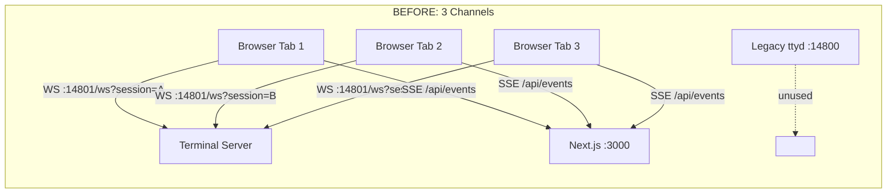
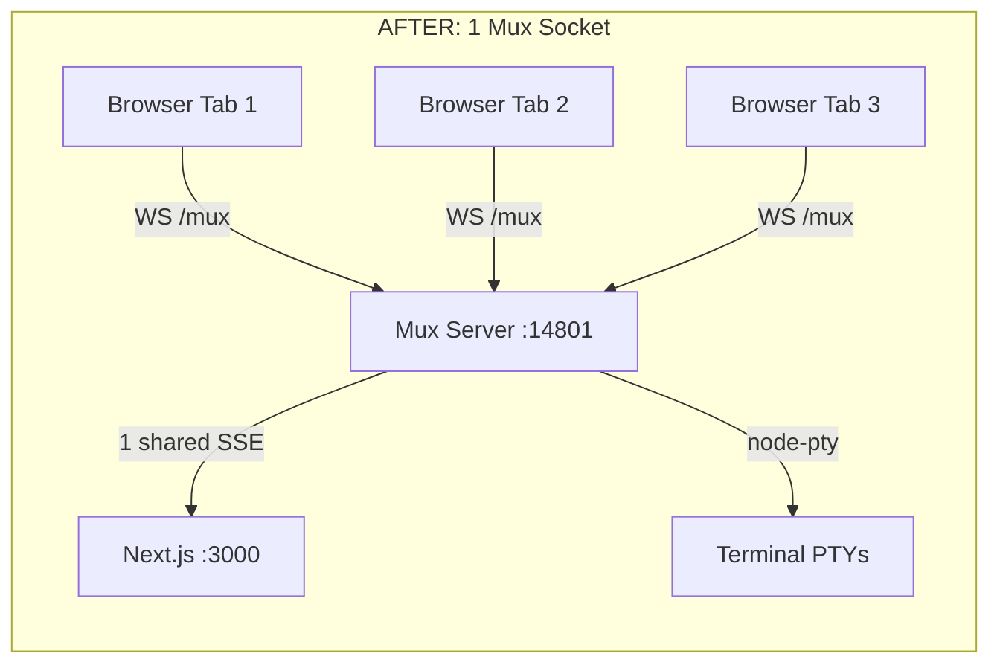
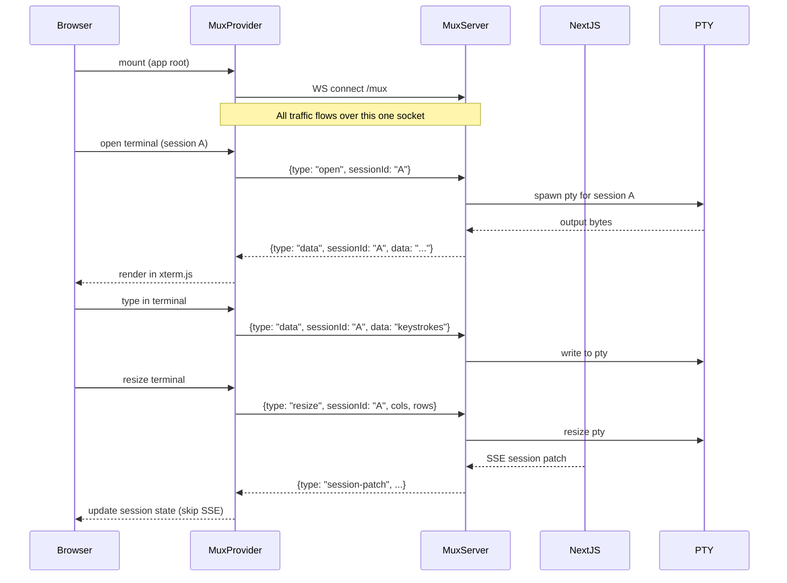

# PR #887: Single-Socket Multiplexing

> `feat(web): single-socket — multiplex terminals + sessions over one WebSocket`
> +2,374 / -1,781 lines across 30 files

## What Changed

Replaced **3 separate real-time channels** with **1 multiplexed WebSocket** at `/mux`.

## Before vs After

## Mux Protocol Flow

## Code Structure Change

```mermaid
graph TB
    subgraph "Deleted"
        style Deleted fill:#4a1a1a,stroke:#ff6b6b
        OLD1["terminal-websocket.ts<br/>(-444 lines, legacy ttyd)"]
        OLD2["direct-terminal-ws.ts<br/>(-305 lines, per-session WS)"]
    end

    subgraph "Added"
        style Added fill:#1a3a1a,stroke:#6bff6b
        NEW1["mux-websocket.ts<br/>(+605 lines, mux server)"]
        NEW2["MuxProvider.tsx<br/>(+323 lines, React context)"]
        NEW3["mux-protocol.ts<br/>(+28 lines, shared types)"]
        NEW4["providers.tsx<br/>(+12 lines, app wrapper)"]
        NEW5["api/sessions/patches/route.ts<br/>(+42 lines, patch endpoint)"]
    end

    subgraph "Simplified"
        style Simplified fill:#1a1a3a,stroke:#6b6bff
        MOD1["DirectTerminal.tsx<br/>(63 added / 245 removed)<br/>uses hooks, no WS mgmt"]
        MOD2["useSessionEvents.ts<br/>(136 added / 73 removed)<br/>accepts mux patches"]
    end
```

## Key Architectural Decisions

| Decision | Rationale |
|----------|-----------|
| Single socket per tab | Reduces connections from N+1 to 1 per browser tab |
| MuxProvider at app root | All components share one connection via React context |
| Server-side SSE relay | Mux server subscribes once to Next.js, broadcasts to all clients |
| Manual WS upgrade routing | Works around `ws` library limitation with multiple servers on one port |
| Lazy SSE connection | `SessionBroadcaster` connects on first subscriber, disconnects on last |

## Connection Count: Before vs After

| Scenario (5 terminals open) | Before | After |
|-----------------------------|--------|-------|
| WebSocket connections | 5 (one per terminal) | 1 (mux) |
| SSE connections to Next.js | 1 per browser tab | 1 total (server-side) |
| Ports used | 14800 + 14801 + 3000 | 14801 + 3000 |
