# Coder as an AO sandbox provider

Research snapshot: 2026-08-18. This is a design report, not an implementation specification. Statements labeled **Inference** or **Recommendation** are AO analysis rather than Coder product commitments.

## Executive summary

### What Coder is, in three sentences

Coder is a self-hosted control plane for creating remote development environments from Terraform templates, with PostgreSQL-backed `coderd`, Terraform provisioners, and an agent inside each workspace. A workspace can be almost any Terraform-managed compute—including a Kubernetes pod, Docker container, cloud VM, storage, and related services—so Coder standardizes lifecycle and access without prescribing the underlying isolation boundary. Developers and automation use its web UI, CLI, REST API, SSH, port forwarding, and encrypted Tailnet connections while the workspace agent initiates its connection outward to the control plane. [S1][S2][S3]

### Recommendation

AO should add Coder as a provider at the same cloud-session lifecycle seam as Daytona, initially for enterprise/design-partner deployments where the customer already operates Coder. The correct unit is **one Coder workspace per AO session**, created from a customer-approved AO template; Coder should own infrastructure provisioning, start/stop/delete, connectivity, template policy, and optional prebuilds, while AO remains authoritative for the coding-agent process, worker epoch, transcript, terminal, workspace file/diff API, PR observation, and derived session status.

For a proof of concept, AO Cloud can call a reachable Coder deployment directly with a scoped token. For the design-partner pilot and GA, prefer a small customer-side AO–Coder connector that holds the Coder credential, calls `coderd` locally, and bootstraps the AO worker through Coder SSH; this supports private Coder endpoints and keeps the Coder administrative token out of AO's SaaS. Do not build on Coder Tasks: it is being retired from normal releases in favor of the beta Coder Agents product, and both products overlap AO's orchestration layer rather than defining the stable infrastructure seam AO needs. [S21][S44]

## Scope, evidence, and terminology

This report evaluates Coder as the machine/workspace provider underneath AO Cloud. It assumes the direction described in [AO's cloud refactor](../cloud-refactor.md) and [cloud development notes](../cloud-development.md): a tenant-aware control plane creates a durable AO session, provisions a remote execution environment, and runs an AO worker which uses the shared agent-runtime package and the existing worker/bootstrap/terminal/workspace contracts. The concurrently authored `docs/design/cloud-integration.md` was not present in this checkout, so interface names below are deliberately conceptual; the lifecycle and ownership recommendations should be reconciled with that document before implementation.

“Coder agent” means Coder's workspace connectivity daemon. “Coding agent” means Claude Code, Codex, Cursor, or another CLI harness run by AO. “Coder Agents” is Coder's beta native AI product. Keeping those three concepts distinct is essential.

The research prioritizes current Coder documentation and the open-source `coder/coder` repository. Source inspection used commit [`b3f05a23fc0525467753f0c839216ba700863d9e`](https://github.com/coder/coder/tree/b3f05a23fc0525467753f0c839216ba700863d9e), authored 2026-08-18; repository links in the source appendix are pinned to that revision. Daytona, Kubernetes, and Firecracker claims use their official documentation or repositories. Pricing and product-stage claims are a point-in-time snapshot and must be rechecked before a commercial commitment.

## 1. What Coder is

### 1.1 Architecture and deployment model

Coder is a self-hosted remote-development platform, not a hosted pool of uniform sandboxes. Its core components are:

| Component | Responsibility | AO relevance |
| --- | --- | --- |
| `coderd` | Web UI, HTTP API, workspace-app proxy, workspace registration, auth, and coordination; it is the only Coder component that reads/writes PostgreSQL. | The Coder provider adapter targets this API. |
| `provisionerd` | Runs Terraform for template import and workspace build jobs. Built-in provisioners run with `coderd`; Premium supports external provisioners for scale and credential/isolation boundaries. | Coder, not AO, owns infrastructure reconciliation and Terraform failure details. |
| Workspace resources | Arbitrary Terraform-managed resources, commonly Docker containers, Kubernetes pods, EC2/Azure/GCP VMs, disks, and supporting services. | The customer chooses the actual security, capacity, persistence, and cost boundary. |
| Coder workspace agent | Runs inside a compute resource and provides SSH, port forwarding, liveness, startup scripts, web terminal, and workspace connectivity. | It is transport/bootstrap substrate for the AO worker, not a replacement for it. |
| Tailnet/DERP and workspace proxies | Connect clients and workspaces through direct WireGuard-style peer paths where possible or encrypted relays where necessary; proxies reduce remote-user latency. | Useful for bootstrap, operator takeover, and recovery without opening inbound workspace ports. |

This split is documented in Coder's infrastructure architecture and networking guides. The workspace agent dials out to `coderd`; user-to-workspace traffic is end-to-end encrypted, direct when NAT traversal succeeds, and relayed otherwise. Browser traffic cannot establish the direct peer path and therefore benefits from a nearby workspace proxy. [S2][S12][S13]

Coder itself can run as a standalone binary, in Docker, or on Kubernetes. Production Kubernetes deployments require PostgreSQL supplied by the operator; Premium high availability runs multiple `coderd` replicas against one low-latency PostgreSQL endpoint. Coder can also operate air-gapped, and license keys are locally verified signed JWTs rather than requiring a Coder-hosted licensing service. [S4][S5][S18]

### 1.2 Terraform templates and supported infrastructure

Templates are normal Terraform configurations plus the Coder provider. The template determines the infrastructure provider, image, CPU and memory, storage lifecycle, networking, startup scripts, apps, and one or more `coder_agent` resources. Coder publishes starters for Docker, Kubernetes, AWS EC2, Azure VMs, and other targets, but any compatible Terraform provider can participate. [S3][S6]

This flexibility has two consequences for AO:

First, “runs on Coder” does not imply a particular sandbox strength. A Docker workspace shares the host kernel; a Kubernetes pod normally shares a node kernel; a VM or sandboxed runtime can provide a hardware or userspace-kernel boundary. Coder manages all of them through the same product model. **Recommendation:** AO's provider configuration must declare and surface the template's isolation class (`container`, `sandboxed-container`, `vm`, or `dedicated`) rather than treating `provider=coder` as a security guarantee. Kubernetes itself recommends sandboxed runtimes or VMs for untrusted workloads because namespaces alone are not a hard isolation boundary. [K1]

Second, Coder workspace stop semantics are template-defined. Resources gated by `coder_workspace.start_count` are destroyed at stop; resources not gated can persist. A typical design destroys compute but retains a home volume, while a fully ephemeral template retains nothing. AO cannot promise resumability until it validates that the selected template persists the checkout and coding-agent session state across stop/start. [S19]

### 1.3 Licensing and pricing

The main repository is AGPL-3.0, while files under its `enterprise` directory carry Coder's separate enterprise license. The public pricing page offers a free Community edition and quote-based Premium billed annually per user; no dollar seat price is published. Community currently includes unlimited workspaces and templates, unlimited members in one organization, OIDC SSO, UI/CLI/API access, and AI tasks. Premium adds multi-organization controls, quotas, audit logs, external provisioners, high availability, workspace proxies, enforced cost controls, custom roles, support, and SLA. [S16][S17][S18][S31][S32]

The AI Governance Add-On is separate from Premium and licensed per user. It is required for AI Gateway and Agent Firewall as of Coder 2.32. Coder service accounts, custom roles, multiple organizations, audit logs, prebuilt workspaces, and several lifecycle controls are also Premium features, making Premium the realistic tier for AO's enterprise integration even though a Community PoC is possible. [S15][S20][S27][S28][S29]

**Licensing caution:** `github.com/coder/coder/v2/codersdk` and `workspacesdk` live in the AGPL repository. Importing them into a private AO Cloud service may create obligations that need counsel's review; the report makes no legal conclusion. The safer initial architecture uses the documented REST API for lifecycle and an operator-supplied `coder` CLI process for the Tailnet/SSH bootstrap path, keeping the licensed program at arm's length. Shipping that binary, modifying it, or moving to an embedded SDK still requires an explicit license review.

Coder's infrastructure expense is separate from its license: the customer pays for the pods, VMs, disks, network, PostgreSQL, and operational staff defined by its templates. Coder quotas use customer-defined integer “credits” rather than cloud-billing truth, so AO should ingest them as admission/policy signals, not as an invoice. [S30]

## 2. Integration surface

### 2.1 REST API, Go SDK, and CLI

Coder exposes an HTTP API under `/api/v2`. A client creates a workspace from a template or template version, reads workspace/build state, and posts a workspace build with transition `start`, `stop`, or `delete`. The current Go source models those transitions and exposes a server-sent event workspace watch, while the published API also exposes build logs, cancellation, timing, agent-connection watches, and resource/agent state. [S7][S8][S33][S34]

The public Go packages are useful evidence for Coder's own client behavior:

- `codersdk.Client` is the HTTP client and sets `Coder-Session-Token` authentication.
- `CreateUserWorkspace` creates a workspace; `CreateWorkspaceBuild` queues lifecycle transitions; `WatchWorkspace` consumes server-sent updates.
- `workspacesdk.Client.DialAgent` establishes the Tailnet path through a WebSocket coordinator and direct or DERP connectivity.
- The resulting agent connection can open an SSH client. `AgentReconnectingPTY` opens the same persistent PTY path used by Coder's web terminal.

The CLI wraps these capabilities with stable operator workflows: `coder create`, `start`, `stop`, `delete`, `ssh`, `port-forward`, and `config-ssh`. `coder ssh <workspace> -- command` can run a noninteractive command; `--stdio` exposes the SSH stream on stdin/stdout, and a PTY can be requested for interactive programs. [S9][S10][S11][S34][S35]

**Recommendation:** use API/SDK terms in the AO provider interface, but implement the first adapter with a small REST client and the Coder CLI only where Tailnet transport is needed. Do not shell out for ordinary lifecycle calls, because typed HTTP errors, build IDs, and watch/reconcile behavior are easier to make idempotent over REST. Do not reimplement Coder's WireGuard/Tailnet protocol.

### 2.2 Authentication, users, and organizations

REST clients send a Coder token in the `Coder-Session-Token` header. Human CLI sessions default to 24 hours and may refresh; users can create longer-lived API tokens, administrators can cap their lifetime, and current Coder token scopes can restrict resources and actions. [S14][S15]

Coder supports password, GitHub, GitHub Enterprise, and OIDC login. Premium IdP sync maps OIDC claims to Coder groups, roles, and organizations. Every deployment starts with one default organization; Premium can create additional organizations, each with its own templates, provisioners, groups, and workspaces. Users may belong to more than one organization. [S22][S23][S24]

For production automation, Premium service accounts are preferable to a human token. A custom organization role should grant only the exact template-read/use, workspace create/read/start/stop/delete, workspace-SSH/application-connect, and relevant build-log permissions. Token scope should narrow that role further. A Community proof of concept can use a regular dedicated user, but it lacks the clean headless-account and custom-role posture expected for enterprise operation. [S15][S25][S26]

Recommended identity mapping:

| AO object | Coder object | Notes |
| --- | --- | --- |
| Sandbox provider connection | One Coder deployment URL, CA bundle, auth mode, and Coder organization | Keep secrets encrypted; expose only redacted connection metadata. |
| AO organization | Usually one Coder organization within that deployment | A customer with one Coder org may map several AO projects into it; do not create Coder orgs automatically. |
| AO user | Optional mapped Coder username/UUID | Needed for user-owned workspaces and “Open in Coder”; derive from an admin-approved identity mapping, not display names. |
| AO project | Coder template ID plus pinned version/preset and non-secret parameter policy | Store stable IDs, not only mutable names. |
| AO session | One Coder workspace plus its latest build and primary workspace-agent IDs | This is the provider handle AO reconciles. |

For the PoC, an `ao-provider` service account can own all workspaces. For the pilot, prefer creating a workspace for the mapped Coder user when the partner wants direct IDE takeover and per-user ownership. Coder allows authorized callers to create workspaces for another user, and workspace sharing can give a developer `use` or `admin` access, but deletion remains with the owner/authorized service. [S7][S36]

### 2.3 Lifecycle, scheduling, and prebuilds

Coder lifecycle is an asynchronous Terraform build, not a synchronous “machine created” call. A create/start request may be pending or starting while a provisioner job runs; success still does not imply AO readiness until the workspace agent is connected and its blocking startup scripts have completed. Failure and unhealthy are different: failed means provisioning did not complete; unhealthy means resources exist but the workspace agent cannot provide connections. [S8]

Coder can autostart, autostop after inactivity, mark workspaces dormant, auto-delete dormant workspaces, and clean up failed workspaces. Several enforcement and cleanup controls are Premium. Coder counts active SSH, terminal, and IDE sessions for activity, but an AO worker performing background work may not match those activity signals. AO must either disable Coder autostop for active AO sessions, use a TTL comfortably above AO's heartbeat/reconciliation window, or intentionally refresh/hold an activity-producing connection. It must not assume that a running coding-agent child process alone will prevent Coder shutdown. [S20]

Premium prebuilt workspaces maintain ready pools for fixed template presets and transparently transfer a matching workspace to the requester. They can remove most infrastructure setup latency, but only when all required parameters are covered by the preset; the pool itself consumes capacity and follows a separate reconciliation/expiration lifecycle. [S29]

**Recommendation:** the initial AO template should be generic and preinstall the AO worker and supported coding-agent binaries, but clone the selected repository only after a workspace is assigned. That keeps prebuilds project-neutral and avoids leaving customer source in an unclaimed pool.

### 2.4 Networking, SSH, ports, and terminals

Coder's networking is unusually valuable for self-hosted customers. Workspaces require outbound HTTPS/WebSocket reachability to `CODER_ACCESS_URL` and no inbound port. CLI clients can establish direct encrypted peer connections with the workspace agent through NAT traversal; when that fails, Coder relays traffic through DERP. Coder recommends client/workspace round trips below 400 ms and random packet loss below 0.5%; those are permissive minimums, not an interactive-quality target. [S12][S13]

Coder provides four related access primitives:

1. SSH through `coder ssh` or an OpenSSH `ProxyCommand` generated by `coder config-ssh`.
2. A reconnecting web terminal whose path is Browser ↔ WebSocket ↔ `coderd` ↔ workspace agent ↔ shell; the agent buffers output while clients disconnect.
3. TCP/UDP port forwarding through the CLI, SSH, the dashboard proxy, or Coder Desktop.
4. Workspace apps proxied by `coderd` or a regional workspace proxy.

These are excellent bootstrap and recovery channels, but AO should not make them its primary user terminal protocol. AO's cloud contract already gives the worker an epoch-scoped persistent agent terminal and routes output, input, resize, and exit through AO's terminal tickets and worker transport. Sending AO terminal traffic directly to Coder would introduce provider-specific browser auth, reconnect semantics, and authorization while bypassing AO's worker fencing. [S9][S10][S11]

### 2.5 Repository and credential handling

Coder can broker Git OAuth tokens to workspaces with external-auth integrations and `GIT_ASKPASS`, or provide a per-user SSH key fetched in memory when Git invokes SSH. It supports GitHub, GitHub Enterprise, GitLab, Azure DevOps, Bitbucket, and custom OAuth providers; more than one external integration is a Premium feature. [S37]

AO Cloud already defines a different, stronger session boundary: the authenticated AO worker requests a short-lived, repository-scoped checkout grant whose repository identity is derived from the worker's session. **Recommendation:** retain that flow by default. The AO worker should clone into the assigned Coder workspace, supply the grant through an ephemeral askpass/stdin helper, scrub it from the remote URL, and never place it in a Coder parameter, Terraform state, workspace metadata, process arguments, or persistent environment.

For a design partner whose GitHub Enterprise is reachable only inside its network, support an explicit `credential_source=coder_external_auth` mode. In that mode Coder owns the user-to-Git mapping and AO does not mint a checkout grant. A project must choose one credential authority; silently falling back between AO and Coder would make access review and incident response ambiguous.

Coder explicitly warns that template parameters are displayed in cleartext and should not be treated as secrets. Ephemeral parameters stop persisting after workspace stop, but that does not make them secret. User secrets are encrypted only when database encryption is configured and become readable to anyone with shell/file access to the workspace. These constraints rule out passing an AO worker bootstrap ticket as a Terraform parameter. [S38][S39]

## 3. Coder's AI-agent products: competition and reusable primitives

### 3.1 Coder Tasks is a retiring compatibility surface

Coder Tasks provisions a full workspace for a prompt, runs a terminal-based coding agent through an AgentAPI web app, displays task state/logs, and pauses the workspace on idle. Its task API and UI support create/list, pause/resume, and status; agent activity bumps the workspace deadline. Pause/resume requires persistent storage and agent-specific state persistence. Custom terminal agents can report activity through Coder's MCP server. [S40][S41][S42][S43]

As of this research snapshot, Coder warns that Tasks entered a 12-month Extended Support Release for Premium customers on 2026-06-02 and will be removed from new Coder releases starting with v2.37 on 2026-09-01. Coder directs customers to Coder Agents. AO should therefore neither implement against the Task API nor require `coder_ai_task`, AgentAPI, or task-specific modules.

Tasks nevertheless validates two AO design choices: one independent agent job per workspace, and persistent workspace storage plus explicit agent state for pause/resume. Its lifecycle also demonstrates why background agent activity cannot be inferred from ordinary IDE use.

### 3.2 Coder Agents is a direct product competitor above the sandbox seam

Coder Agents is a beta, self-hosted chat and API that runs Coder's own Go agent loop in the Coder control plane. It selects templates, creates/starts workspaces, uses the workspace daemon to read/write/edit files and execute processes, supports sub-agents and context compaction, stores chat state in PostgreSQL, and sends inference requests from the control plane to a configured model provider. It is explicitly not a wrapper around Claude Code or Codex. [S44][S45]

Its experimental Chats API creates and manages chats and streams chat, Git, and desktop events over WebSockets. Coder warns that the API may change without notice and recommends pinning a release before broad rollout. [S46][S47]

Coder Agents therefore competes with AO's orchestration, conversation, and multi-agent product surface. It complements AO only as evidence that Coder's workspace agent and Tailnet can safely expose file, process, Git, and desktop primitives to a control-plane agent. AO should not layer itself on Coder Agents because doing so would delegate agent identity, transcript, tool protocol, orchestration, and model routing to an experimental competing subsystem and would make non-Coder providers behave differently.

### 3.3 Primitives AO can reuse independently

Coder offers useful infrastructure/security primitives without adopting its agent product:

- **Agent Firewall:** a process-level firewall that can wrap any terminal-based agent, including a custom one. It enforces HTTP method/domain/path allowlists, blocks unapproved network access, writes local logs, and sends policy audit records to `coderd`. It requires the AI Governance Add-On. [S27][S28]
- **AI Gateway:** an optional control-plane proxy for model keys, spend, and policy. It also requires the AI Governance Add-On. AO agent CLIs could target it, but that would introduce a Coder user token into the coding-agent auth path and must be a separate, partner-selected credential mode—not a dependency of the provider adapter. [S28]
- **Template policy and external provisioners:** templates can pin images, tools, network policy, persistent storage, and resource sizes. External provisioners can isolate cloud credentials and Terraform execution from `coderd`. [S5][S6]
- **Workspace agent connectivity:** outbound-only registration, SSH, PTY, port forwarding, health, and startup coordination are mature and independent of AI features. [S2][S12]
- **Prebuilds and quotas:** Premium pools can reduce startup time and quotas can prevent runaway concurrent capacity. [S29][S30]

**Inference:** Agent Firewall is defense in depth, not the sandbox boundary. It restricts the wrapped process's network behavior, but AO still needs an appropriately isolated template, filesystem policy for read-only sessions, least-privilege Git/model credentials, and protection from host/neighbor escape.

## 4. Proposed AO integration architecture

### 4.1 Ownership boundary

The provider adapter should answer one question: “What execution environment should exist for this AO session, and how do we get an AO worker running inside it?” Everything after `worker.ready` remains provider-neutral.

```mermaid
flowchart LR
    UI[AO desktop / web] -->|Cloud API, SSE, terminal ticket| CP[AO Cloud control plane]
    CP --> REC[Session reconciler]
    REC --> SEAM[Cloud session lifecycle seam]

    SEAM --> DAY[Daytona adapter]
    SEAM --> CODER[Coder adapter]

    subgraph Customer[Customer network / account]
        GW[AO-Coder connector]
        CD[coderd + PostgreSQL]
        PV[Terraform provisioner]
        WS[Coder workspace per AO session]
        CA[Coder workspace agent]
        WK[AO worker + coding-agent CLI]

        GW -->|REST lifecycle; SSH bootstrap| CD
        CD --> PV
        PV --> WS
        WS --- CA
        WS --- WK
    end

    CODER -. direct PoC .-> CD
    CODER -->|desired state / signed connector channel| GW
    CA -->|outbound Tailnet registration| CD
    WK -->|bootstrap, heartbeat, turns, events, workspace and terminal transport| CP
    WK -->|model API or optional Coder AI Gateway| LLM[Approved model endpoint]
    WK -->|short-lived checkout grant| SCM[Git provider]
```

The dashed direct path is suitable only when the Coder endpoint is reachable from AO Cloud and the customer accepts AO custody of a Coder token. The connector path is the enterprise target: it can run beside `coderd` or as a customer-managed service, make outbound authenticated contact to AO, and keep Coder connectivity and credentials local.

### 4.2 Provider handle and lifecycle contract

The pluggable seam should express desired state rather than leak Coder builds into the session service. A conceptual provider contract needs provision, inspect/watch, start, stop, delete, and bootstrap/recover operations. The durable provider handle for Coder should contain:

- AO provider-connection ID (not the secret itself);
- Coder deployment and organization IDs;
- workspace owner ID, workspace ID, and deterministic name;
- pinned template ID, template version ID, and optional preset ID;
- latest Coder build ID/number and primary workspace-agent ID;
- AO worker ID and epoch once bootstrapped; and
- observed infrastructure phase, last successful reconcile time, and sanitized failure code.

Provider lifecycle facts must remain separate from AO display status. A Coder workspace can be `running` while the coding agent is idle, blocked, or exited; it can be `stopped` while the AO session remains resumable. Conversely, a transient failure to reach Coder is not proof that the AO session is dead. This preserves the durable-facts/derived-status rule in [AO's architecture](../architecture.md).

### 4.3 Lifecycle mapping

| AO operation or fact | Coder operation/state | Required AO behavior |
| --- | --- | --- |
| Create session | Create workspace with template version/preset and allowed non-secret parameters | Persist returned workspace/build IDs before waiting; creation is asynchronous. |
| Provisioning | Build `pending`/`starting`; Terraform job pending/running | Stream a normalized provisioning phase; optionally expose sanitized build logs. |
| Infrastructure ready | Build `running`, workspace agent `connected`, lifecycle `ready` | Only then bootstrap or confirm the AO worker. |
| Worker ready | AO `worker.ready` with current worker ID/epoch | This—not Coder `running`—makes the execution plane ready. |
| Run coding agent | AO worker launches CLI with `backend/pkg/agentruntime` inside the checkout | Coder is unaware of AO activity unless optional metadata is reported. |
| Terminal attach | AO terminal ticket and AO worker PTY transport | Keep provider-neutral; Coder web terminal remains an operator escape hatch. |
| Suspend/resume | Coder `stop`/`start` build | Before stop, persist agent session state and checkout; after start, require a new/current worker epoch. |
| Kill/teardown | Graceful AO worker stop, preservation check, then Coder `delete` build | Coder delete runs Terraform destroy and is irreversible; retain AO history and record teardown outcome. |
| Reconcile | Workspace watch/SSE plus periodic GET, worker heartbeat, and generation fencing | Treat missed streams and unknown probes as unknown; retry idempotently. |

### 4.4 Why workspace-per-session

**Recommendation:** one workspace per AO session, not one workspace per project.

It matches AO's current invariant that every session owns an isolated checkout and runtime. Start, stop, delete, resource quotas, template version, credentials, logs, health, and developer takeover can all be managed independently. It also matches Coder Tasks' and Coder's own AI guidance: unpredictable background agents should run in separate, restricted templates/workspaces. [S40][S48]

A project-level workspace containing several Git worktrees would reduce provisioning cost and clone latency, but it would couple session failure domains and lifecycle. One session could exhaust CPU/disk, inspect another session's code or credentials, keep the entire project workspace active, or make teardown unsafe. Coder's workspace agent and sharing permissions operate at workspace scope, so Coder cannot enforce session separation inside that shared machine. Project-per-workspace should remain an explicit future optimization for trusted, single-user workloads only, not the default provider model.

### 4.5 Provision and bootstrap sequence

Recommended happy path:

1. AO creates the durable session and provider intent, chooses the configured Coder connection/template/version/preset, and allocates a deterministic workspace name such as `ao-<short-session-id>`. Current Coder names are limited to 32 characters and a restricted character set, so AO must not use arbitrary project/session titles. [S33]
2. The adapter creates the workspace with `automatic_updates=never` and only allowlisted, non-secret rich parameters such as resource preset or region. It stores the workspace/build IDs before waiting.
3. The adapter consumes the workspace watch stream and also polls with bounded backoff until the build is `running`, the chosen workspace agent is `connected`, and required startup scripts are ready. Provisioner/build errors are normalized without discarding the provider request ID and raw diagnostic reference.
4. The template image already contains a version-pinned AO worker and supported coding-agent binaries. The connector invokes the worker over `coder ssh --stdio`, passing a short-lived, one-time AO bootstrap ticket on stdin—not as argv, environment, or a Coder parameter.
5. The worker exchanges that ticket for its session-scoped rotating token through the existing AO worker bootstrap API, reports `worker.ready`, obtains its short-lived checkout grant and coding-agent credential, clones the repository, and launches the requested harness.
6. From this point forward, the worker owns the local PTY and all AO terminal/workspace traffic. The Coder SSH bootstrap session may close after successful registration; Coder's workspace agent continues to provide liveness and recovery access.

If Coder SSH is unavailable after infrastructure provisioning, the workspace is unhealthy rather than safely ready. AO should preserve the workspace for a bounded diagnostic window and surface the Coder build and agent health; it should not repeatedly create replacement workspaces without fencing the prior provider handle.

**Alternative for environments that prohibit inbound AO-to-Coder access:** the customer connector performs steps 2–4 locally. It receives a signed, single-use desired-state command from AO over an outbound channel and returns only provider facts. This is the recommended pilot design.

### 4.6 Idempotency and reconciliation

**Inference from the current public API/source:** workspace creation does not expose an AO-style idempotency key. AO should therefore use a deterministic name per session/owner, persist the returned ID immediately, and on ambiguous timeout look up that exact owner/name before retrying. Reuse is allowed only when the immutable AO session marker, template, organization, and owner match; otherwise the adapter must raise a collision rather than attach to an unrelated workspace.

Every start/stop/delete request produces a new build. The adapter should store the build ID and reconcile it to a terminal state instead of issuing duplicate transitions on each loop. A newer unexpected build is an external mutation: inspect it, record drift, and decide against desired state. Coder watch streams reduce latency, but periodic reads are the repair path after disconnects.

Worker generation remains AO's fence. A restarted or rebuilt Coder workspace must bootstrap a new AO worker epoch, and late heartbeat/terminal/turn events from the former epoch must be rejected by the AO control plane. Coder workspace/build IDs must never substitute for that fence.

### 4.7 Terminal, files, diff, and developer takeover

The AO worker should create and own the agent CLI's PTY, then use AO's existing epoch-scoped terminal endpoints for output/input/resize/exit. This gives every sandbox provider identical replay, authorization, and terminal-ticket semantics. Workspace file reads, writes, directory listing, and diff likewise execute locally through the AO worker transport, confined to the checkout root.

Coder's terminal and SSH stay valuable in three cases:

- bootstrapping the AO worker;
- break-glass diagnosis when the AO worker cannot register; and
- an “Open in Coder” handoff that lets an authorized developer connect with their existing Coder identity and IDE.

The last action should be an explicit external navigation to the customer's Coder URL, not a Coder token embedded in AO's frontend. If AO later proxies a Coder reconnecting PTY as a fallback, it must issue a narrowly scoped, short-lived server-side ticket and preserve AO's authorization boundary; that is not needed for the initial integration.

### 4.8 Stop, resume, and safe delete

Coder stop can destroy compute while preserving a configured volume. Before requesting it, AO must stop the coding-agent process cleanly, flush terminal/transcript events, persist the native agent session ID, and ensure the checkout and relevant home directories live on persistent storage. The template should use a generous shutdown timeout so CLI agents can save state. On restart, Coder recreates compute, the workspace agent reconnects, and the AO worker obtains a fresh epoch before restoring the coding-agent conversation.

Coder delete runs Terraform destroy for both ephemeral and persistent resources and cannot be undone. AO should request worker-side preservation first: push committed work, capture an agreed recovery artifact for uncommitted changes, or refuse/hold deletion when neither succeeds. This is the remote equivalent of AO's local rule not to force-delete dirty registered worktrees. A policy-driven retention window may stop the workspace before final delete, but its infrastructure cost depends on what the customer's template persists.

### 4.9 Self-hosted multi-tenancy and data residency

There are three deployable trust models:

| Model | Coder API/token location | Network requirement | Data-residency consequence |
| --- | --- | --- | --- |
| Direct AO SaaS → Coder | Token encrypted in AO Cloud | Customer exposes `coderd` to AO over TLS/VPN/allowlist | Workspace filesystem stays customer-side, but AO SaaS still receives prompts, agent events, terminal output, and requested file/diff content. |
| Customer connector | Token remains in customer connector | Connector reaches private `coderd` and opens outbound authenticated channel to AO | Coder administration and source filesystem stay local; AO SaaS still receives the AO application data its UI/control plane uses. |
| Customer-hosted AO control plane + connector | All control/data services customer-side | No AO SaaS data path required | Strongest basis for “customer code never touches AO cloud,” subject to the chosen external model/SCM providers. |

The second model is the recommended enterprise default. It allows a customer to keep `coderd`, PostgreSQL, provisioners, workspace networks, GitHub Enterprise, and the Coder token private. It does **not** by itself justify an absolute “code never touches our cloud” claim: AO's hosted transcript, terminal, file/diff, and tool-result paths can carry code. Product and sales language should say “compute and repository checkout remain in customer-controlled infrastructure” unless AO also offers customer-hosted control/data plane or a metadata-only/direct-browser data path.

Within a shared AO control plane, each AO organization chooses a provider connection. Authorization is checked in AO before dispatch; the connector command is bound to that organization, connection, session, desired generation, and allowed template. The connector must never accept an arbitrary Coder URL, template source, Terraform, owner, shell command, or workspace ID from a worker. It executes a closed set of lifecycle/bootstrap operations, preventing a compromised AO session from turning the provider credential into general Coder administration.

## 5. Latency, capacity, cost, and operational limits

### Provisioning latency

Coder provisioning time is template- and infrastructure-dependent. Docker containers may be quick, while Terraform-created VMs, image pulls, disks, and long startup scripts can take minutes. Coder exposes build timing metrics from request through agent readiness, so a pilot should measure p50/p95/p99 separately for Terraform provision, agent connection, startup scripts, AO bootstrap, and repository clone. [S8][S49]

Premium prebuilds can make workspace assignment fast, but they exchange latency for standing capacity. AO should begin without prebuild dependence, record these timings, and enable a small project-neutral preset pool only if p95 time-to-worker-ready misses the partner's target.

### Interactive latency

The AO worker-to-control-plane terminal path is independent of Coder Tailnet after bootstrap. The customer should locate workspace compute near its Git/model endpoints and the AO terminal ingress near users. Direct Coder SSH can be peer-to-peer; browser traffic is relayed through `coderd` or a workspace proxy. Coder's documented `<400 ms` RTT and `<0.5%` random loss are minimum connectivity requirements, not acceptable design targets for an interactive TUI; the pilot should target p95 terminal echo below roughly 150 ms as an AO product goal. The 150 ms target is an AO inference, not a Coder guarantee. [S13]

### Capacity and failure modes

Each Terraform workspace build occupies one provisioner, so provisioner count limits concurrent create/start/stop/delete throughput. Coder's default user workspace count is unlimited; Premium quotas and template policy are therefore important admission controls. AO must apply its own organization/session concurrency limits before calling Coder, because a Coder quota rejection occurs after AO has accepted the session intent. [S5][S8][S30]

Expected provider failure classes include no matching provisioner, Terraform failure, quota denial, agent connection timeout/unhealthy, template drift or required new parameters, token expiry/revocation, Coder API/DB outage, workspace autostop during agent work, and customer-initiated workspace mutation/deletion. Each should map to a durable provider fact and retry/repair policy rather than directly overwriting AO's derived agent status.

### Cost model

For Coder, AO cannot quote a universal per-session price. The effective cost is:

`Coder Premium/AI add-on seats + coderd/PostgreSQL/provisioner operations + workspace compute + persistent storage + network + warm-pool idle capacity`.

Community has no Coder license fee but lacks several controls expected by a production enterprise integration. Premium and AI Governance prices are quote-based. Template `daily_cost` credits can help admission control but need a customer-maintained mapping to currency. [S16][S28][S30]

## 6. Provider comparison

| Dimension | Coder | Daytona | Raw Kubernetes | Raw Firecracker |
| --- | --- | --- | --- | --- |
| Primary abstraction | Terraform-templated developer workspace with embedded connectivity agent | API-first sandbox with filesystem, Git, process, PTY, snapshots, and lifecycle SDKs | Pod/workload plus cluster APIs | Minimal KVM microVM process plus Unix-socket API |
| Deployment model | Fully self-hosted control plane and workspaces on customer-selected infrastructure | Managed shared/dedicated service by default; BYOC custom regions attach customer runner machines; a managed single-tenant offering exists | Self/customer/cloud-managed cluster | Customer builds and operates hosts, networking, images, storage, scheduling, and control plane |
| Infrastructure breadth | Very high: any Terraform provider; official Docker, Kubernetes, AWS/Azure/GCP VM patterns | Daytona container/VM/GPU sandbox classes and regions | Any Kubernetes-supported nodes/runtime/storage; VM isolation requires an added runtime such as Kata/gVisor | Linux KVM hosts on supported CPUs; microVM-focused |
| Lifecycle API ergonomics | Good but asynchronous and Terraform-shaped; stable REST/CLI, broad Go SDK; connection SDK is more complex | Excellent sandbox-oriented REST and multi-language SDKs; direct exec/fs/git/PTY and push lifecycle events | Mature API, watches, exec, and attach, but AO must build the sandbox controller, image, persistence, cleanup, and policy layers | Low-level machine configuration/start API only; AO must build nearly everything above it |
| Terminal/exec | Coder SSH, reconnecting web PTY, Tailnet, ports, apps | First-class process sessions and WebSocket PTY | Pod exec/attach streams; persistence/reconnect semantics are AO's responsibility | No developer terminal abstraction; normally add SSH/vsock/guest agent |
| Startup optimization | Template-specific; Premium prebuilt workspace pools | Snapshot/image-based fast sandbox creation; Daytona markets millisecond startup | Pre-pulled images and warm nodes; custom pool controller needed | Sub-125 ms microVM start is possible at the VMM layer, excluding AO image/network/bootstrap work [F1] |
| Isolation | Whatever the template provisions; container/pod through dedicated VM | Product-defined sandbox classes plus network controls; exact isolation depends class/region | Containers share a kernel by default; stronger runtime/VM or node/cluster isolation must be configured [K1] | Hardware virtualization plus jailer/seccomp/cgroup/namespace defense in depth [F1][F2] |
| Enterprise/self-hosted fit | **Best for an existing self-hosted Coder customer:** customer owns control plane, infra, identity, network, and templates | Strong managed API and BYOC; full control-plane sovereignty depends on enterprise/single-tenant terms | Strong for customers with a platform team willing to own the missing product layer | Strongest primitive isolation/control, highest engineering and operational burden |
| Multi-tenancy/governance | Premium orgs, OIDC sync, custom roles, quotas, audit, HA, proxies, external provisioners | Organizations, scoped API keys, quotas/rate limits, network policy; SSO/audit/BYOC in Enterprise | Namespaces/RBAC/quota/network policy are building blocks, not a turnkey tenant product | Must be designed entirely by AO/operator |
| Cost | Quote-based annual Premium seats plus customer's infrastructure/operations; Community free | Published pay-per-second CPU/RAM/storage for managed sandboxes; enterprise/BYOC by quote [D5][D6] | Infrastructure plus significant platform engineering/operations | Infrastructure efficiency can be excellent; platform engineering and on-call cost are highest |
| Provider lock-in | **Moderate:** Terraform resources are portable, but Coder workspace lifecycle, agent, Tailnet, templates, and Premium policy are Coder-specific | **Moderate-high:** simple sandbox API accelerates delivery, but toolbox, lifecycle, snapshots, regions, and pricing are provider-specific | **Low API lock-in, high implementation ownership:** Kubernetes is portable but cluster/runtime choices still matter | **Low vendor lock-in, very high custom-platform ownership** |
| Best AO role | Enterprise/self-hosted provider alongside Daytona | Default managed Cloud v1 provider when speed and uniform API matter | Future provider or implementation substrate after the provider seam is proven | Isolation substrate under a managed sandbox layer, not a near-term direct AO adapter |

Daytona's current API is more directly aligned with AO's provider needs: it creates an isolated sandbox and immediately offers typed process, filesystem, Git, PTY, snapshot, and lifecycle operations. It also publishes explicit managed pricing and tier/rate limits. Its current enterprise positioning includes SSO, audit logs, and BYOC, where customer runners form custom regions, but the default API endpoint remains Daytona-hosted and full private-control-plane terms require commercial confirmation. [D1][D2][D3][D4][D5][D6][D7][D8]

Coder's advantage is not a simpler sandbox API; it is enterprise fit where a platform team already standardized templates, networks, identities, credentials, and developer access on customer-controlled infrastructure. The provider seam lets AO use Daytona for a uniform managed fleet and Coder for bring-your-existing-platform deals without forcing either provider's terminal or agent product into AO's core.

## 7. Staged implementation plan and rough sizing

All estimates below are **AO engineering estimates**, not sourced Coder commitments. They assume the base cloud execution seam, worker protocol, and durable reconciliation primitives exist or land in parallel; they exclude customer Terraform/cloud setup, security review lead time, procurement, and unrelated Cloud UI work. One engineer-week means one focused engineer for one week, not calendar duration.

### Stage 0: partner discovery and contract freeze — 1–2 engineer-weeks

Before code, obtain the partner's Coder version, Community/Premium/add-on licenses, deployment topology, API reachability, CA/SSO policy, organization/user mapping, chosen template, underlying isolation, persistent storage, Git/model egress, desired direct IDE takeover, and data-residency language. Reconcile this report with `docs/design/cloud-integration.md` and freeze the provider interface without Coder-specific types leaking into session services.

Exit criteria: agreed trust model, template contract, credential authority, lifecycle semantics, supported Coder version range, and target SLOs.

### Stage 1: direct-connect PoC — 6–8 engineer-weeks, about 3–4 calendar weeks with two engineers

Build a private Coder lifecycle adapter using the stable REST surface; add encrypted provider connection configuration, validation, template/version/preset selection, deterministic workspace naming, create/watch/poll, start/stop/delete, and normalized diagnostics. Produce one Linux template that preinstalls AO worker plus one or two coding-agent CLIs and uses persistent storage. Bootstrap the worker with an operator-supplied Coder CLI over SSH/stdin, then run the existing AO terminal and checkout flows.

Test against Docker for fast local iteration and the partner's actual target (Kubernetes pod or VM) for meaningful security and persistence results. Exercise create ambiguity, provisioner failure, unhealthy agent, token revocation, Coder restart, worker restart/epoch fencing, stop/resume, dirty teardown, and direct Coder IDE takeover.

Exit criteria: one AO session reliably completes clone → agent CLI → terminal → commit/push/PR observation on Coder; 20 consecutive lifecycle runs without orphaned resources; failures retain actionable Coder build IDs/log references.

### Stage 2: design-partner pilot — 12–20 engineer-weeks, about 6–8 calendar weeks with two to three engineers

Replace direct credential custody with the customer-side connector and an outbound authenticated desired-state channel. Add scoped service-account/custom-role guidance, custom CA and proxy support, connector upgrade/version reporting, reconciliation after either side restarts, metrics, audit correlation, quotas/admission controls, and safe stop/retention/delete policy. Add optional mapped-user ownership and “Open in Coder.”

Harden the template with pinned artifacts/checksums, non-root execution, persistent agent state, egress policy, optional Agent Firewall, short-lived AO checkout/model credentials, and no secrets in parameters/state. Validate a small Premium prebuild pool only if measurements justify it.

Exit criteria: partner security review, no Coder token in AO SaaS, documented disaster/revocation procedures, p95 readiness/terminal SLOs measured for two weeks, zero unexplained workspace leaks, and successful recovery from control-plane/connector/workspace restarts.

### Stage 3: GA provider — 24–40 engineer-weeks, about 8–12 calendar weeks with three to four engineers

Productize provider setup and health checks, template compatibility validation, version capability discovery, upgrade policy, rate/backoff limits, fleet dashboards, billing/usage export, support bundles with secret redaction, policy documentation, and end-to-end conformance tests shared with Daytona. Support more than one Coder deployment per AO organization, connector high availability/fencing, and rolling upgrades.

Complete license review for any distributed Coder CLI/SDK component and commercial review for supported Premium features. Publish a support matrix for Coder versions, Linux architectures, workspace isolation classes, and template requirements. Decide whether strict customer-hosted AO/data-plane deployment is a separate SKU.

Exit criteria: support/on-call runbooks, multi-customer load and failure testing, provider conformance suite green, documented data flows, security/threat-model approval, and rollback/disable controls.

## 8. Risks, open decisions, and validation experiments

### Highest risks

1. **Bootstrap credential delivery.** Coder parameters are not secret. The pilot must prove SSH/stdin bootstrap through the customer connector and ensure tickets never reach argv, logs, Terraform state, or workspace metadata.
2. **SDK licensing and protocol coupling.** Embedding `codersdk/workspacesdk` is technically attractive for Tailnet/SSH but needs AGPL review and pins AO to Coder internals. Prefer REST plus an external CLI until counsel and compatibility testing say otherwise.
3. **Template-defined security.** Coder may provision a plain container, not a strong sandbox. AO must make isolation class, egress, filesystem mode, credentials, and privileged settings reviewable policy.
4. **Autostop versus background work.** Coder activity detection may stop an AO workload that has no IDE/SSH activity. Explicit scheduling configuration and integration tests are required.
5. **Safe deletion.** Coder deletion is irreversible Terraform destroy. AO needs worker-side preservation and a durable teardown state instead of optimistic delete.
6. **Data-sovereignty claims.** A customer-side connector keeps Coder credentials and source storage local but does not prevent code-bearing AO events from reaching AO SaaS.
7. **Identity and seat semantics.** Service-owned versus user-owned workspaces affect audit, sharing, user experience, and possibly licensed-seat counting. Confirm with Coder for the partner's contract.
8. **Version drift.** Coder's stable workspace API is broad, but Coder Agents/Chats are beta/experimental and main moves quickly. Pin and test a supported release range; do not integrate experimental AI APIs.

### Decisions to make with the first partner

- Does the customer require fully private `coderd`, or can AO Cloud reach it through a private link?
- Is the workspace owned by a service account or the mapped developer?
- Which template/version/preset is approved, and is it a VM, sandboxed pod, or ordinary container?
- What persists across stop: checkout, home directory, native agent conversation, caches, and logs?
- Does Git use AO's GitHub App checkout grant or Coder external auth?
- Does the coding-agent model connect directly, through a customer proxy, or through Coder AI Gateway?
- What terminal/file/transcript data may be stored by AO Cloud?
- What is the retention policy for stopped, failed, unhealthy, and dirty workspaces?
- Are Premium prebuilds and Agent Firewall licensed and desired?

### PoC measurements

Record p50/p95/p99 for create request, provisioner queue, Terraform apply, workspace-agent connect, startup scripts, AO bootstrap, clone, coding-agent start, terminal echo, stop, restart, and delete. Also record orphan rate, duplicate-create avoidance after injected timeouts, workspace cost/credits by state, connector reconnect duration, and recovery point for uncommitted changes. These results—not Coder marketing or a Docker laptop demo—should decide whether Coder meets AO's pilot SLO.

## 9. Conclusion

Coder is a strong second provider for AO, specifically because it is not merely another hosted sandbox pool. It lets an enterprise use its existing customer-controlled control plane, Terraform templates, infrastructure accounts, identities, network policy, Git integration, and developer access while AO supplies the multi-agent workflow and consistent product experience. That can unlock customers Daytona's managed control plane cannot satisfy.

The integration stays tractable only if AO preserves the boundary: Coder provisions and connects the workspace; AO runs and observes the coding agent. A workspace-per-session model, customer-side connector, AO-owned worker/terminal protocol, explicit credential authority, and template security contract produce a provider that can coexist with Daytona. Building on Coder Tasks or Coder Agents would instead couple AO to a retiring or competing orchestration surface and should be avoided.

## Sources appendix

### Coder product and administration

- [S1] Coder, [Coder documentation home](https://coder.com/docs).
- [S2] Coder, [Infrastructure architecture](https://coder.com/docs/admin/infrastructure/architecture).
- [S3] Coder, [Templates](https://coder.com/docs/admin/templates).
- [S4] Coder, [Installation options](https://coder.com/docs/install).
- [S5] Coder, [External provisioners](https://coder.com/docs/admin/provisioners).
- [S6] Coder, [Creating templates](https://coder.com/docs/admin/templates/creating-templates).
- [S7] Coder, [Workspaces REST API](https://coder.com/docs/reference/api/workspaces).
- [S8] Coder, [Workspace lifecycle](https://coder.com/docs/user-guides/workspace-lifecycle).
- [S9] Coder, [`coder ssh` CLI reference](https://coder.com/docs/reference/cli/ssh).
- [S10] Coder, [Web terminal](https://coder.com/docs/user-guides/workspace-access/web-terminal).
- [S11] Coder, [Port forwarding](https://coder.com/docs/user-guides/workspace-access/port-forwarding).
- [S12] Coder, [Security best practices](https://coder.com/docs/tutorials/best-practices/security-best-practices).
- [S13] Coder, [Networking](https://coder.com/docs/admin/networking).
- [S14] Coder, [REST API authentication](https://coder.com/docs/reference/api/authentication).
- [S15] Coder, [Sessions and API tokens](https://coder.com/docs/admin/users/sessions-tokens).
- [S16] Coder, [Plans and feature comparison](https://coder.com/pricing).
- [S17] Coder, [Licensing](https://coder.com/docs/admin/licensing).
- [S18] Coder, [High availability](https://coder.com/docs/admin/networking/high-availability).
- [S19] Coder, [Resource persistence](https://coder.com/docs/admin/templates/extending-templates/resource-persistence).
- [S20] Coder, [Workspace scheduling](https://coder.com/docs/user-guides/workspace-scheduling).
- [S21] Coder, [Coder Tasks](https://coder.com/docs/ai-coder/tasks).
- [S22] Coder, [Users and authentication](https://coder.com/docs/admin/users).
- [S23] Coder, [IdP sync](https://coder.com/docs/admin/users/idp-sync).
- [S24] Coder, [Organizations](https://coder.com/docs/admin/users/organizations).
- [S25] Coder, [Groups and roles](https://coder.com/docs/admin/users/groups-roles).
- [S26] Coder, [Headless authentication](https://coder.com/docs/admin/users/headless-auth).
- [S27] Coder, [Agent Firewall](https://coder.com/docs/ai-coder/agent-firewall).
- [S28] Coder, [AI Governance Add-On](https://coder.com/docs/ai-coder/ai-governance).
- [S29] Coder, [Prebuilt workspaces](https://coder.com/docs/admin/templates/extending-templates/prebuilt-workspaces).
- [S30] Coder, [Resource quotas](https://coder.com/docs/admin/users/quotas).

### Coder repository and integration details

- [S31] `coder/coder`, [AGPL-3.0 license at inspected commit](https://github.com/coder/coder/blob/b3f05a23fc0525467753f0c839216ba700863d9e/LICENSE).
- [S32] `coder/coder`, [enterprise directory license at inspected commit](https://github.com/coder/coder/blob/b3f05a23fc0525467753f0c839216ba700863d9e/LICENSE.enterprise).
- [S33] `coder/coder`, [workspace creation request](https://github.com/coder/coder/blob/b3f05a23fc0525467753f0c839216ba700863d9e/codersdk/organizations.go#L250-L263), [client method](https://github.com/coder/coder/blob/b3f05a23fc0525467753f0c839216ba700863d9e/codersdk/organizations.go#L665-L684), and [workspace-name validation path](https://github.com/coder/coder/blob/b3f05a23fc0525467753f0c839216ba700863d9e/codersdk/workspaces.go#L675-L700).
- [S34] `coder/coder`, [workspace lifecycle and watch client methods](https://github.com/coder/coder/blob/b3f05a23fc0525467753f0c839216ba700863d9e/codersdk/workspaces.go#L217-L275).
- [S35] `coder/coder`, [workspace Tailnet and reconnecting PTY client](https://github.com/coder/coder/blob/b3f05a23fc0525467753f0c839216ba700863d9e/codersdk/workspacesdk/workspacesdk.go#L204-L390).
- [S36] Coder, [Workspace sharing](https://coder.com/docs/user-guides/shared-workspaces).
- [S37] Coder, [External authentication and Git credentials](https://coder.com/docs/admin/external-auth).
- [S38] Coder, [Secrets in templates](https://coder.com/docs/admin/security/secrets).
- [S39] Coder, [Build and ephemeral parameters](https://coder.com/docs/admin/templates/extending-templates/parameters).

### Coder AI products

- [S40] Coder, [Understanding Coder Tasks](https://coder.com/docs/ai-coder/tasks-core-principles).
- [S41] Coder, [Task lifecycle](https://coder.com/docs/ai-coder/tasks-lifecycle).
- [S42] Coder, [Tasks REST API](https://coder.com/docs/reference/api/tasks).
- [S43] Coder, [Custom agents for Tasks](https://coder.com/docs/ai-coder/custom-agents).
- [S44] Coder, [Coder Agents](https://coder.com/docs/ai-coder/agents).
- [S45] Coder, [Coder Agents architecture](https://coder.com/docs/ai-coder/agents/architecture).
- [S46] Coder, [Coder Agents getting started and API stability](https://coder.com/docs/ai-coder/agents/getting-started).
- [S47] Coder, [Chats REST API](https://coder.com/docs/reference/api/chats).
- [S48] Coder, [Coder Tasks security guidance](https://coder.com/docs/ai-coder/security).
- [S49] Coder, [Prometheus metrics, including workspace build duration](https://coder.com/docs/admin/integrations/prometheus).

### Comparison sources

- [D1] Daytona, [Architecture](https://www.daytona.io/docs/en/architecture/).
- [D2] Daytona, [Sandbox lifecycle](https://www.daytona.io/docs/en/sandboxes/).
- [D3] Daytona, [Go SDK, process and PTY surface](https://www.daytona.io/docs/en/go-sdk/daytona/).
- [D4] Daytona, [Regions, dedicated infrastructure, and BYOC custom regions](https://www.daytona.io/docs/en/regions/).
- [D5] Daytona, [Billing](https://www.daytona.io/docs/billing).
- [D6] Daytona, [Pricing](https://www.daytona.io/pricing).
- [D7] Daytona, [Resource and API limits](https://www.daytona.io/docs/limits).
- [D8] Daytona, [API keys and scopes](https://www.daytona.io/docs/api-keys/).
- [D9] `daytonaio/daytona`, [current repository and AGPL-3.0 license](https://github.com/daytonaio/daytona).
- [K1] Kubernetes, [Multi-tenancy and sandboxing guidance](https://kubernetes.io/docs/concepts/security/multi-tenancy/).
- [F1] Firecracker, [FAQ and performance characteristics](https://github.com/firecracker-microvm/firecracker/blob/main/FAQ.md).
- [F2] Firecracker, [Production host setup and jailer guidance](https://github.com/firecracker-microvm/firecracker/blob/main/docs/prod-host-setup.md).

### Methodology and limitations

The report triangulated product claims across Coder's current documentation, pricing pages, API references, and source repository; architecture-critical client behavior was checked against the pinned Go source. The comparison uses first-party Daytona, Kubernetes, and Firecracker material. Sources are primary except for AO's own synthesis.

No live Coder deployment was provisioned, so startup latency, Coder API edge cases, template compatibility, user-seat accounting, and the SSH/stdin bootstrap design remain to be validated in the PoC. Premium and AI Governance commercial terms are not public beyond feature/tier descriptions. Coder's versionless documentation had advanced to 2.36.0 when checked, while search indexes still labeled some pages 2.35.x; implementation must test a pinned supported release rather than assume `main` or latest docs match the partner's deployment.
