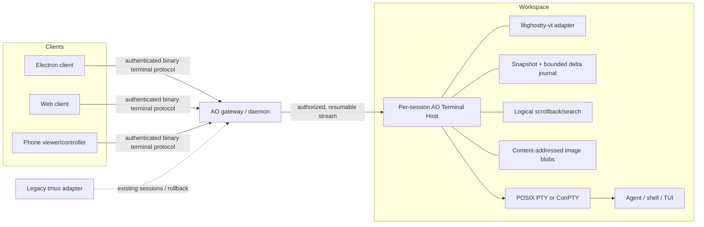

# Terminal architecture end to end

**Status:** research recommendation  
**Date:** 2026-08-16  
**Scope:** terminal process ownership, persistence, transport, multi-client synchronization, rendering, and interaction across AO desktop, web, mobile, local, cloud, Unix, and Windows

## Executive summary

AO should not begin by replacing xterm.js. It should first replace the raw-byte, per-client terminal attachment model with a workspace-side **AO Terminal Host** that owns the PTY or ConPTY, maintains authoritative terminal state, and synchronizes atomic snapshots plus sequenced screen deltas to every client. The host should use `libghostty-vt` behind an AO-owned adapter, while xterm.js remains the compatibility renderer during the transition.

That ordering addresses the root causes shared by AO's rendering, reattach, resize, and cloud problems. Today, Unix output passes through the agent, tmux's screen model, a fresh `tmux attach` PTY for each viewer, WebSocket framing, and xterm.js. Windows already uses a different and more centralized ConPTY host. A renderer swap alone preserves the nested state machines, replay bursts, ambiguous resize ownership, and raw-stream WAN behavior.

The recommended path is:

1. **Now — harden and measure:** upgrade-test xterm.js 6, add deterministic terminal recordings and cross-platform visual/state fixtures, introduce explicit stream generations, replay completion, acknowledgements, and a single writer/resize lease. Keep the existing architecture deployable.
2. **Next — establish terminal authority:** run a supervised Terminal Host beside each workspace. It owns the native POSIX PTY or Windows ConPTY and uses pinned `libghostty-vt` for headless state. Initially it emits an atomic VT snapshot followed by live output to existing xterm.js clients. New sessions opt in; tmux remains a rollback and legacy-session path.
3. **Later — adopt a state protocol and purpose-built clients:** send versioned snapshots and screen deltas, page/search server scrollback, move images out of band, and add a browser renderer backed by `libghostty-vt` WASM or an AO renderer. Retire tmux as the mandatory session layer only after fidelity, accessibility, mobile, and recovery gates pass.

`libghostty-vt` is the strongest terminal-core candidate: its current API targets macOS, Linux, Windows, and WebAssembly; exposes damage tracking and input encoding; and can serialize state as VT, text, or HTML. Its C API remains explicitly in flux, so AO must pin a revision and never expose Ghostty structures on the wire. xterm.js itself is healthy—6.0 shipped in December 2025—and remains the lowest-risk browser renderer in the near term. Its limitations are reasons to isolate it behind a client boundary, not reasons to make a renderer rewrite the first dependency of the cloud architecture. [S07] [S08] [S12] [S14] [S15]

## Decision

Build toward **Candidate C, AO Terminal Host with compatibility rendering**, then evolve it into **Candidate D, AO state protocol with native clients**. Use Candidate A, a hardened current stack, as the safe first stage. Do not adopt tmux control mode, Zellij, WezTerm's mux, or Mosh wholesale as the target; borrow their strongest protocol and collaboration techniques.

The essential decision is where terminal truth lives:

> One workspace-side process owns the child process, the PTY dimensions, the VT state, and the ordered history. Clients are resumable views and input principals—not independent terminal emulators attached to independent upstream PTYs.

This is an architectural inference from AO's failure modes and the referenced systems, not a claim made by any one upstream project.

## Baseline: what AO has today

On Unix, the agent command runs in a tmux pane whose `TERM` is `tmux-256color` under tmux's default configuration; a user's tmux `default-terminal` setting can override it. Tmux owns the durable screen. For every WebSocket viewer, the daemon starts `tmux -u -T RGB attach-session` on a new local PTY whose `TERM` is `xterm-256color`, then relays raw bytes. Each attach therefore has its own terminal handshake and repaint. AO intentionally chose per-client tmux attaches because a shared attach stream would emit terminal queries only once and break later clients. [AO01] [AO02]

The React client feeds those bytes into xterm.js 5.5. It prefers WebGL, falls back to canvas, fits and refits around layout changes, and contains explicit replay buffering and cover logic to suppress the initial visible walk through history. [AO05] [AO06] [AO07] On Windows, a per-session host owns ConPTY, retains a raw byte ring, and broadcasts output; each attachment receives the ring as its initial replay. [AO04] The terminal manager reconciles competing attachment sizes, making size selection a server concern even though each viewer measures independently. [AO03]

The current system has useful properties: tmux keeps Unix processes alive across daemon and client restarts, offers mature scrollback and manual recovery, and reproduces a conventional terminal byte stream. But it also creates three independently stateful terminal stages:

```text
agent/TUI → tmux pane state → per-client tmux attach PTY → xterm.js state
```

The chain explains why bugs are difficult to locate. A stale frame can originate in the application, tmux's idea of the attached client size, attach-time redraw, dropped/coalesced transport bytes, xterm parser state, glyph metrics, or the GPU renderer. Windows does not exercise the same chain, so behavioral parity is accidental rather than architectural.

### Failure mechanics

| Symptom | Structural cause | Why a renderer swap is insufficient |
|---|---|---|
| Reattach/repaint artifacts | A new `tmux attach` emits a non-atomic redraw plus mode queries and responses; the browser consumes it incrementally. | A different renderer still sees the same redraw stream and timing. |
| Multi-client resize fights | A PTY has one character grid, while viewers have different pixel and cell dimensions. Current policies select a winner implicitly. | Every emulator must render the one upstream grid; the ownership problem remains. |
| Scrollback inconsistency | tmux, the replay path, and xterm.js each have different history and reflow semantics. | Client history cannot reconstruct history the server did not send consistently. |
| WAN stalls and bursts | Raw output preserves every intermediate paint and lacks an application-level resumable state contract. | Faster drawing does not eliminate redundant network bytes or missing replay boundaries. |
| Font/WebGL regressions | Glyph shaping, atlas invalidation, browser GPU drivers, and DOM sizing are client concerns. | A native or WASM renderer can improve these, but only after state/session problems are separated. |
| Unix/Windows divergence | tmux is both persistence and screen authority on Unix; the ConPTY host is a byte-ring authority on Windows. | Choosing another browser renderer leaves two server lifecycles. |

## Findings: renderer alternatives

### xterm.js: retain as a bridge, not as the architecture

xterm.js is actively maintained and broadly deployed. Version 6.0 added synchronized output handling, more detailed ligature control, OSC 52 clipboard support, WebGL fixes, and search improvements. Its repository provides search, fit, WebGL, canvas, image, ligature, Unicode, serialization, and headless packages, plus IME and screen-reader modes. [S07] [S08]

Its important constraints are architectural:

- Parsing and terminal state largely run on the browser main thread; the open worker/parser discussion documents the difficulty of separating parser state from rendering. [S10]
- VT feature coverage is broad but not complete. SIXEL remains an external addon, and Kitty graphics support is still an active design area rather than a settled core capability. [S09] [S11]
- Touch selection, gestures, and virtual-keyboard behavior require product-specific mobile work. xterm.js provides primitives, not a best-in-class phone terminal. [S11]
- The server-side `@xterm/headless` plus serialize addon can create a coherent VT replay, but the client must parse the serialized VT again. That is a strong migration bridge, not an efficient final screen-state protocol. [S07] [S30]

AO is on 5.5, so a controlled 6.x upgrade should be evaluated before attributing current problems to project health. The xterm.js maintainers are themselves investigating `libghostty` for parser/state hot paths, evidence that these two options can be complementary rather than mutually exclusive. [S45]

### `libghostty-vt`: best headless core, not a drop-in browser widget

Ghostty now separates its terminal core from its native application. `libghostty-vt` presents a C API for terminal state on macOS, Linux, Windows, and WebAssembly. Its render-state API exposes global and row-level dirty tracking and bulk row access intended to reduce cross-language and WASM boundary overhead. Its input API encodes keys according to active terminal modes. [S12] [S13] [S14]

The formatter can emit current state as VT, plain text, or HTML and can include cursor, styles, hyperlinks, palette, terminal modes, scroll regions, tab stops, working directory, and Kitty keyboard state. That makes it unusually well suited to a gradual AO migration: the server can become authoritative while still sending an atomic VT reconstruction to xterm.js. [S15]

`libghostty-vt` does **not** provide a finished HTML canvas, DOM, WebGL, or WebGPU terminal component. Ghostling demonstrates that the library is renderer-agnostic and can compile to standalone WASM, but the consumer supplies drawing, windowing, selection, accessibility, and interaction. [S16] The full Ghostty application demonstrates a high feature ceiling—grapheme clusters, ligatures, font fallback, GPU rendering, and Kitty graphics—but its GUI is not an embeddable cross-platform AO renderer. [S17]

Risk: the API documentation explicitly says signatures are still in flux. AO should pin a tested revision, isolate it behind a tiny C ABI adapter or sidecar, keep golden VT fixtures, and define its own versioned wire schema. Ghostty enum values and memory layouts must never become AO protocol types. [S12] [S13]

### `alacritty_terminal`: proven core, more integration ownership

The Rust crate exposes a `Term`, grid, renderable content, search, damage tracking, and optional serialization. It is a real library rather than a GUI extraction. [S18] [S19] Zed uses a fork in its terminal implementation, while Warp describes using a fork of Alacritty's grid as the basis of its native product. [S36] [S38]

That adoption is evidence of performance and flexibility, but the forks are also a warning: an adopter owns compatibility changes, shaping, renderer integration, serialization stability, and browser/WASM plumbing. Compared with `libghostty-vt`, Alacritty has no comparable C API and formatter explicitly designed for cross-language/WASM consumers. It remains the strongest fallback if Ghostty's API or licensing/integration constraints become unacceptable.

### WezTerm/Termwiz: excellent ideas, too much product surface

WezTerm is a cross-platform Rust terminal and multiplexer with native scrollback, mouse support, ligatures, color emoji, hyperlinks, images, and remote multiplexer domains. [S20] Its Termwiz `Surface` is especially relevant: it tracks change sequence numbers and can return either accumulated changes or a full repaint when history cannot satisfy a consumer. That is almost exactly the semantic AO needs for resumable multi-client viewing. [S21]

However, Termwiz documents active development and potentially sweeping API changes. Adopting the complete WezTerm mux would import another workspace/session product, while extracting its terminal crates would still require an AO renderer and stable protocol wrapper. [S22] AO should copy the sequence/delta/full-repaint contract, not adopt WezTerm as the session authority.

### Zed and Warp: product approaches, not embeddable answers

Zed keeps its UI local and runs project work, including terminal processes, in a remote headless server. Its shipped terminal implementation is built around an Alacritty fork. [S35] [S36] A community Zed RFC/prototype proposes a persistent `pty-host`, a headless copy of the same `Term`, serialized snapshots, raw live bytes, and flow-control watermarks. That prototype is useful corroboration for AO's direction, but it is not evidence of shipped Zed behavior and must not be presented as such. [S37]

Warp built a native Rust/Metal renderer, forked Alacritty's grid, and used shell integration to divide commands and output into semantic blocks. [S38] The techniques—GPU-native rendering, semantic command boundaries, and a full editor model—are attractive later. Warp's renderer and block UI are integral to its product, not a reusable browser component, and therefore do not solve AO's near-term cloud/browser requirement.

### Renderer comparison

| Option | Browser/Electron | Native/Windows core | Damage/state API | Rich-text ceiling | Integration maturity for AO | Best role |
|---|---|---|---|---|---|---|
| xterm.js 6 | Excellent, ready now | Browser only; headless Node available | Internal buffer + serialize; not a semantic wire protocol | Good; addons for images/ligatures, gaps remain | High | Compatibility renderer and tactical upgrade |
| `libghostty-vt` | WASM core, no finished widget | macOS/Linux/Windows | Explicit render state and dirty rows | Very high | Medium; C API is in flux | Recommended server core and possible future client core |
| `alacritty_terminal` | Possible Rust/WASM work, no finished widget | Strong Rust core | Renderable content and damage | High with adopter work | Medium-low | Fallback core or native-client foundation |
| WezTerm/Termwiz | No AO-ready browser widget | Strong cross-platform app/crates | Strong sequence/change model | Very high | Low-medium; broad and unstable surface | Source of protocol ideas |
| Warp/Zed implementations | No reusable browser component | Native product-specific | Product-specific | Very high | Low | Techniques and UX references only |

## Findings: session and synchronization layer

### Keep ordinary tmux attach

Tmux remains an excellent local process-survival tool. It is installed, debuggable, familiar, and can repaint a terminal after a client disappears. For AO, ordinary attach also preserves terminal query/response behavior per viewer. The costs are the extra PTY/emulator layer, a process per attachment, terminal-dependent repaint streams, Unix-only persistence, and inefficient WAN semantics.

This remains the right rollback path and the lowest-risk short-term architecture, but it cannot be the cloud target.

### Tmux control mode (`-C`/`-CC`)

Control mode turns tmux into a line protocol. `%output` messages carry pane bytes; clients explicitly set sizes; `pause-after` flow control can stop a slow consumer, which must recover with `capture-pane`. `-CC` adds application-oriented behavior used by iTerm2. [S23]

It could eliminate each viewer's attached PTY and make pane lifecycle and output routing explicit. It does not provide an authoritative semantic terminal snapshot. `capture-pane` is a rendered text capture, not a complete transfer of cursor style, hidden modes, graphics, parser partial state, or every terminal capability. This limitation is an inference from tmux's documented control messages and capture recovery, and should be verified with a spike against AO's fixture corpus. It also leaves Windows on a separate path.

Verdict: useful as a bounded legacy bridge or diagnostic transport, not the target architecture.

### Zellij

Zellij has first-class multi-user sessions and a browser client with authentication, read-only tokens, mobile viewport handling, and touch scrolling. [S24] Its multiplayer model permits clients to have independent focus/cursors. [S46] These are good interaction references.

Zellij session resurrection serializes layouts and optionally viewport/scrollback; restarting exited commands is a separate, confirmation-gated feature, not transparent live-process persistence. [S25] Its current web client packages xterm.js assets, so adopting Zellij does not by itself migrate AO off xterm.js. [S26] It would also impose Zellij's panes, layouts, plugins, and session semantics underneath AO's own orchestration model.

Verdict: steal its read-only tokens, explicit collaboration, and mobile affordances; do not make it AO's core dependency.

### Mosh as a state-sync model

Mosh's State Synchronization Protocol treats the terminal screen as replicated state rather than an ordered byte stream. It assigns state numbers, acknowledges the latest state received, skips obsolete intermediate screens, and supports conservative speculative local echo. [S27] This is the right mental model for AO over variable-latency networks.

AO should not adopt Mosh's UDP roaming protocol wholesale. AO already needs authenticated browser transport, scrollback/search, multiple simultaneous viewers, and rich terminal extensions. The transferable ideas are:

- sequence and acknowledge display state, not just transport packets;
- allow a slow observer to jump to a recent full snapshot;
- never let obsolete paint backlog block fresh input or the current screen;
- predict only input known to be safe, then reconcile visibly.

For agent TUIs, prediction must be much more conservative than for a shell prompt. AO should disable it in alternate screen, raw/no-echo mode, mouse reporting, bracketed composition, password entry, and whenever shell-integration confidence is absent. This is an AO design inference.

### Embedded headless VT authority

A headless emulator next to the process consumes the one canonical PTY output stream once. It can atomically snapshot the screen, retain logical scrollback, produce per-client deltas, track terminal modes, and answer reconnects without replaying every obsolete animation. Both POSIX PTYs and ConPTY produce VT streams; ConPTY explicitly translates legacy Console API operations into VT output and accepts VT input. [S28] [S29]

This unifies Unix and Windows above the platform process adapter. It also creates responsibilities tmux previously supplied: process supervision, detach/reattach, resize policy, crash recovery, scrollback storage, and a manual escape hatch. Those responsibilities are substantial but align directly with AO's cloud product rather than with a third-party multiplexer UI.

### Session-layer comparison

| Session layer | Reattach fidelity | Scrollback authority | Multi-client size | WAN behavior | Windows parity | Main residual risk |
|---|---|---|---|---|---|---|
| tmux normal attach | Good eventual repaint; non-atomic attach | tmux plus client histories | Implicit/shared policy | Raw redraw stream | Separate ConPTY path | Nested emulators remain |
| tmux control mode | Better lifecycle/flow visibility; snapshot incomplete | tmux capture plus client state | Explicit client sizes, still one pane grid | Better framing, still mostly raw bytes | Poor | Unix bridge becomes permanent |
| Zellij | Strong within Zellij model | Zellij | Built-in collaboration | Browser-ready | Limited for AO's Windows requirement | Imports competing product semantics |
| Mosh/SSP | Strong current-screen resync | Screen-focused; not AO search/history | Primarily one interactive client | Excellent under loss/latency | Model is portable | Not a ready browser/multi-view solution |
| AO headless VT host | Atomic state + ordered resume | One server authority | Explicit writer lease and observer viewports | Coalesced deltas/resync | Native PTY/ConPTY adapters | Highest implementation ownership |

## Competitor and adjacent-system teardown

Public evidence varies. Where a vendor does not publish its terminal transport, this report says so rather than inferring architecture from screenshots.

### VS Code remote terminals

VS Code's current pty service is the most actionable reference. A persistent PTY is independent of the renderer. `XtermSerializer` feeds output and resize events to a headless xterm instance and uses the serialize addon to produce a compact VT replay, including terminal modes, for reconnect. The browser receives an explicit replay-complete event before live operation. [S30]

The terminal process tracks unacknowledged output characters and pauses the PTY at a high watermark until client acknowledgements drain below a low watermark. The browser process manager sends those acknowledgements. [S31] [S32]

Techniques to steal:

- isolate the PTY owner from renderer/client lifecycle;
- distinguish replay from live output explicitly;
- keep a server-side emulator for coherent reconstruction;
- implement credit/acknowledgement flow control;
- preserve shell-integration metadata across reconnect.

Limitation: serialized VT is still reparsed by the client and does not give multiple clients independent semantic delta streams. It is an excellent intermediate architecture for AO, not the final protocol.

OpenVSCode Server is explicitly used as the basis for browser-hosted VS Code experiences including Gitpod and GitHub Codespaces, while code-server is a patched distribution of VS Code for browser access. [S33] [S34] These products therefore validate the operational pattern—remote extension/PTY services plus a browser xterm client—but are not independent evidence for a new renderer. Public Codespaces material does not establish an internal terminal protocol beyond that family resemblance.

### Conductor and agent orchestrators

Conductor documents workspaces with a terminal for each task, but its public documentation does not specify terminal renderer, persistence owner, replay format, or resize arbitration. [S39] No architecture claim should be made from the visible product alone. This lack of public detail is itself a useful boundary: AO's decision should rest on inspectable protocols and source, not competitor UI inference.

Open agent terminal projects frequently use the same thin-relay pattern as AO. ttyd connects a command to xterm.js over the web and adds authentication, SSL, file transfer, IME/CJK, and graphics support. [S40] GoTTY states directly that it relays TTY input/output over WebSocket and recommends tmux to share one process. [S41] These systems demonstrate reach and simplicity, but not atomic multi-client state synchronization.

### sshx

sshx is a collaborative, end-to-end encrypted web terminal with reconnection, remote cursors, chat, and predictive echo. Its open source tree uses an xterm fork and client-side typeahead logic. [S42] The collaboration UX and guarded prediction are worth studying. Its relay-oriented collaboration model does not remove AO's need for a workspace-side canonical screen and durable cloud-session ownership.

### Warp and Zed

Warp demonstrates the ceiling of treating terminal output as structured application content: shell hooks establish command blocks, while native GPU rendering and an editor-like input model enable richer selection and workflows. [S38] Zed demonstrates the value of a small remote headless server while keeping latency-sensitive rendering local. [S35] AO should copy their separation of remote execution from local presentation and progressively add OSC 133/shell semantic regions; it should not couple process persistence to a proprietary/native UI model.

### What to steal

| Source | Technique | AO adaptation |
|---|---|---|
| VS Code | Persistent PTY service, headless serializer, replay sentinel, output acks | Immediate bridge architecture; later replace VT replay with screen snapshots/deltas |
| Mosh | Latest-state synchronization, sequence/ack, guarded prediction | Coalesce observer updates; resume by sequence; normal-shell-only prediction |
| WezTerm/Termwiz | Change journal that falls back to full repaint | Bounded delta log with snapshot reset on gaps |
| Zellij | Viewer/controller collaboration, read-only access, mobile viewport UX | Explicit terminal roles, control requests, touch patterns |
| sshx | Presence, remote cursors, predictive echo | Optional collaboration overlay and conservative typeahead |
| Warp | Shell-semantic blocks | Preserve OSC 133 regions for search/navigation and agent-event correlation |
| ttyd/GoTTY | Thin, deployable browser access | Keep a raw-VT compatibility route for recovery and debugging |

## Best-in-class feature bar

The feature bar is not “renders ANSI.” It is consistent behavior across a local desktop, a Chromium tab over a WAN, and a narrow touch device.

| Area | Acceptance bar | Architectural implication |
|---|---|---|
| Perceived latency | Local input-to-first-paint p95 under one frame when the app echoes promptly; WAN typing remains responsive under 100–200 ms RTT; current screen is never stuck behind obsolete animation. | Timestamp input/output/paint; acknowledge state; coalesce superseded paints; add prediction only under proven-safe modes. |
| Reattach | First visible frame is atomic and current; no “history fast-forward”; cursor, title, palette, modes, alt screen, and mouse state match before input is enabled. | Snapshot plus sequence, replay-complete barrier, full resync on gaps. |
| Scrollback | Search is fast across retained history; wrapped logical lines survive resize; results page without downloading all history; copy preserves text rather than cell padding. | Server-owned logical scrollback with hard/soft-wrap metadata and paged search. |
| Multi-client | One explicit controller owns input and canonical grid size; observers cannot resize the process; control transfer is visible and auditable. | Writer/resize lease, viewer role, presence, crop/pan/letterbox for observers. |
| Keyboard and IME | Bracketed paste, focus, Kitty keyboard extensions, compose/dead keys, CJK IME, emoji, and key-up/repeat semantics work without double encoding. | Send normalized input/composition events; encode against server-known terminal modes. Kitty's protocol is a useful capability target. [S44] |
| Mouse and alternate screen | Mode transitions are acknowledged before input; selection overrides are consistent; wheel behavior is defined for application mouse mode and normal scrollback. | Modes live in authoritative state; client interaction derives from the acknowledged snapshot. |
| Text fidelity | Unicode grapheme clusters, width, combining marks, fallback fonts, ligatures, underline variants, and bidi limitations are deterministic and tested. | Version width tables; ship font metrics policy; compare state separately from glyph rasterization. |
| Images and links | OSC 8 links are inspectable and safe; Kitty/SIXEL images are bounded, deduplicated, and reconnectable. | Content-addressed image blobs with quotas and references in screen state; never replay unlimited inline image payloads. Kitty's graphics protocol provides a strong interoperability target. [S43] |
| Accessibility | Screen readers receive ordered textual updates; keyboard-only selection/search works; contrast and reduced-motion settings are honored. | Maintain a DOM accessibility mirror or equivalent semantic tree; canvas/GPU pixels alone are insufficient. |
| Mobile | Touch scroll does not inject wheel events accidentally; long-press selection, copy, pinch font size, safe-area layout, and a configurable modifier/key row work; read-only viewing is excellent. | Phone-specific interaction layer and viewer-default role, not a shrunk desktop terminal. Zellij's web client is a useful reference. [S24] |
| Observability | A report identifies application bytes, PTY state, protocol sequence, renderer, font, GPU backend, and resize/controller events without capturing secrets by default. | Layer-specific trace IDs and opt-in redacted recordings; no terminal contents in ordinary telemetry. |

## Candidate end-to-end architectures

Scores are a decision aid, not measured facts: 1 is poor and 5 is strong. “Delivery safety” rewards a smaller, reversible change. Weighted totals are an AO synthesis.

| Criterion | Weight | A: harden tmux+xterm | B: tmux control + headless client | C: AO host + VT compatibility | D: AO host + state protocol/new renderer |
|---|---:|---:|---:|---:|---:|
| Reattach fidelity | 20% | 2 | 3 | 4 | 5 |
| WAN and multi-client behavior | 20% | 2 | 3 | 4 | 5 |
| Browser/mobile fit | 15% | 3 | 3 | 4 | 5 |
| Unix/Windows parity | 15% | 2 | 2 | 5 | 5 |
| Eliminates nested-state bugs | 10% | 1 | 3 | 4 | 5 |
| Delivery safety | 10% | 5 | 3 | 3 | 1 |
| Feature ceiling | 10% | 3 | 3 | 4 | 5 |
| **Weighted total** | **100%** | **2.45** | **2.85** | **4.05** | **4.60** |

### Candidate A — harden tmux attach and xterm.js

Upgrade xterm.js, improve replay framing/observability, define resize ownership, and retain per-client `tmux attach`.

- **Effort/risk:** low; weeks rather than quarters, depending on regression breadth.
- **Windows/browser:** browser stays strong; Windows remains a parallel ConPTY implementation.
- **Eliminates:** some xterm 5.5 bugs, hidden replay timing, ambiguous resize policy, weak diagnostics.
- **Does not eliminate:** nested emulators, attach-time repaint, raw WAN output, duplicate Unix/Windows session semantics.
- **Use:** mandatory stabilization and rollback stage, not target.

### Candidate B — tmux control mode plus a headless state service

Replace each normal attach with one control-mode connection and feed pane output into a headless emulator; clients receive serialized state or bytes.

- **Effort/risk:** medium.
- **Windows/browser:** browser is manageable; Windows still needs a separately designed authority.
- **Eliminates:** per-client tmux attachment PTYs and some output-routing ambiguity.
- **Does not eliminate:** tmux as a Unix-only state owner, incomplete initial-state reconstruction, two platform lifecycles.
- **Use:** only if a spike proves it is a fast compatibility bridge for existing tmux sessions. Do not build the cloud contract around it.

### Candidate C — AO Terminal Host with VT compatibility output

A workspace-side host owns the native PTY/ConPTY and child. A pinned `libghostty-vt` instance consumes output and owns screen/scrollback state. On attach, it formats one coherent VT snapshot, marks replay complete, then sends live VT output to xterm.js. It journals sequence numbers and enforces one writer/resize lease.

- **Effort/risk:** high but incremental; approximately one major subsystem with a feature-flagged session boundary.
- **Windows/browser:** the platform split ends below the host; all clients remain xterm-compatible.
- **Eliminates:** mandatory tmux layer for new sessions, per-client server PTYs, non-atomic history walk, inconsistent resize authority, daemon-coupled attachments.
- **Residual:** client reparses VT; live output can still contain obsolete redraws; renderer-specific bugs remain.
- **Use:** recommended next architecture.

### Candidate D — AO Terminal Host, native state protocol, purpose-built clients

The host sends atomic snapshots and compact semantic deltas. Clients render cells, glyph runs, cursor, selections, links, and image references without reconstructing history from VT. Browser clients use `libghostty-vt` WASM where parsing/input logic helps, or an AO WebGPU/canvas renderer with a DOM accessibility mirror. Native clients may share the same core.

- **Effort/risk:** very high; renderer, protocol, accessibility, font shaping, mobile, and conformance are all product code.
- **Windows/browser:** best possible parity; one stable AO protocol above platform adapters.
- **Eliminates:** nested parsing, raw-byte replay, redundant WAN paints, renderer lock-in at the transport boundary.
- **Residual:** AO owns a complex terminal UI and protocol forever.
- **Use:** target evolution after Candidate C proves the server authority and protocol semantics.

## Recommended target architecture



### Ownership and lifecycle

- Run the Terminal Host inside the workspace, beside the process, so cloud terminal bytes do not depend on a desktop daemon staying connected.
- Prefer one host process per terminal session for crash and memory isolation. A small workspace supervisor owns discovery and restarts, but a restarted host can restore only the last screen—not a child whose PTY owner died. This failure is equivalent in class to a tmux-server crash and must be measured explicitly.
- Keep control-plane metadata in AO's durable store, but keep live terminal cells, scrollback, secrets, and image payloads in the workspace terminal service with bounded retention. Do not put high-volume terminal state through SQLite change events.
- Use an unguessable short-lived attach ticket carrying session, user, role, and expiry. The gateway authenticates clients; the host still validates scoped authorization.
- Preserve a local raw-VT/manual attach path for recovery. The Ghostty formatter can supply a coherent VT snapshot to a conventional terminal.

### Canonical dimensions and multiple viewers

A PTY has exactly one `(columns, rows)` grid; there is no technically correct way to give simultaneous controllers incompatible widths. ConPTY likewise exposes one pseudo-console size. [S28]

AO should make the policy a visible product concept:

1. A session has one **controller lease**. Its measured grid sets canonical PTY dimensions.
2. Observers do not resize the PTY. They crop/pan, letterbox, or scale typography locally while preserving the canonical cell grid.
3. A controller can transfer control; lease generation changes atomically and is shown to all clients.
4. Phone clients attach read-only by default and can explicitly request control with a phone-appropriate canonical size.
5. On controller loss, keep the last size for a grace period; then transfer according to an explicit policy, never “largest recent socket wins.”

This makes resize bugs attributable and prevents a dashboard thumbnail or phone rotation from reflowing an agent's TUI.

### Versioned synchronization protocol

Define an AO-owned binary protocol. WebSocket is sufficient initially; WebTransport can be evaluated later without changing message semantics.

**Attach and capability negotiation**

```text
ClientHello { protocol_versions, renderer_caps, input_caps, viewport, resume_token }
Attach       { session_id, generation?, after_seq?, requested_role }
ServerHello { protocol_version, session_generation, role, canonical_size, feature_caps }
```

**State transfer**

- `Snapshot`: atomic primary and alternate buffers, active buffer, cursor, modes, palette, title, cwd/shell regions, hyperlinks, wrap metadata, image references, canonical dimensions, and `snapshot_seq`.
- `Delta`: monotonic `(generation, seq)`, row/cell runs plus mode/cursor/metadata operations. Several obsolete deltas may be coalesced into the newest equivalent state.
- `Ack`: latest applied sequence and optional receive credit. The host keeps only a bounded journal per session, not per client.
- `ResetRequired`: a resume sequence is too old or capabilities changed; client discards derived state and requests a new snapshot.
- `ScrollPage`/`Search`: pages logical history independently of the live viewport.
- `ReplayComplete`: enables input only after the initial snapshot and modes are applied. Candidate C uses the same barrier around formatted VT.

The protocol should carry semantic AO operations, never Rust/Zig/C structs. It needs golden compatibility fixtures and at least the current and previous protocol version during rolling cloud upgrades.

**Input**

Send text, key, composition, paste, mouse, focus, and resize/control requests as typed events. The host encodes terminal sequences using current authoritative modes. This avoids a stale client encoding Kitty keyboard or application-cursor keys against yesterday's mode. During compatibility, raw byte input can remain as a negotiated capability.

**Flow control and latency**

- Never block current display state behind an unbounded slow-client queue.
- Pause PTY reads only as a last protection for the child; normally coalesce display deltas for slow observers.
- Never drop input, lease, resize, or mode-control events.
- Bound snapshots, scrollback, hyperlinks, OSC payloads, and decoded images before allocation.
- Record input-received, PTY-written, PTY-read, delta-produced, client-applied, and frame-painted timestamps without recording content.

### Rendering boundary

The protocol should separate terminal semantics from drawing:

- The state model establishes cells/graphemes, attributes, modes, links, cursor, image references, and logical history.
- The renderer owns font discovery/fallback, shaping, ligatures, glyph atlas, selection visuals, GPU/canvas fallback, accessibility mirror, and device input UX.
- A renderer cannot silently reinterpret widths. It negotiates a width-table/version capability and reports metrics.

For the first browser renderer, evaluate two implementations behind the same conformance suite:

1. `libghostty-vt` WASM plus a thin AO WebGPU/canvas renderer, using bulk render-state reads and Ghostty input encoding.
2. A direct AO screen-delta renderer that does no VT parsing, with HarfBuzz-compatible shaping in WASM and canvas/WebGPU backends.

The first reuses more terminal logic; the second has a smaller browser runtime once the server protocol is authoritative. Neither should block Candidate C.

## Staged migration plan

### Now: make the current stack measurable and deterministic

**Session and protocol**

- Specify controller/viewer roles and a single resize lease in the existing mux protocol.
- Add terminal stream generation, monotonically ordered chunks, explicit initial-replay completion, and reconnect/resume outcomes.
- Prototype output acknowledgements and bounded queues using VS Code's high/low-watermark design as the reference. [S31] [S32]
- Measure binary WebSocket framing against current base64-in-JSON frames; adopt it if the compatibility and CPU results justify the change.

**Renderer**

- Run an xterm.js 6 upgrade branch through a fixture matrix before changing defaults. Test WebGL, canvas fallback, browser zoom, DPR changes, font loading/fallback, ligatures, IME, Unicode width, search, and resize convergence.
- Keep WebGL fallback automatic and observable. A GPU backend is an implementation detail, not session state.
- Do not enable images or new grapheme behavior globally until memory, paste/copy, and width regressions pass.

**Test and attribution harness**

- Record deterministic fixtures as `{initial size, input events, resize events, PTY byte chunks, timing markers}` plus expected semantic screen hashes and selected screenshots.
- Include shells, long scrollback, rapid progress redraw, tmux attach, alternate-screen TUIs, mouse tracking, OSC 8, OSC 133, bracketed paste, CJK/emoji/combining marks, IME, Kitty keyboard, SIXEL/Kitty image rejection or rendering, and resize storms.
- Replay each fixture into xterm 5.5, xterm 6, `libghostty-vt`, and later the AO state renderer. Compare semantic cells separately from pixels.
- Add layer identifiers and sequences to diagnostics: agent PTY, tmux/control attach, daemon mux, client parser, renderer backend, font fingerprint, DPR, and lease generation.
- Establish dashboards for attach-to-stable-frame, input-to-first-paint, bytes per rendered cell change, resync count, dropped/coalesced delta count, search latency, and renderer fallback/crash rate.

**Exit criteria**

- Regressions are reproducible from a shareable, secret-scrubbed fixture.
- No observer can resize an interactive session.
- Replay completion and stream generation are explicit in logs and tests.
- xterm 6 is either shipped with measured parity or rejected with named failing fixtures.

### Next: introduce the AO Terminal Host

1. **Build the lifecycle shell.** Create a supervised, per-session host that survives client and daemon restarts. Start with POSIX PTY; put ConPTY behind the same host interface. Define discovery, attach tickets, graceful shutdown, resource caps, and raw-VT recovery.
2. **Embed the state core.** Pin a `libghostty-vt` revision behind a narrow adapter. Feed output, resize once per lease event, and validate state against the fixture corpus. Shadow-parse existing terminal streams first; do not make it authoritative until divergence is understood.
3. **Ship the compatibility replay.** Use the formatter to send one coherent VT snapshot to xterm.js, followed by an explicit replay-complete boundary and live bytes. Preserve modes and shell metadata. This should replace raw-ring/history fast-forward for opted-in sessions.
4. **Unify platforms.** Move Windows ConPTY ownership under the same lifecycle, lease, replay, and flow-control contract. Keep only the PTY adapter platform-specific.
5. **Canary new sessions.** Existing tmux sessions remain attached through the legacy path. New local sessions opt in by feature flag, followed by cloud workspaces. Support fallback at session creation rather than trying to migrate a live PTY between owners.
6. **Add server scrollback.** Retain bounded logical history and hard/soft-wrap markers. Provide paged retrieval and search before reducing client scrollback retention.

**Exit criteria**

- Client/daemon restart reconnects atomically without a visible history walk.
- POSIX and Windows pass the same protocol and semantic-screen fixtures.
- Two observers plus one controller remain consistent under WAN delay, reconnect, and resize.
- Host memory/CPU, scrollback quotas, child exit propagation, and crash behavior have load and fault-injection coverage.
- A tmux/raw-VT rollback remains available for new-session creation.

### Later: native screen sync and renderer independence

1. Define snapshot/delta protocol v1 from observed compatibility-host behavior, not from a speculative renderer object model.
2. Ship a hidden client renderer that consumes semantic deltas; run it side by side with xterm.js and compare screen hashes.
3. Add DOM accessibility output, keyboard-only navigation, IME, touch selection, mobile modifier row, and viewer-first phone layouts before calling the renderer production-ready.
4. Move large Kitty/SIXEL payloads into quota-controlled, content-addressed blobs. Add OSC 8 safety UI and shell-semantic command regions.
5. Add conservative Mosh-style prediction only for verified normal-buffer, echoing shell input. Mark predicted cells and reconcile; automatically disable on raw mode, alternate screen, mouse reporting, IME composition, or uncertainty.
6. Graduate clients independently: web/mobile first if network savings justify it; Electron may retain xterm longer. Remove VT compatibility only after all supported clients negotiate state protocol v1.
7. Stop requiring tmux for new Unix sessions after recovery, manual attach, lifecycle, scrollback, and upgrade gates pass. Keep an explicit “run inside tmux” compatibility option for users and diagnostics if demand warrants it.

**Exit criteria**

- Native state clients meet or beat xterm on the feature bar and accessibility audit.
- Resume after an intentionally lost network interval transfers a bounded snapshot/delta set, not elapsed raw output.
- Cloud p95 input-to-paint and attach-to-stable-frame targets hold under representative RTT/loss.
- No critical fixture differs across Electron, web, phone, POSIX, and Windows without a documented capability downgrade.

## Risks and mitigations

| Risk | Consequence | Mitigation / decision gate |
|---|---|---|
| `libghostty-vt` API churn | Build breakage or subtle state drift | Pin revisions; tiny adapter; AO-owned types; golden corpus; planned upgrade cadence. |
| Host crash owns the PTY | Live child is lost | Per-session isolation, supervisor, crash-loop limits, fault tests, visible failure reason; retain tmux fallback until reliability is demonstrated. |
| Server and client width/shaping disagree | Cursor and selection drift | Version grapheme/width policy; semantic hashes; server determines cells, client only shapes within them. |
| Delta protocol overfits one renderer | Long-term lock-in reappears | Model terminal semantics, not GPU buffers or Ghostty structs; build two consumers in tests. |
| Slow observers consume memory | Workspace instability | Bounded shared journal, per-client credit, coalescing, snapshot reset, disconnect limits. |
| Rich image escape sequences exhaust resources | Memory/disk/security incidents | Disabled by default initially; strict decoded-byte/dimension/count quotas; blob validation and retention. |
| Accessibility arrives late | New renderer cannot replace xterm | Accessibility tree and keyboard interaction are release gates from the first hidden renderer. |
| Terminal recordings expose secrets | Trust/privacy failure | Content-free metrics by default; explicit opt-in capture; local redaction; short retention; never ordinary telemetry. |
| Rolling cloud upgrades split protocol versions | Failed attaches | Capability negotiation, previous-version support, generation reset, raw-VT recovery. |
| Shell prediction corrupts TUI input | User-visible wrong commands | Opt-in experimental flag; narrow positive safety conditions; instant disable and reconciliation. |

## Open questions and validation spikes

These questions should be answered before Candidate C's protocol is frozen:

1. Does `libghostty-vt`'s formatter reconstruct every mode AO's xterm clients need after a snapshot, including alternate buffer, Kitty keyboard, mouse/focus reporting, partial parser state, and graphics references? Build fixtures; do not assume.
2. Can scrollback be extracted and paged without copying the full Ghostty terminal state, or should AO own a parallel logical-line journal fed by parser events?
3. What host packaging produces the lowest operational risk: cgo-linked Go, a Zig/C sidecar, or a Rust/Zig terminal service? Compare crash isolation, cross-compilation, signing, and Windows distribution.
4. What is the canonical controller policy for noninteractive log sessions, agent-owned background TUIs, and user takeover? Product behavior must precede protocol fields.
5. How much bandwidth does semantic delta encoding save on real agent TUIs versus compressed raw VT plus atomic snapshots? Measure recorded workloads at 50, 100, and 200 ms RTT with loss.
6. Can `tmux -CC` produce a safe one-release bridge for already-running sessions, or does capture/mode incompleteness make ordinary attach more reliable? Validate, then discard the losing path.
7. Which client should first consume native deltas: phone, browser, or Electron? Choose based on measured network/interaction benefit, not implementation novelty.

## Sources and evidence quality

Sources were accessed 2026-08-16. Primary repositories, source files, protocol papers, and official documentation were preferred. GitHub issues and maintainer discussions are used only to establish an active limitation or direction, not as guarantees. Product behavior inferred from sources is labeled in the body. Conductor's unpublished internals are intentionally left unknown.

### AO implementation baseline

- **[AO01]** AO, [`backend/internal/terminal/doc.go`](../../backend/internal/terminal/doc.go) — terminal transport rationale and per-client attach model.
- **[AO02]** AO, [`backend/internal/adapters/runtime/tmux/tmux.go`](../../backend/internal/adapters/runtime/tmux/tmux.go) and [`commands.go`](../../backend/internal/adapters/runtime/tmux/commands.go) — tmux launch, attach, environment, sizing, and capture behavior.
- **[AO03]** AO, [`backend/internal/terminal/manager.go`](../../backend/internal/terminal/manager.go) — attachment and authoritative-size reconciliation.
- **[AO04]** AO, [`backend/internal/adapters/runtime/conpty/host.go`](../../backend/internal/adapters/runtime/conpty/host.go) and [`attach.go`](../../backend/internal/adapters/runtime/conpty/attach.go) — Windows host, raw replay ring, broadcast, and resize policy.
- **[AO05]** AO, [`frontend/src/renderer/components/XtermTerminal.tsx`](../../frontend/src/renderer/components/XtermTerminal.tsx) — renderer/addon/fallback and fitting behavior.
- **[AO06]** AO, [`frontend/src/renderer/hooks/useTerminalSession.ts`](../../frontend/src/renderer/hooks/useTerminalSession.ts) and [`terminal-mux.ts`](../../frontend/src/renderer/lib/terminal-mux.ts) — WebSocket framing, replay buffering, reconnect, and resize handling.
- **[AO07]** AO, [`frontend/package.json`](../../frontend/package.json) — pinned xterm.js and addon version ranges.

### Terminal cores and renderers

- **[S07]** xterm.js maintainers, [xterm.js README and addon inventory](https://github.com/xtermjs/xterm.js), official repository.
- **[S08]** xterm.js maintainers, [xterm.js releases](https://github.com/xtermjs/xterm.js/releases), official release history.
- **[S09]** xterm.js maintainers, [Supported terminal sequences](https://xtermjs.org/docs/api/vtfeatures/), official capability matrix.
- **[S10]** xterm.js maintainers, [Issue #3368: parser in a worker](https://github.com/xtermjs/xterm.js/issues/3368), open architectural discussion.
- **[S11]** xterm.js maintainers, [Issue #5377: mobile touch support](https://github.com/xtermjs/xterm.js/issues/5377), active limitation/proposal.
- **[S12]** Ghostty project, [`libghostty-vt` README](https://github.com/ghostty-org/ghostty/blob/main/README.md), official platform/API status.
- **[S13]** Ghostty project, [`ghostty/vt.h`](https://github.com/ghostty-org/ghostty/blob/main/include/ghostty/vt.h), official C API.
- **[S14]** Ghostty project, [`ghostty/vt/render.h`](https://github.com/ghostty-org/ghostty/blob/main/include/ghostty/vt/render.h), official damage/render-state API.
- **[S15]** Ghostty project, [`ghostty/vt/formatter.h`](https://github.com/ghostty-org/ghostty/blob/main/include/ghostty/vt/formatter.h), official state formatting API.
- **[S16]** Ghostty project, [Ghostling](https://github.com/ghostty-org/ghostling), official minimal renderer and WASM example.
- **[S17]** Ghostty project, [Ghostty features](https://ghostty.org/docs/features), official full-application feature reference.
- **[S18]** Alacritty project, [`alacritty_terminal` crate](https://docs.rs/alacritty_terminal/latest/alacritty_terminal/), official generated API documentation.
- **[S19]** Alacritty project, [`alacritty_terminal::term`](https://docs.rs/alacritty_terminal/latest/alacritty_terminal/term/), official `Term`, search, render, and damage API.
- **[S20]** WezTerm project, [WezTerm overview](https://wezterm.org/), official terminal/multiplexer feature documentation.
- **[S21]** WezTerm project, [`termwiz::surface::Surface`](https://docs.rs/termwiz/latest/termwiz/surface/struct.Surface.html), official change-sequence API.
- **[S22]** WezTerm project, [Termwiz README](https://docs.rs/crate/termwiz/latest/source/README.md), official scope and stability note.
- **[S36]** Zed Industries, [`terminal` crate source](https://github.com/zed-industries/zed/tree/main/crates/terminal), official repository showing Alacritty-derived implementation.
- **[S37]** Zed community, [Discussion #50584: persistent terminal prototype/RFC](https://github.com/zed-industries/zed/discussions/50584), explicitly non-shipped design evidence.
- **[S38]** Warp, [How Warp works](https://www.warp.dev/blog/how-warp-works), vendor engineering account of its grid, renderer, and block model.
- **[S45]** xterm.js maintainers, [Issue #5686: explore `libghostty` adoption](https://github.com/xtermjs/xterm.js/issues/5686), current exploratory direction.

### Multiplexers, protocols, and platform PTYs

- **[S23]** tmux project, [Control mode](https://github.com/tmux/tmux/wiki/Control-Mode), official protocol and flow-control documentation.
- **[S24]** Zellij project, [Web client](https://zellij.dev/documentation/web-client.html), official authentication, mobile, and attach behavior.
- **[S25]** Zellij project, [Session resurrection](https://zellij.dev/documentation/session-resurrection.html), official persistence boundaries.
- **[S26]** Zellij project, [`xtask/src/assets.rs`](https://github.com/zellij-org/zellij/blob/main/xtask/src/assets.rs), official source showing packaged web-terminal assets.
- **[S27]** Keith Winstein and Hari Balakrishnan, [Mosh: An Interactive Remote Shell for Mobile Clients](https://mosh.org/mosh-paper-draft.pdf), original protocol paper.
- **[S28]** Microsoft, [Windows Console definitions: pseudo console](https://learn.microsoft.com/en-us/windows/console/definitions), official ConPTY model.
- **[S29]** Microsoft Command Line team, [Introducing the Windows Pseudo Console (ConPTY)](https://devblogs.microsoft.com/commandline/windows-command-line-introducing-the-windows-pseudo-console-conpty/), official engineering explanation.
- **[S43]** Kitty project, [Terminal graphics protocol](https://sw.kovidgoyal.net/kitty/graphics-protocol/), protocol specification.
- **[S44]** Kitty project, [Keyboard protocol](https://sw.kovidgoyal.net/kitty/keyboard-protocol/), protocol specification.
- **[S46]** Zellij project, [Multiplayer sessions](https://zellij.dev/news/multiplayer-sessions/), official collaboration model.

### Remote IDEs and browser terminal systems

- **[S30]** Microsoft, [`ptyService.ts`](https://github.com/microsoft/vscode/blob/main/src/vs/platform/terminal/node/ptyService.ts), current VS Code persistent PTY and serializer implementation.
- **[S31]** Microsoft, [`terminalProcess.ts`](https://github.com/microsoft/vscode/blob/main/src/vs/platform/terminal/node/terminalProcess.ts), current output acknowledgement/watermark implementation.
- **[S32]** Microsoft, [`terminalProcessManager.ts`](https://github.com/microsoft/vscode/blob/main/src/vs/workbench/contrib/terminal/browser/terminalProcessManager.ts), current browser-side acknowledgement path.
- **[S33]** Gitpod, [OpenVSCode Server](https://github.com/gitpod-io/openvscode-server), official repository and deployment positioning.
- **[S34]** Coder, [code-server FAQ](https://github.com/coder/code-server/blob/main/docs/FAQ.md), official relationship to VS Code web/server implementations.
- **[S35]** Zed Industries, [Remote development](https://zed.dev/docs/remote-development), official local-client/headless-server model.
- **[S39]** Conductor, [Workspaces](https://www.conductor.build/docs/core/workspaces), official public product documentation; no terminal internals disclosed.
- **[S40]** ttyd project, [ttyd](https://github.com/tsl0922/ttyd), official repository and feature list.
- **[S41]** GoTTY project, [GoTTY](https://github.com/yudai/gotty), official repository and raw WebSocket/tmux sharing description.
- **[S42]** sshx project, [sshx](https://github.com/ekzhang/sshx), official repository and collaboration/predictive-echo implementation.

## Bottom line

AO's strategic terminal problem is not “which canvas draws ANSI fastest?” It is “which component owns truth, and how do many lossy, differently sized clients resume that truth?” Make the workspace Terminal Host authoritative, use `libghostty-vt` to avoid inventing terminal semantics, retain xterm.js as a reversible compatibility client, and let measured protocol and accessibility work—not renderer enthusiasm—determine when AO is ready to leave xterm.js behind.
