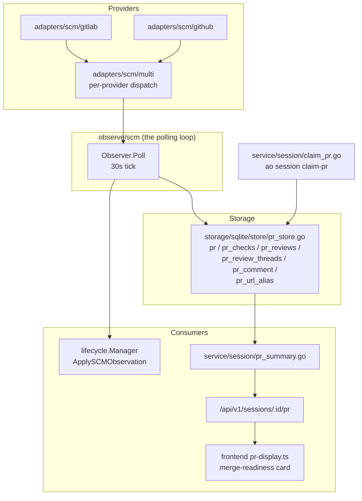
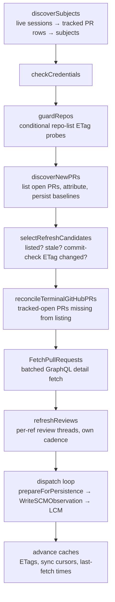

# SCM Observer Architecture

How AO observes pull requests: the polling pipeline, the durable-state rules it
must never violate, where PR identity lives today, why repo renames broke it,
and the target identity design.

Scope: the provider-neutral SCM subsystem — adapters, the polling observer,
PR storage/identity, and the read models that feed the UI. The lifecycle
manager (LCM) is covered only at its SCM boundary. Per-provider field-mapping
rules (how GitHub's `mergeStateStatus` becomes `MergeBlocked`, etc.) are
documented in `backend/internal/adapters/scm/github/doc.go` and the GitLab
equivalent; this doc does not duplicate them.

## Table of Contents

- [Component Map](#component-map)
- [How PR Facts Enter the System](#how-pr-facts-enter-the-system)
- [The Polling Pipeline](#the-polling-pipeline)
- [Durable-State Invariants](#durable-state-invariants)
- [PR Identity Today: Five Independent Derivations](#pr-identity-today-five-independent-derivations)
- [Case Study: the Rename Bug Cluster](#case-study-the-rename-bug-cluster)
- [Target Design: ProviderID-Primary Identity](#target-design-providerid-primary-identity)
- [Testing Strategy](#testing-strategy)
- [Non-Goals](#non-goals)

---

## Component Map

Wiring lives in `backend/internal/daemon/scm_wiring.go`: both providers are
registered with the `multi` dispatcher; a missing token disables one provider
without disabling the other. GitHub auth falls back `AO_GITHUB_TOKEN` → `gh
auth token`; GitLab falls back `AO_GITLAB_TOKEN` → `glab`, plus per-host
static tokens from config.

The observer is deliberately provider-neutral: it never speaks REST/GraphQL
itself. Everything it knows arrives as `ports.SCMObservation` /
`ports.SCMPRRef` / guard results through the `ports` interfaces.

## How PR Facts Enter the System

Three write paths create or update `pr` rows. All of them converge on
`Store.WriteSCMObservation` / `Store.ClaimPR` (`pr_store.go`), which own
identity resolution and alias collapse:

1. **Observer discovery** (`discoverNewPRs`): lists open PRs per scanned repo,
   attributes them to sessions by author identity + branch-prefix match, and
   persists a baseline row before the first detail fetch.
2. **Observer refresh** (the rest of `Poll`): batch GraphQL detail fetches,
   review-thread refreshes, and terminal reconciliation update existing rows.
3. **Explicit claim** (`ao session claim-pr`, `spawn --claim-pr`, gh-wrapper
   capture): resolves a PR ref against the project origin and claims the row
   for a session, including takeover rules for terminated owners.

The **read model** (`ListPRSummaries`) groups rows through `pr_url_alias` so a
PR observed under multiple URLs renders as one card, then derives the summary
DTO. Display status is never stored — the frontend's "Checking merge
readiness" state is purely `ci.state ∈ {unknown, pending}` or
`mergeability.state == unknown` in the served summary
(`frontend/src/renderer/lib/pr-display.ts`).

## The Polling Pipeline

`Observer.Poll` (`backend/internal/observe/scm/observer.go`) runs every 30s
(`DefaultTickInterval`). Cadence knobs: review refresh 2m
(`DefaultReviewInterval`), unconditional re-fetch after 5m
(`DefaultPRMaxAge`), GraphQL batches of 25 (`BatchSize`), incremental
discovery overlap 5m.

Stage notes:

- **Subjects** are the observer's in-memory unit of tracking: one live session
  + one tracked PR row + the repo identity to poll it under. Terminated
  sessions produce no subjects; their PRs stop being observed.
- **Repo scan set** (`resolveScanRepos`): the project origin plus every other
  GitHub/GitLab remote in the checkout (upstreams, mirrors). Attribution still
  requires the PR's head repo to be a session's push origin, so extra remotes
  only surface cross-fork PRs.
- **Candidate selection** is incremental: once a repo has a sync cursor, only
  PRs in the updated listing, PRs with a changed commit-check ETag, or PRs
  older than `DefaultPRMaxAge` are re-fetched.
- **Terminal reconciliation** exists because GitHub's `state=open` listing
  drops merged/closed PRs before their terminal transition can be observed;
  GitLab lists `state=all` and does not need it.
- **Review refresh** runs per-ref on its own cadence and write mode
  (replace/merge/preserve) because thread pagination is expensive and
  intentionally bounded.
- **Dispatch** persists first, notifies lifecycle second, then re-persists the
  acknowledged hashes (see invariants below).

### The lifecycle boundary

`lifecycle.Manager.ApplySCMObservation` (`backend/internal/lifecycle/reactions.go`)
is the only LCM entrypoint. It projects the observation into reaction logic
(CI-failure injection, review-comment injection, merge-driven teardown) and
emits/resolves notifications (PR merged, ready-to-merge). It ignores
`Fetched=false` observations entirely. LCM never reads provider APIs.

## Durable-State Invariants

These are cross-cutting rules the pipeline already enforces; any refactor must
preserve them. They exist because the caches (ETags, cursors, last-fetch
times) are performance state, while the `pr` tables + semantic hashes are
correctness state.

1. **ETags/cursors never advance past an unpersisted observation.** A failed
   fetch, failed write, or failed lifecycle notification marks the repo
   refresh-incomplete; a 304 must never make a missed update unrecoverable.
   Per-ref monotonicity: one failed ref in a repo pins the whole repo's
   cursor.
2. **Semantic hashes are the observer's acknowledgement cursor.** Metadata/CI/
   review hashes are only advanced to the observed values after lifecycle has
   successfully consumed the observation; a daemon restart after a lifecycle
   failure re-delivers the same observation.
3. **`Fetched=false` placeholders are routing metadata, never data.** They
   carry per-provider errors (rate-limit cooldowns, refresh-incomplete marks)
   and must not overwrite durable facts or reach storage.
4. **Review facts have their own write mode.** Metadata/CI writes preserve
   review rows by default; only an actual review fetch replaces or merges
   them, so slower review polling can't be clobbered by fast CI polling.
5. **Discovery persists baselines before refresh.** A session can own several
   PRs; terminal handling for one reads all of them from the store, so a
   just-discovered sibling must already be durable.

## PR Identity Today: Five Independent Derivations

"Which PR is this?" is answered independently in five places. Each derivation
is locally reasonable; collectively they form a distributed invariant — *all
five must agree* — that nothing enforces. A repo rename/org transfer is
exactly the event that makes them disagree.

| # | Layer | Identity used | Source |
|---|-------|--------------|--------|
| 1 | Stored row | `pr.url` (PK) + `provider/host/repo` + `number` columns | whatever path created the row |
| 2 | Observer subject key | `prKey(repo, number)` = `provider:host:repo#number` | row's `repo` via `repoForTrackedPR`, or the scanned repo at discovery |
| 3 | Observation dispatch key | `prKeyFromObs(obs)` — same shape | `obs.Repo`, canonicalized **from the PR URL** since #3923 |
| 4 | Repo scan set | owner/name parsed from git remotes + project `RepoOriginURL` | local git config, project record |
| 5 | Store identity machinery | `provider_id` (unique per provider+host) + `pr_url_alias` | migration 0097, added by #3923 |

After a rename (`AgentWrapper/agent-orchestrator` → `Untrivial-ai/agent-orchestrator`):

- (1) keeps the old `repo` string forever unless something rewrites it.
- (2) trusts (1), so subjects poll under the old name — which *works*, because
  the providers follow rename redirects.
- (3) reports the new name — so the observation key no longer matches the
  subject key.
- (4) contains both names when a stale `upstream` remote survives, producing
  two scan identities for one repo.
- (5) already holds the stable answer (`PR_kwDO…` node IDs, GitLab MR global
  IDs) but is only consulted inside the store, after the observer has already
  decided which subject an observation belongs to — or dropped it.

The stable identity exists (row #5); it just isn't the key the observer
dispatches on.

## Case Study: the Rename Bug Cluster

Four issues in six weeks, all facets of the same distributed invariant:

| Issue | Facet | Derivations that disagreed |
|-------|-------|---------------------------|
| [#2509](https://github.com/Untrivial-ai/agent-orchestrator/issues/2509) | observer reloaded tracked repos without owner/name → check-run 404s | 1 ↔ 2 |
| [#3922](https://github.com/Untrivial-ai/agent-orchestrator/issues/3922) / PR [#3923](https://github.com/Untrivial-ai/agent-orchestrator/pull/3923) | duplicate rows for one transferred PR → stale row's `conflicting` shown | 1 ↔ 4 (two scan identities each created a row) |
| [#3252](https://github.com/Untrivial-ai/agent-orchestrator/issues/3252) | new PRs not attributable after transfer; stale project origin | 4 ↔ provider reality |
| [#4089](https://github.com/Untrivial-ai/agent-orchestrator/issues/4089) | CI/mergeability permanently `unknown` ("Checking merge readiness" forever) | 2 ↔ 3 — **regression introduced by #3923** |

The #3923 → #4089 sequence is the cautionary tale: #3923 fixed identity at the
store layer (aliases + `provider_id`) and changed it at the provider layer
(`obs.Repo` canonicalized from the PR URL instead of echoing the requesting
ref), but the observer's dispatch keying between them was not updated. Its
tests covered each layer separately; no test crossed the seam with a renamed
repo. PR [#4090](https://github.com/Untrivial-ai/agent-orchestrator/pull/4090)
patches that seam (URL-match fallback re-keys observations to the requesting
ref), which restores behavior but adds a *sixth* reconciliation point. That is
the signal to stop patching pairwise and give identity one owner.

## Target Design: ProviderID-Primary Identity

**Principle: a PR's identity is `(provider, host, provider_id)`. Repo name,
number, and URL are mutable display coordinates.** Node IDs survive renames,
transfers, and URL changes; both adapters already stamp them on every listing
and detail observation (GitHub `node_id`/GraphQL `id`, GitLab MR global ID),
and migration 0097 already enforces their uniqueness in storage.

### Changes

1. **One identity helper, one place.** Introduce a small identity type in the
   observer (or `ports`) that resolves a subject/observation to its dispatch
   key: `provider:host@provider_id` when a provider ID is known, else the
   legacy `provider:host:repo#number`. All key construction goes through it —
   `discoverSubjects`, `discoverNewPRs`, `selectRefreshCandidates`,
   `reconcileTerminalGitHubPRs`, the batch dispatch loop, `refreshReviews`,
   and the per-poll caches (`LastPRFetchAt`, `LastReviewPollAt`,
   `commitETags`, candidate/refresh bookkeeping).
2. **Subjects carry ProviderID.** `repoForTrackedPR` keeps resolving the repo
   to *poll under* (refs still need an owner/name to build a GraphQL query),
   but the subject's identity comes from the row's `provider_id`. Two subjects
   with the same identity are the same PR regardless of which repo name each
   was tracked under — the duplicate-ownership guard and discovery's
   "already tracked?" check both switch to identity, which kills the
   two-scan-repos-create-two-subjects class (#3922) at the source instead of
   collapsing it later in the store.
3. **Observation dispatch matches by identity first.** The batch and
   reconcile loops key fetched observations by `obs.PR.ProviderID`; the
   URL-match fallback from #4090 remains only for legacy rows whose
   `provider_id` is still empty (their first successful fetch stamps it, so
   the fallback is self-retiring).
4. **Rows self-heal, no data migration.** Persistence already writes
   `obs.Repo` (canonical) and maintains `pr_url_alias`; with identity-keyed
   dispatch, every stale row converges to canonical repo/URL on its next
   successful fetch. Schema is untouched — 0097 suffices.
5. **Repo-level state keeps its own key.** ETags, sync cursors, and the repo
   scan set stay keyed by `provider:host:owner/name` — repo listing is
   genuinely a per-name operation. Only *PR-level* state moves to identity
   keys. When two scan names alias one repo (stale `upstream`), their listings
   attribute to the same PR identities, so the duplicate-row path is closed
   even though both names are still scanned.

### What deliberately does not change

- The polling pipeline's shape, cadences, and every durable-state invariant
  above.
- #3923's store-level alias/identity collapse (it becomes the backstop rather
  than the only line of defense).
- Provider adapters' canonicalization of `obs.Repo` from the PR URL.
- `prKey(repo, number)` for repo-level guards/cursors.

## Testing Strategy

The bug cluster survived because each layer was tested in isolation. The
refactor lands with a cross-layer scenario suite in `observe/scm` (fake
provider + fake store, same harness as today) that walks one repo through a
transfer end-to-end:

1. Track PRs under the old name; transfer happens (provider starts returning
   canonical repo/URL, redirects still serve the old name).
2. Detail fetch for a stale-named subject → facts persist, row heals
   (regression test for #4089; exists in #4090).
3. Terminal reconciliation for a stale-named subject → same (exists in #4090).
4. Discovery sees the same PR via two scan names → one subject, one row
   (regression test for #3922 at the observer layer).
5. Legacy row without `provider_id` → URL fallback delivers the first fetch,
   which stamps the ID; second poll dispatches by identity.
6. Review refresh keyed by identity → review + metadata land on the same row.
7. Post-transfer new PR discovered via the old scan name → attributed and
   enriched (observer half of #3252).

## Non-Goals

- **Project-origin refresh and gh-wrapper PATH** (#3252 items 2–4): detecting
  moved origins, updating `RepoOriginURL`, and wrapper precedence are
  discovery-input problems, tracked separately.
- **GitLab project moves**: GitLab MR global IDs get the same identity
  treatment, but proactive testing against a live project transfer is out of
  scope here.
- **LCM audit**: lifecycle reactions are consumed through
  `ApplySCMObservation` unchanged; a holistic LCM review is a separate
  exercise.
