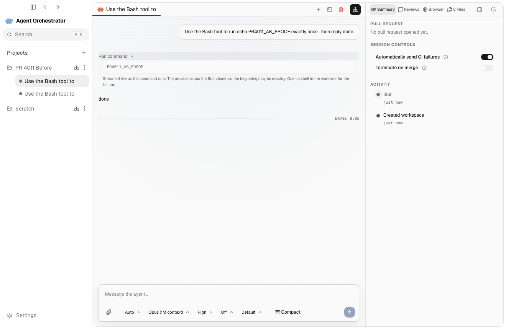
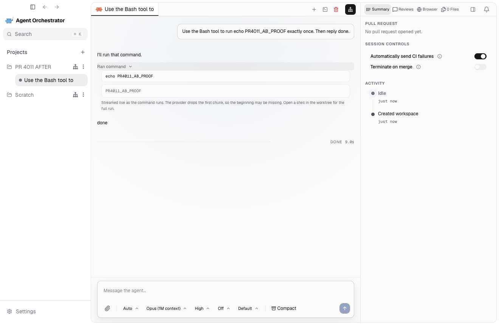

# PR #4011 A/B evidence

The screenshots below come from the real AO Electron desktop app. Both runs used
Claude Code in Chat mode and the same prompt:

> Use the Bash tool to run echo PR4011_AB_PROOF exactly once. Then reply done.

Each run used a fresh, isolated `AO_DATA_DIR` and the command row was expanded
before taking the screenshot at the same 1320 x 860 viewport.

## A — current main, command missing

Build: `3348277ec` (`origin/main` at the time of the test)

The expanded row shows the output `PR4011_AB_PROOF`, but it does not show the
executed command `echo PR4011_AB_PROOF`.



The persisted activity contains the provider input, but has no normalized
`detail.command` or audit-preserving `detail.rawCommand` field.

## B — PR #4011 with review fixes, command visible

Build: `7ad251b89`

The expanded row shows the executed command `echo PR4011_AB_PROOF` above the
separate output `PR4011_AB_PROOF`.



The same live activity now persists both:

```json
{
  "command": "echo PR4011_AB_PROOF",
  "rawCommand": "echo PR4011_AB_PROOF",
  "output": "PR4011_AB_PROOF"
}
```

This verifies the whole path: ACP event normalization, daemon persistence,
conversation API serialization, and Electron rendering.
