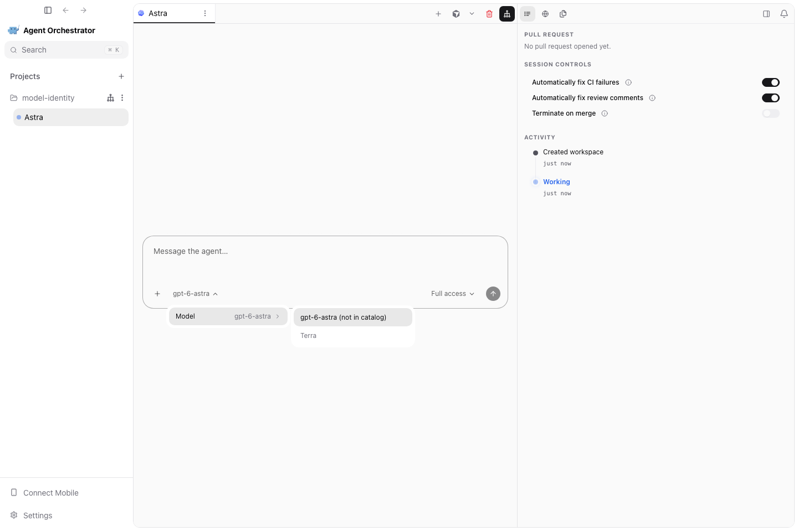
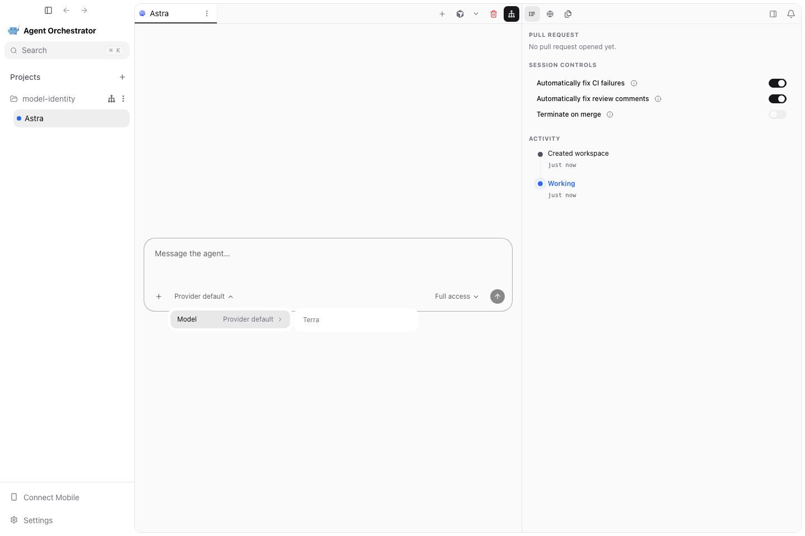

# PR #4923 visual evidence

Captured 2026-09-05.

Captured from this PR’s actual React renderer using deterministic daemon/native-bridge fixtures at 1440×960. These show the UI regression states; they are not live-provider or packaged-Electron execution evidence. Local dependency symlinks caused the renderer to use fallback fonts.

The selected Astra ID remains visible even when absent from the catalog.

No explicit selection is labeled Provider default, without guessing the catalog default.

